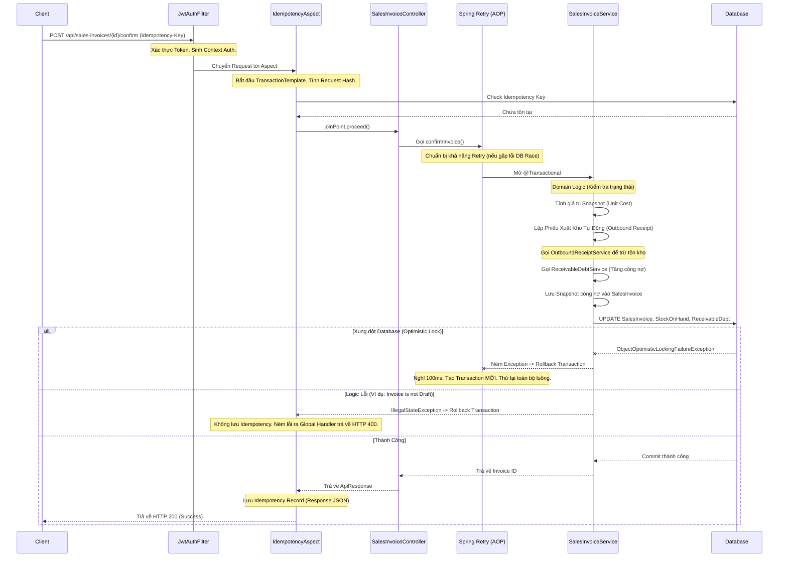

# Tổng Quan Luồng Hoạt Động Của Hệ Thống ERP (Phase 2)

Tài liệu này tóm tắt kiến trúc luồng dữ liệu (Data Flow) và cách các Aspect (AOP) đóng vai trò đảm bảo tính toàn vẹn dữ liệu (Consistency) cũng như chống lặp giao dịch (Idempotency) trong kiến trúc của hệ thống tính đến cuối Sprint 2.

---

## 1. Tóm Lược Kiến Trúc & Các Lớp Quan Trọng

Hệ thống được thiết kế theo hướng **Domain-Driven Design (DDD)** với các Module độc lập (Inventory, Order, CRM) và giao tiếp thông qua Service layer, được bọc bảo vệ bởi các lớp Security và AOP.

Các thành phần cốt lõi xử lý Workflow:
- **`JwtAuthenticationFilter`**: Chặn mọi request ở cửa ngõ, parse token JWT, trích xuất `branchId` và `userId` rồi nạp vào `SecurityContextHolder`. Điểm đặc biệt: Thông tin mở rộng được lưu ở `Authentication.getDetails()`.
- **`IdempotencyAspect`**: "Vệ sĩ" chống double-click hoặc retry rác từ Client. Bọc ngoài Controller, chặn request lặp, lưu Snapshot kết quả.
- **`@Retryable` (Spring Retry)**: Đảm bảo Concurrency an toàn. Bao bọc tầng ngoài cùng của Service để tự động thử lại khi có 2 luồng đồng thời tranh chấp ghi dữ liệu (Optimistic Lock).
- **Domain Services (`SalesInvoiceService`, `GoodsReturnService`, v.v...)**: Chứa Business Logic (tính toán, snapshot data, validate). Nằm trong `@Transactional`.

---

## 2. Giải Thích Cơ Chế Hoạt Động Của AOP & ACID

### AOP - Hỗ trợ Consistency và Idempotency như thế nào?
1. **Idempotency (Tính luỹ đẳng):**
   - **Cách hoạt động:** Khi Request chạm tới Controller có gắn `@IdempotencyProtected`, `IdempotencyAspect` sẽ can thiệp. Nó lấy `Idempotency-Key` từ Header và tính toán `Request-Hash` dựa trên (HTTP Method + URI + Request Body).
   - **Xử lý lặp:** 
     - Nếu DB đã có Record mang Key này và Hash khớp: Trả về kết quả JSON cũ (Cache Snapshot) mà không chạy lại Logic.
     - Nếu DB có Key nhưng Hash lệch: Báo `409 Conflict` (Client tái sử dụng Key sai mục đích).
   - **Atomicity (Tính Nguyên Tử - Chữ A trong ACID):** Quá trình lưu Idempotency Record được nhét **chung** vào một `TransactionTemplate` với Logic Nghiệp Vụ. Nhờ vậy, nếu nghiệp vụ thành công, record được lưu. Nếu nghiệp vụ văng lỗi (ví dụ Hết hàng), mọi thứ Rollback sạch sẽ, Record Idempotency bị xoá bỏ để Client có thể sửa lỗi và gửi lại đúng Key đó.

2. **Concurrency Consistency (Tính Nhất Quán Đồng Thời - Chữ C trong ACID):**
   - Dùng versioning (`@Version`) trong Database để chống ghi đè (Optimistic Locking).
   - Khi 2 nhân viên cùng xuất kho 1 món hàng cuối cùng, DB sẽ văng `ObjectOptimisticLockingFailureException`.
   - Aspect `@Retryable` của `spring-retry` đứng hứng bên ngoài hàm. Khi bắt được lỗi này, nó cho phép Service chờ 100ms và chạy lại (tối đa 3 lần).
   - **Vì sao không tự vòng lặp `while`?** Vì Spring Transaction thiết kế rất khắt khe: Bất kỳ Exception nào văng ra bên trong biên giới `@Transactional` đều làm cho toàn bộ Transaction đó bị gán nhãn **Rollback-Only** vĩnh viễn. Nếu bắt try-catch vòng lặp bên trong, cuối cùng nó vẫn chết vì `UnexpectedRollbackException`. Việc dùng `@Retryable` bên ngoài ép Spring phải tạo một Transaction hoàn toàn mới và "sạch sẽ" ở mỗi lần thử lại.

---

## 3. Workflow Chi Tiết (Ví Dụ: Chốt Hoá Đơn Bán Hàng)

Dưới đây là luồng xử lý chính khi người dùng nhấn nút **Xác nhận (Confirm) Hoá Đơn**:

### Các Đặc Trưng Xử Lý Lỗi (Rollback)

- **Lỗi Validation / Logic Nghiệp vụ (Data/Business Error):** 
  - (Vd: Trạng thái không đúng, Lỗi khoá ngoại FK). 
  - Transaction lập tức Rollback. Client nhận thông báo lỗi chi tiết. Không lưu Idempotency Key.
- **Lỗi Đồng Thời (Concurrency/Race Condition):**
  - Xảy ra khi dùng chung dữ liệu. 
  - Nếu gặp `DataIntegrityViolationException` (insert trùng key) hoặc `OptimisticLockException` (update version cũ).
  - Transaction bị Rollback -> Tự động Retry luồng (AOP `@Retryable`) bằng Transaction mới. Client không cảm nhận được lỗi trừ khi quá 3 lần retry.
- **Lỗi Idempotency (Trùng/Sai Key):**
  - Bị chặn ngay từ `IdempotencyAspect` trước khi mở Transaction. Không đụng tới logic nghiệp vụ, giảm tải cho Database (Bảo vệ hệ thống).
