# BÁO CÁO KHÓA LUẬN TỐT NGHIỆP
## ĐỀ TÀI: XÂY DỰNG HỆ THỐNG ERP ĐA CHI NHÁNH TRONG LĨNH VỰC BÁN LẺ VẬT LIỆU XÂY DỰNG

---

## CHƯƠNG 1. TỔNG QUAN ĐỀ TÀI

### 1.1. Bối cảnh và Vấn đề

**1.1.1. Mô hình kinh doanh chuỗi cửa hàng vật liệu xây dựng**
Trong bối cảnh nền kinh tế thị trường phát triển, mô hình chuỗi cửa hàng bán lẻ vật liệu xây dựng và thiết bị nội thất ngày càng mở rộng. Mô hình đặc trưng thường bao gồm một Trụ sở chính (Headquarter - HQ) và nhiều Chi nhánh (Branch) phân tán về mặt địa lý. HQ đóng vai trò trung tâm điều phối, quản lý danh mục sản phẩm dùng chung, chính sách giá và cấu hình người dùng toàn hệ thống. Trong khi đó, các Chi nhánh chịu trách nhiệm vận hành nghiệp vụ trực tiếp bao gồm bán hàng, nhập kho, quản lý tồn kho và theo dõi công nợ khách hàng.

**1.1.2. Các vấn đề nghiệp vụ nổi bật**
Với mô hình phân tán, các doanh nghiệp thường đối mặt với những thách thức lớn về vận hành và công nghệ:
- Sự gián đoạn kết nối mạng giữa Chi nhánh và Trụ sở thường xuyên xảy ra, dẫn đến việc Chi nhánh không thể thực hiện giao dịch nếu phụ thuộc hoàn toàn vào máy chủ trung tâm.
- Dữ liệu tồn kho và công nợ giữa các chi nhánh không được đồng bộ kịp thời, gây sai lệch trong quá trình đối soát và báo cáo tổng hợp.
- Quản lý phân quyền và người dùng thường bị phân mảnh hoặc thiếu nhất quán khi mỗi chi nhánh sử dụng một hệ thống quản lý cục bộ riêng biệt.
- Phương pháp tính giá vốn truyền thống (như bình quân gia quyền) không cho phép truy vết lợi nhuận gộp theo từng giao dịch bán hàng hay lô hàng nhập cụ thể, làm giảm tính minh bạch trong báo cáo tài chính.

### 1.2. Mục tiêu nghiên cứu

**1.2.1. Mục tiêu tổng quát**
Xây dựng một hệ thống Quản trị Nguồn lực Doanh nghiệp (ERP) đa chi nhánh, cung cấp khả năng vận hành cục bộ liên tục tại các Chi nhánh ngay cả khi mất kết nối mạng, đồng thời đảm bảo khả năng quản lý, giám sát và tổng hợp dữ liệu tập trung tại Trụ sở chính.

**1.2.2. Mục tiêu cụ thể**
Để đạt được mục tiêu tổng quát, đề tài tập trung giải quyết 10 mục tiêu cụ thể sau:
1. Xây dựng phân hệ Bán hàng (Sales) hỗ trợ tạo, chỉnh sửa và xác nhận hóa đơn.
2. Xây dựng phân hệ Nhập hàng (Inbound) hỗ trợ tạo và xác nhận phiếu nhập kho từ nhà cung cấp.
3. Hỗ trợ quy trình Trả hàng (Goods Return) nhằm quản lý hàng hóa hoàn trả.
4. Quản lý Tồn kho (Inventory) chính xác, tuân thủ nguyên tắc tính giá vốn FIFO (First-In, First-Out).
5. Theo dõi sát sao Công nợ phải thu (Receivable Debt) của khách hàng theo từng chi nhánh.
6. Quản lý tập trung dữ liệu nền tảng (Master Data) tại HQ và tự động phân phối xuống Chi nhánh.
7. Triển khai cơ chế phân quyền linh hoạt cho các vai trò ADMIN và STAFF theo phạm vi truy cập (HQ hoặc Branch).
8. Xây dựng cơ chế đồng bộ dữ liệu hai chiều giữa HQ và Branch đảm bảo tính toàn vẹn thông tin.
9. Cung cấp hệ thống Dashboard tổng hợp, báo cáo doanh thu và cảnh báo tồn kho thấp.
10. Đảm bảo các tiêu chuẩn về tính toàn vẹn dữ liệu, bảo mật hệ thống và khả năng bảo trì mã nguồn.

### 1.3. Đối tượng nghiên cứu
- Quy trình nghiệp vụ ERP trong môi trường bán lẻ chuỗi phân tán.
- Các mô hình kiến trúc phần mềm phân tán đa điểm (HQ/Branch topology).
- Cơ chế đồng bộ dữ liệu giữa các cơ sở dữ liệu phân tán (Logical Replication).
- Các thuật toán và quy trình quản lý tồn kho, đặc biệt là phương pháp tính giá vốn FIFO.
- Các giải pháp xác thực và phân quyền an toàn trong môi trường nhiều thực thể (N-instance).

### 1.4. Phạm vi nghiên cứu

**1.4.1. Chức năng trong phạm vi phát triển**
Hệ thống được giới hạn phát triển các phân hệ cốt lõi sau:
- Identity: Quản lý xác thực và phân quyền người dùng.
- Branch: Quản lý thông tin chi nhánh.
- Catalog: Quản lý sản phẩm, danh mục, nhà cung cấp và bảng giá.
- CRM: Quản lý thông tin khách hàng và công nợ phải thu.
- Order: Xử lý hóa đơn bán hàng (Sales) và phiếu trả hàng (Goods Return).
- Inventory: Quản lý tồn kho, tính giá vốn FIFO và nhập kho (Inbound).
- Analytics: Phân tích số liệu, dashboard và cảnh báo.
- Common: Xử lý các tiện ích chung và đảm bảo tính Idempotency của giao dịch.
- Infrastructure & System: Cơ chế hạ tầng về đồng bộ dữ liệu (Logical Replication) và bảo mật.

**1.4.2. Giới hạn ngoài phạm vi**
Các nghiệp vụ sau đây được xác định nằm ngoài phạm vi phát triển của đề tài (Out of scope) và đóng vai trò như định hướng mở rộng trong tương lai:
- Đặt hàng trước của khách hàng (Customer Order).
- Đơn đặt hàng từ nhà cung cấp (Purchase Order) và Công nợ phải trả (Supplier Payable).
- Luân chuyển kho nội bộ (Stock Transfer) và Phiếu xuất kho khác (Outbound Receipt).
- Yêu cầu báo giá (RFQ) và tích hợp Thanh toán trực tuyến (Online Payment).
- Thuật ngữ Lô hàng (Stock Lot) không được sử dụng, thay vào đó hệ thống áp dụng thuật ngữ thống nhất là Lớp giá (Cost Layer).

### 1.5. Cấu trúc báo cáo
Báo cáo khóa luận được chia thành các chương như sau:
- **Chương 1:** Tổng quan đề tài, trình bày bối cảnh, mục tiêu và phạm vi nghiên cứu.
- **Chương 2:** Phân tích yêu cầu và thiết kế kiến trúc hệ thống, bao gồm cơ sở lý thuyết, phân tích kiến trúc và lựa chọn mô hình triển khai.
- **Chương 3:** Phân tích nghiệp vụ và thiết kế hệ thống, mô tả chi tiết Use Case, luồng hoạt động, cấu trúc dữ liệu và thiết kế phần mềm.
- **Kết luận:** Tổng kết các kết quả đạt được và đề xuất hướng phát triển tiếp theo.

---

## CHƯƠNG 2. PHÂN TÍCH YÊU CẦU VÀ THIẾT KẾ KIẾN TRÚC HỆ THỐNG

### 2.1. Tổng quan Lý thuyết và Công trình Liên quan

Việc thiết kế một hệ thống phân tán đòi hỏi sự lựa chọn kỹ lưỡng dựa trên cơ sở khoa học và thực tiễn. Dưới đây là các nghiên cứu và tiền lệ làm nền tảng cho các quyết định kiến trúc của hệ thống.

**2.1.1. Kiến trúc Monolith và xu hướng Modular Monolith**
- *Cơ sở tham khảo:* Các nghiên cứu thực nghiệm trên ArXiv (2022-2024) chỉ ra rằng Modular Monolith là lựa chọn tối ưu cho hệ thống quy mô vừa, tránh được chi phí vận hành quá lớn của Microservices. Thực tiễn từ dự án Prime Video (Amazon, 2023) cũng cho thấy việc chuyển đổi từ Microservices phân tán về Monolith giúp giảm đáng kể độ phức tạp vận hành và chi phí hạ tầng.
- *Kết luận:* Microservices thường mang lại overhead lớn về quản lý phân tán và độ trễ giao tiếp. Với ERP đa chi nhánh, Modular Monolith giúp duy trì một mã nguồn duy nhất có ranh giới module rõ ràng, giảm chi phí triển khai mà vẫn đảm bảo tính độc lập.
- *Liên hệ hệ thống:* Dự án áp dụng kiến trúc Modular Monolith sử dụng Java Spring Boot. Mã nguồn được triển khai cho cả HQ và Branch, sử dụng cấu hình `@ConditionalOnProperty(name="instance.role")` để kích hoạt các tính năng tương ứng. Các module giao tiếp qua các Facade Interface thay vì truy cập trực tiếp vào Repository của nhau.

**2.1.2. Đồng bộ dữ liệu phân tán (PostgreSQL Logical Replication)**
- *Cơ sở tham khảo:* Theo tài liệu chính thức của PostgreSQL, Logical Replication cho phép nhân bản dữ liệu có chọn lọc giữa các database độc lập. Giải pháp này cũng được EnterpriseDB xác nhận mang lại hiệu quả băng thông lớn và cho phép hệ thống duy trì hoạt động khi mất kết nối mạng WAN.
- *Kết luận:* Logical Replication giải quyết triệt để bài toán đồng bộ dữ liệu hai chiều (từ HQ xuống Branch và ngược lại) mà không phụ thuộc vào middleware cấp ứng dụng, phù hợp hoàn hảo với hệ thống bán lẻ phân tán.
- *Liên hệ hệ thống:* Dự án thiết lập mô hình xuất/nhận dữ liệu riêng biệt. `MASTER_TABLES` được đồng bộ từ HQ xuống Branch, và `TRANSACTION_TABLES` được đồng bộ từ Branch lên HQ. Việc sử dụng UUID làm khóa chính giúp tránh xung đột dữ liệu khi nhiều Branch cùng gửi dữ liệu về.

**2.1.3. Tính nhất quán cuối cùng (Eventual Consistency) trong hệ thống phân tán**
- *Cơ sở tham khảo:* Định lý CAP (Brewer, 2000; Gilbert & Lynch, 2002) khẳng định hệ thống phân tán không thể đạt đồng thời Tính nhất quán, Tính sẵn sàng và Khả năng chịu lỗi phân vùng. Tài liệu về kiến trúc Dynamo (Amazon) chứng minh Eventual Consistency ưu tiên tính sẵn sàng khi có lỗi mạng là phù hợp trong bán lẻ.
- *Kết luận:* Việc ưu tiên tính sẵn sàng (Availability) ở cấp độ liên chi nhánh là bắt buộc. Hệ thống chấp nhận độ trễ trong quá trình đồng bộ để đảm bảo chi nhánh luôn có thể thao tác độc lập.
- *Liên hệ hệ thống:* Hệ thống áp dụng mô hình ưu tiên tính sẵn sàng khi liên thông dữ liệu. Các báo cáo tại HQ có thể không hiển thị theo thời gian thực 100% nhưng đảm bảo dữ liệu sẽ được khớp hoàn toàn khi kết nối được phục hồi.

**2.1.4. Phương pháp tính giá vốn FIFO — Cơ sở kế toán**
- *Cơ sở tham khảo:* Chuẩn mực Kế toán Việt Nam số 02 (VAS 02) và Thông tư 200/2014/TT-BTC quy định FIFO (First-In, First-Out) là phương pháp hợp lệ và tối ưu cho hàng hóa có thể phân biệt. Chuẩn mực Quốc tế IAS 2 (IFRS) cũng có quy định tương đương, ưu tiên FIFO để truy vết chính xác giá trị tồn kho.
- *Kết luận:* Kỹ thuật FIFO phản ánh chính xác luồng di chuyển vật lý của hàng hóa và cho phép tính toán chuẩn xác biên lợi nhuận gộp cho từng giao dịch cụ thể.
- *Liên hệ hệ thống:* Hệ thống áp dụng FIFO bằng cách theo dõi các Lớp giá (Cost Layer). Giá vốn được lưu trữ cố định (snapshot) vào dòng hóa đơn ngay thời điểm xác nhận, đảm bảo bất biến.

**2.1.5. Hệ thống thực tế tương đương**
- *Cơ sở tham khảo:* SAP Business One (với Intercompany Integration Solution) và Odoo Multi-company đều cung cấp giải pháp vận hành chi nhánh độc lập có cơ sở dữ liệu phân tách và đồng bộ dữ liệu về trung tâm.
- *Kết luận:* Mô hình HQ + N Branch hoạt động độc lập đã được chứng minh tính khả thi qua các sản phẩm ERP hàng đầu.
- *Liên hệ hệ thống:* Thay vì sử dụng bộ đồng bộ riêng biệt như SAP, hệ thống tận dụng trực tiếp tính năng Logical Replication của PostgreSQL nhằm giảm chi phí hạ tầng và độ phức tạp vận hành.

### 2.2. Đặc điểm Kiến trúc của Bài toán

**2.2.1. Vận hành địa lý phân tán (Multi-location)**
Hệ thống bao gồm 1 Trụ sở (HQ) và nhiều Chi nhánh (Branch). Mỗi thực thể đóng vai trò như một node trong mạng lưới phân tán.

**2.2.2. Vận hành cục bộ (Local Operation)**
Do đặc thù đường truyền mạng, các Chi nhánh bắt buộc phải hoạt động độc lập. Mỗi chi nhánh cần có Backend và DB riêng để phục vụ giao dịch bán hàng liên tục.

**2.2.3. Chia sẻ dữ liệu gốc và quản lý giao dịch cục bộ**
HQ nắm quyền phân phối dữ liệu nền (Master Data). Chi nhánh sở hữu dữ liệu giao dịch phát sinh nội bộ (Transaction Data) và đẩy dữ liệu về HQ phục vụ phân tích.

### 2.3. Yêu cầu Chức năng và Phi chức năng

**2.3.1. Yêu cầu Chức năng**
- Identity & Branch: Đăng nhập, thu hồi token, quản lý thông tin chi nhánh.
- Catalog: Quản lý danh mục, sản phẩm, bảng giá và nhà cung cấp.
- CRM: Quản lý hồ sơ khách hàng và theo dõi công nợ.
- Order (Sales & Goods Return): Lập hóa đơn bán hàng và xử lý phiếu trả hàng.
- Inventory (kèm Inbound): Xử lý nhập kho, quản lý tồn kho và tính giá vốn FIFO.
- Analytics: Báo cáo, cảnh báo, dashboard tổng hợp.
- Common & Infrastructure: Xử lý đồng bộ dữ liệu, bảo mật và lưu vết giao dịch.

**2.3.2. Yêu cầu Phi chức năng (NFR)**
- Availability: Chi nhánh hoạt động độc lập với HQ.
- Integrity: Đảm bảo giao dịch toàn vẹn cục bộ trên từng chi nhánh.
- Security: Phân chia phạm vi cấp và xác thực quyền hạn giữa HQ và Branch.
- Scalability: Cho phép dễ dàng thêm chi nhánh mới mà không thay đổi mã nguồn.
- Maintainability: Quản lý duy nhất một codebase.

### 2.4. Phân tích và Lựa chọn Phương án Kiến trúc

Phương án **Modular Monolith + N-instance** được lựa chọn do đáp ứng toàn diện:
- Tính độc lập tuyệt đối cho Chi nhánh (có DB riêng).
- Duy trì sự đơn giản trong phát triển (1 codebase).
- Đảm bảo tính nhất quán dữ liệu ở phạm vi cục bộ mạnh mẽ.
- Ứng dụng xuất sắc mô hình Logical Replication.

### 2.5. Thiết kế Kiến trúc Tổng thể

**2.5.1. Kiến trúc Hệ thống Tổng thể**

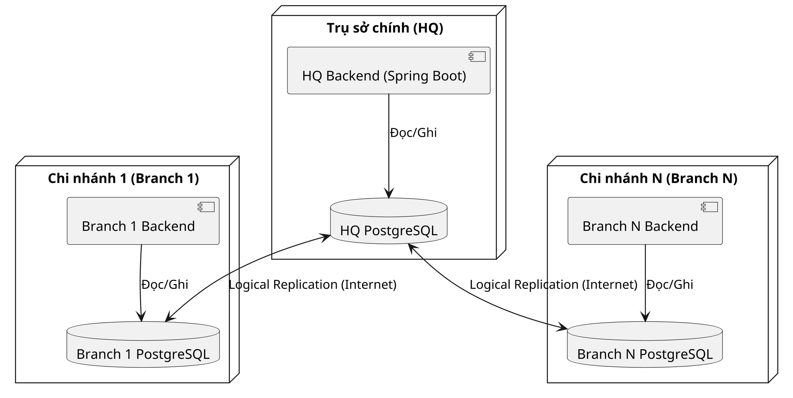
*(Hình 2.1: Sơ đồ kiến trúc tổng thể HQ + Branch)*

Hệ thống được tổ chức thành mô hình Hub-and-Spoke. HQ đóng vai trò Hub triển khai ứng dụng Spring Boot, PostgreSQL, Redis. Các Branch (Spoke) chạy độc lập và giao tiếp qua Logical Replication.

**2.5.2. Cấu trúc Module Backend**

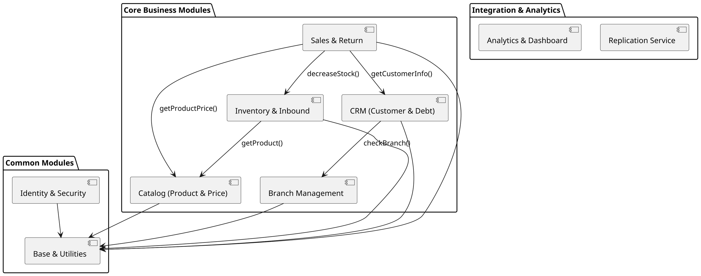
*(Hình 2.2: Sơ đồ kiến trúc Module Backend)*

Ứng dụng Backend được thiết kế theo kiến trúc Modular Monolith với 9 module (package) chính. Các module giao tiếp qua Facade để hạn chế sự phụ thuộc. Các nghiệp vụ như Bán hàng (Sales) và Trả hàng (Goods Return) được quy tụ về module **Order**; Nhập hàng (Inbound) được quy tụ về module **Inventory**. Các cơ chế Replication & Security được xếp vào **Infrastructure & System**.

Dưới đây là bảng chuẩn hóa danh sách các module bám sát mã nguồn thực tế:

| STT | Tên Module | Package | Chức năng chính | Entity chính | Nhóm Sơ đồ (Class/ERD) |
|---|---|---|---|---|---|
| 1 | Identity | `identity` | Quản lý người dùng, phân quyền, cấp token | `UserAccount`, `Role`, `Permission` | Identity & CRM |
| 2 | Branch | `branch` | Quản lý thông tin và cấu hình chi nhánh | `Branch` | Identity & CRM |
| 3 | CRM | `crm` | Quản lý khách hàng, công nợ phải thu | `Customer`, `ReceivableDebt`, `ReceivableDebtMovement` | Identity & CRM |
| 4 | Catalog | `catalog` | Quản lý sản phẩm, danh mục, bảng giá, nhà cung cấp | `Product`, `Category`, `Supplier`, `PriceList` | Catalog & Inventory |
| 5 | Inventory | `inventory` | Nhập kho (Inbound), quản lý tồn kho, tính giá vốn FIFO | `InboundReceipt`, `StockOnHand`, `StockMovement`, `CostLayer` | Catalog & Inventory |
| 6 | Order | `order` | Bán hàng (Sales), Trả hàng (Goods Return), giá riêng | `SalesInvoice`, `GoodsReturn`, `CustomerProductPrice` | Order & Common |
| 7 | Analytics | `analytics` | Báo cáo, thống kê, Dashboard | `FactSales`, `DimBranch` (Dữ liệu OLAP) | Không vẽ (OLAP) |
| 8 | Common | `common` | Tiện ích chung, lưu vết giao dịch (Idempotency) | `IdempotencyRecord`, `BaseEntity` | Order & Common |
| 9 | Infrastructure & System | `infrastructure`, `system`| Cơ chế hạ tầng: Redis, Logical Replication, Security | Không có Entity nghiệp vụ | Không vẽ |

**2.5.3. Mô hình Triển khai (Runtime Topology)**

*(Hình 2.3: Sơ đồ triển khai hệ thống - Deployment Diagram)*

Triển khai thông qua Docker, mỗi instance là một cụm tài nguyên độc lập bao gồm Nginx, Ứng dụng Backend và DB tương ứng.

**2.5.4. Cơ chế nhân bản dữ liệu (Logical Replication)**

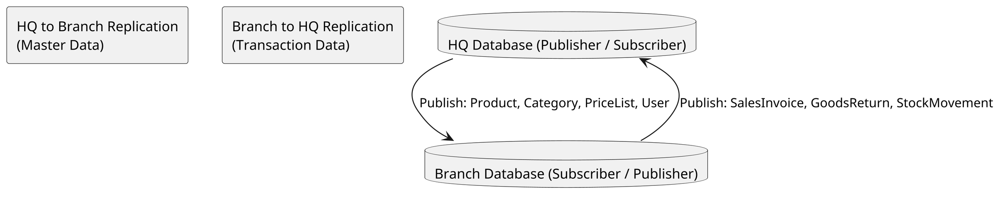
*(Hình 2.4: Luồng nhân bản dữ liệu Logical Replication)*

Thiết lập cơ chế đồng bộ theo nguyên tắc Single-writer-per-table. 
- HQ Push Master Data xuống Branch.
- Branch Push Transaction Data về HQ.

**2.5.5. Thiết kế Bảo mật và Đồng bộ Tác vụ**

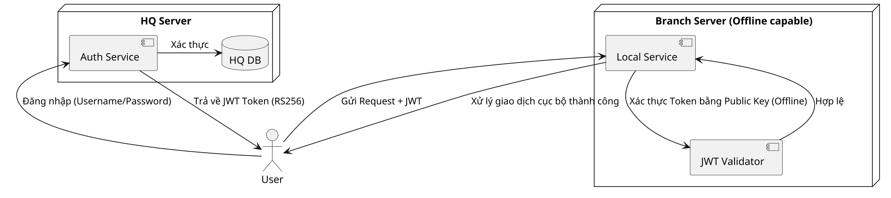
*(Hình 2.5: Kiến trúc bảo mật)*

- **Xác thực:** HQ là đơn vị duy nhất phát hành Token. Branch thực hiện xác thực ngoại tuyến (offline verification) nhằm duy trì hoạt động cục bộ mà không cần gọi về HQ.
- **Toàn vẹn xử lý:** Áp dụng phương pháp khóa lạc quan (Optimistic Locking) để chống ghi đè dữ liệu đồng thời, và lưu vết yêu cầu (Idempotency) để tránh xử lý lặp giao dịch.

---

## CHƯƠNG 3. PHÂN TÍCH NGHIỆP VỤ VÀ THIẾT KẾ HỆ THỐNG

Trong chương này, hệ thống ERP bán lẻ đa chi nhánh sẽ được phân tích và thiết kế chi tiết thông qua các góc nhìn từ tổng quan đến cụ thể. Đầu tiên, mô hình hóa chức năng (Use Case, Activity, DFD) sẽ làm rõ các yêu cầu nghiệp vụ và luồng xử lý của người dùng. Tiếp theo, cấu trúc tĩnh và hành vi động của hệ thống được phác họa qua Sơ đồ lớp (Class Diagram) và Sơ đồ tuần tự (Sequence Diagram). Cuối cùng, thiết kế dữ liệu (ERD) sẽ định hình cấu trúc lưu trữ, đảm bảo tính nhất quán và phục vụ tốt cho cơ chế đồng bộ trong kiến trúc Modular Monolith.

### 3.1. Phân tích Yêu cầu Chức năng (Use Case)

#### 3.1.1. Sơ đồ Use Case tổng quát

Hệ thống ERP bán lẻ đa chi nhánh được phân tách quyền hạn dựa trên hai tác nhân chính: Admin tại Trụ sở chính (HQ) và Staff tại Chi nhánh (Branch).
- **Admin** chịu trách nhiệm thiết lập các dữ liệu nền tảng (Master Data) bao gồm người dùng, chi nhánh, danh mục sản phẩm, nhà cung cấp và bảng giá, đồng thời xem các báo cáo tổng hợp.
- **Staff** vận hành trực tiếp các nghiệp vụ tại cửa hàng như lập hóa đơn, lập phiếu trả hàng, quản lý nhập kho, khách hàng và theo dõi công nợ cục bộ.

Do số lượng chức năng phong phú, sơ đồ Use Case được phân tách làm hai biểu đồ riêng biệt dành cho Admin và Staff, qua đó thể hiện rõ ranh giới nghiệp vụ của từng nhóm người dùng đối với các phân hệ của hệ thống.

**Sơ đồ Use Case của Admin:**

```plantuml
@startuml
skinparam dpi 300
skinparam monochrome true
skinparam shadowing false
skinparam defaultFontName Arial

actor "Quản trị viên (Admin)" as Admin
actor "Nhân viên Chi nhánh (Staff)" as Staff

circle "Hệ thống ERP
Đa chi nhánh" as ERP

Admin --> ERP : Cấu hình Master Data
(Người dùng, Sản phẩm, Bảng giá)
ERP --> Admin : Báo cáo tổng hợp, Doanh thu

Staff --> ERP : Giao dịch bán lẻ
(Hóa đơn, Nhập kho, Trả hàng)
ERP --> Staff : Thông tin tồn kho, Công nợ
@enduml
```
*Hình 2: Sơ đồ Use Case dành cho tác nhân Admin*

**Sơ đồ Use Case của Staff:**

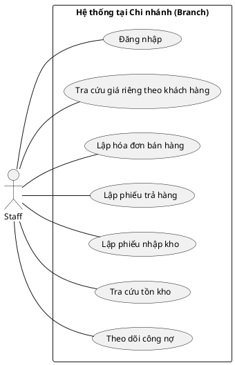
*Hình 3: Sơ đồ Use Case dành cho tác nhân Staff*

#### 3.1.2. Đặc tả các Use Case nghiệp vụ chính

Dưới đây là đặc tả chi tiết của 5 Use Case cốt lõi nhất, đóng vai trò nền tảng trong quá trình xác thực bảo mật và vận hành chuỗi bán hàng.

| Tên UC | Mã UC | Mô tả tóm tắt | Actor | Yêu cầu trước khi thực hiện | Các bước thực hiện | Điều kiện thoát | Điều kiện sau khi thực hiện | Yêu cầu đặc biệt |
|---|---|---|---|---|---|---|---|---|
| Đăng nhập | UC01 | Cho phép người dùng xác thực và truy cập vào hệ thống. | Admin, Staff | Người dùng có tài khoản đang hoạt động (`isActive = true`) [E12]. | 1. Người dùng gửi yêu cầu qua endpoint `POST /login` [P01].<br>2. Hệ thống gọi phương thức `login` của `AuthService` [M08].<br>3. Kiểm tra quy tắc nghiệp vụ: Staff phải có `branchId` [B01], Admin không được có `branchId` [B02].<br>4. Phát hành JWT token chứa các claims theo quy định [N03]. | Tài khoản không hợp lệ, sai mật khẩu, hoặc vi phạm quy tắc vai trò. | Người dùng nhận được JWT Token với role tương ứng [N02]. | Không |
| Lập hóa đơn bán hàng | UC10 | Lập và xác nhận hóa đơn bán hàng, ghi nhận thanh toán. | Staff | Đã xác thực, chọn khách hàng tồn tại [E06]. | 1. Staff gửi yêu cầu lập hóa đơn.<br>2. Hệ thống khởi tạo hóa đơn [E14] thông qua `createAndConfirm` [M11].<br>3. Lưu trạng thái nháp, sau đó gọi luồng xác nhận `applyConfirmationEffects` [B05, M12].<br>4. Với từng dòng sản phẩm [E15], gọi `recordSaleAndGetCost` [M16] tiêu thụ tồn kho FIFO [B08].<br>5. Tăng công nợ nếu còn thiếu qua `increaseDebt` [M05].<br>6. Cập nhật hóa đơn thành `CONFIRMED` [N04]. | Tồn kho lỗi, khách hàng không tồn tại, hoặc dữ liệu không nhất quán. | Hóa đơn được xác nhận [N04], trừ tồn kho [E21], công nợ khách hàng tăng [E24]. | Phải chạy trong transaction, sử dụng `@Retryable` [B10]. |
| Lập phiếu trả hàng | UC11 | Lập phiếu nhận lại hàng hóa trả về từ khách hàng. | Staff | Đã xác thực. | 1. Staff yêu cầu trả hàng, hệ thống lấy phiếu qua `findByIdForUpdate` [B06].<br>2. Khóa dòng phiếu bằng Pessimistic Lock [B11].<br>3. Hệ thống xử lý qua phương thức `confirmReturn` [M14].<br>4. Với từng dòng hoàn trả [E17], gọi `recordReturn` [M17] để hoàn lại kho.<br>5. Gọi `decreaseDebt` [M06] giảm công nợ khách hàng.<br>6. Cập nhật trạng thái phiếu thành `CONFIRMED` [N05]. | Lỗi tìm kiếm phiếu trả hàng hoặc giao dịch. | Phiếu hoàn trả xác nhận [E16], tồn kho hoàn lại, công nợ giảm đi. | Khóa Pessimistic Write phải duy trì suốt luồng [B11]. |
| Lập phiếu nhập kho | UC12 | Ghi nhận hàng hóa nhập từ nhà cung cấp [E04]. | Staff | Đã xác thực, chọn đúng sản phẩm [E03]. | 1. Staff tạo yêu cầu nhập kho [E19].<br>2. Hệ thống xử lý thông qua `confirmReceipt` [M15] và luồng [B07].<br>3. Tăng tồn kho và tạo biến động `StockMovement.inbound` [B07].<br>4. Lập các lớp giá mới qua phương thức `fromInbound` [M19] của `CostLayer` [E23].<br>5. Cập nhật phiếu thành `CONFIRMED` [N06]. | Sản phẩm hoặc nhà cung cấp không khả dụng. | Phiếu nhập kho được lưu [E19], `StockOnHand` tăng [E21], tạo thêm `CostLayer`. | Áp dụng `@Retryable` [M15] nếu xung đột. |
| Quản lý khách hàng | UC08 | Cho phép tạo, sửa hoặc xóa thông tin khách hàng. | Staff | Đã xác thực ở chi nhánh (có `branchId`). | 1. Staff gửi thông tin khách hàng qua các endpoint `POST`, `PUT`, `DELETE` [P04, P05, P06].<br>2. Gọi `createCustomer` [M04] trên `CustomerWriteService` (nếu tạo mới).<br>3. Tham chiếu khách hàng với chi nhánh qua thuộc tính `branchId` [R12].<br>4. Lưu khách hàng vào cơ sở dữ liệu [E06]. | Dữ liệu đầu vào sai định dạng hoặc mã đã tồn tại. | Hồ sơ khách hàng [E06] được tạo mới hoặc cập nhật. | Không |

*Tiếp nối việc xác định các chức năng cốt lõi thông qua sơ đồ Use Case, phần tiếp theo sẽ đi sâu vào mô tả chi tiết các bước thực hiện tuần tự của từng nghiệp vụ bằng biểu đồ hoạt động.*

### 3.2. Phân tích Yêu cầu Chức năng (Activity Diagram)

Mục này trình bày chi tiết luồng hoạt động (Activity Diagram) cho các nghiệp vụ cốt lõi của hệ thống, bao gồm Bán hàng, Trả hàng và Nhập kho. Các sơ đồ minh họa sự tương tác giữa nhân viên tại chi nhánh và hệ thống, cùng với các bước xử lý ngầm dựa trên luồng gọi hàm và quy tắc nghiệp vụ trong thực tế.

#### 3.2.1. Nghiệp vụ Bán hàng (Sales Invoice - UC10)

Sơ đồ dưới đây mô tả quy trình lập hóa đơn bán hàng. Hệ thống thực hiện kiểm tra thông tin khách hàng, ghi nhận biến động kho, tính giá vốn theo phương pháp FIFO và cập nhật công nợ trước khi chuyển trạng thái hóa đơn sang xác nhận.

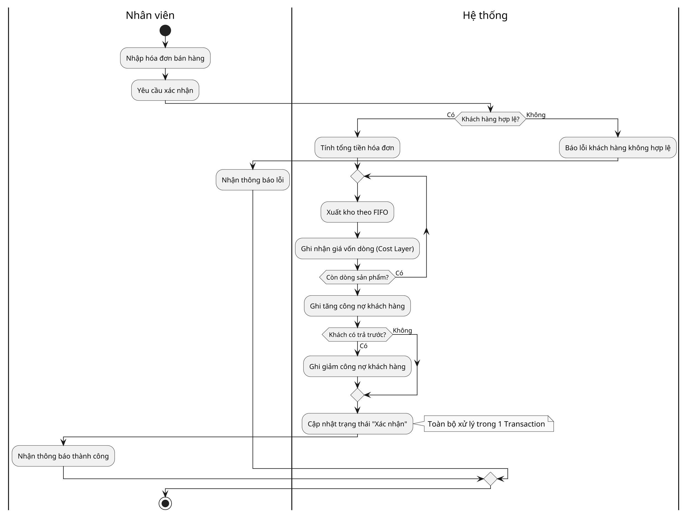
*Hình 4: Sơ đồ Activity - Luồng Bán hàng*

**Bảng truy vết hoạt động - Luồng Bán hàng:**

| Hoạt động mới | Hàm gốc được gộp | Nguồn |
|---|---|---|
| Nhập hóa đơn | - | [UC10] |
| Khách hàng hợp lệ? | `crmFacade.customerExists` | [B05] |
| Xuất kho theo FIFO | `fifoCostService.consume`, `stock.decreaseAllowNegative`, `StockMovement.sale` | [B08, B09] |
| Ghi giá vốn dòng | - | [B05] |
| Ghi tăng công nợ | `debtService.increaseDebt` | [B05] |
| Có trả trước? | - | [B05] |
| Trừ công nợ | `debtService.decreaseDebt` | [B05] |
| Xác nhận hóa đơn | `invoice.snapshotDebt`, `invoice.confirm`, `invoiceRepository.save` | [B05] |

#### 3.2.2. Nghiệp vụ Trả hàng (Goods Return - UC11)

Quy trình trả hàng theo mô hình Nháp (Draft) sang Xác nhận (Confirm). Khi nhân viên yêu cầu xác nhận, hệ thống tiến hành khóa hóa đơn gốc để đảm bảo tính toàn vẹn (tránh việc trả hàng đồng thời vượt quá số lượng mua), hoàn lại số lượng vào kho và giảm công nợ cho khách hàng.

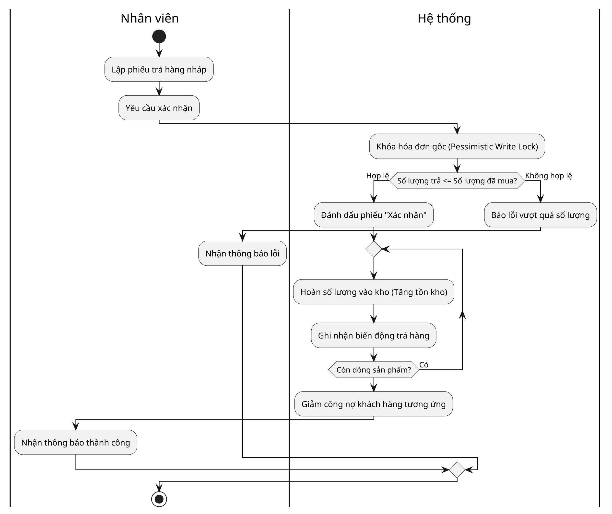
*Hình 5: Sơ đồ Activity - Luồng Trả hàng*

**Bảng truy vết hoạt động - Luồng Trả hàng:**

| Hoạt động mới | Hàm gốc được gộp | Nguồn |
|---|---|---|
| Lập phiếu trả nháp | `returnRepository.save` (DRAFT) | [UC11] |
| Yêu cầu xác nhận | - | [UC11] |
| Khóa hóa đơn gốc | `invoiceRepository.findByIdForUpdate` | [B06, B11] |
| Xác nhận phiếu | `goodsReturn.confirm` | [B06] |
| Hoàn hàng vào kho | `inventoryFacade.recordReturn` | [B06, V4] |
| Giảm công nợ | `debtService.decreaseDebt` | [B06] |
| Thông báo | `returnRepository.save` | [B06] |

#### 3.2.3. Nghiệp vụ Nhập kho (Inbound Receipt - UC12)

Quy trình nhập kho áp dụng mô hình duyệt tương tự. Quá trình xác nhận sẽ thực hiện tăng tồn kho, ghi nhận biến động nhập và sinh ra các Lớp giá (Cost Layer) mới phục vụ cho phương pháp tính giá vốn FIFO ở các giao dịch xuất kho sau này.

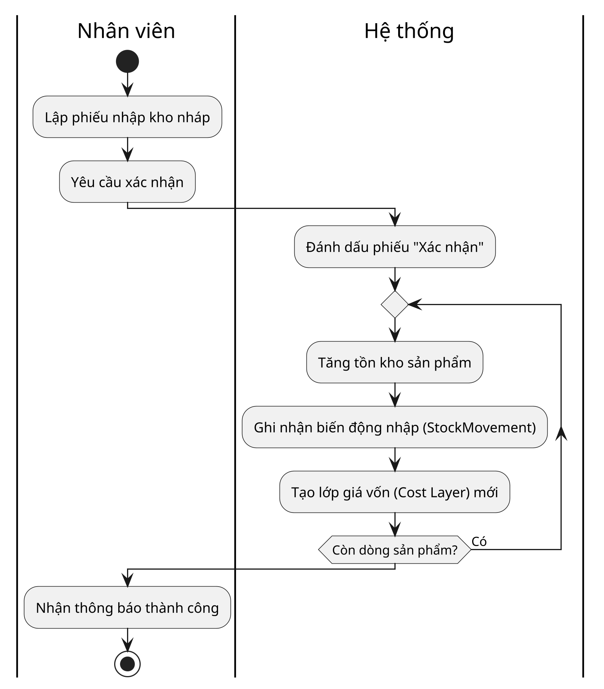
*Hình 6: Sơ đồ Activity - Luồng Nhập kho*

**Bảng truy vết hoạt động - Luồng Nhập kho:**

| Hoạt động mới | Hàm gốc được gộp | Nguồn |
|---|---|---|
| Lập phiếu nhập nháp | `inboundRepo.save` (DRAFT) | [UC12] |
| Yêu cầu xác nhận | - | [UC12] |
| Xác nhận phiếu | `receipt.confirm` | [B07] |
| Tăng tồn kho | `stockRepo.findByProductIdAndBranchId`, `stock.increase`, `stockRepo.save` | [B07] |
| Ghi biến động nhập | `StockMovement.inbound`, `movementRepo.save` | [B07] |
| Tạo lớp giá vốn | `CostLayer.fromInbound`, `costLayerRepo.save` | [B07] |
| Thông báo kết quả | `inboundRepo.save` | [B07] |

*Từ việc hiểu rõ trình tự các bước thực hiện nghiệp vụ, bước tiếp theo ta sẽ mô hình hóa các luồng dữ liệu vào và ra của từng quy trình bằng biểu đồ luồng dữ liệu (DFD).*

### 3.3. Biểu đồ Luồng Dữ liệu (DFD)

#### 3.3.1. DFD Cấp 0 (Context Diagram)
Biểu đồ DFD Cấp 0 mô tả cái nhìn tổng quát nhất về toàn bộ hệ thống ERP bán lẻ đa chi nhánh và các tương tác với các tác nhân bên ngoài (Admin, Staff).

```plantuml
@startuml
skinparam dpi 300
skinparam monochrome true
skinparam shadowing false
skinparam defaultFontName Arial

actor "Quản trị viên (Admin)" as Admin
actor "Nhân viên Chi nhánh (Staff)" as Staff

circle "Hệ thống ERP
Đa chi nhánh" as ERP

Admin --> ERP : Cấu hình Master Data
(Người dùng, Sản phẩm, Bảng giá)
ERP --> Admin : Báo cáo tổng hợp, Doanh thu

Staff --> ERP : Giao dịch bán lẻ
(Hóa đơn, Nhập kho, Trả hàng)
ERP --> Staff : Thông tin tồn kho, Công nợ
@enduml
```
*Hình 7: Biểu đồ DFD Cấp 0 của hệ thống*

#### 3.3.2. DFD mức chi tiết cho các Use Case

##### 3.3.2.1. UC10: Lập hóa đơn bán hàng

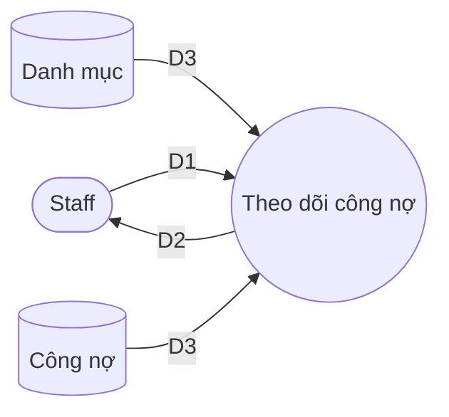
*Hình 8: Biểu đồ DFD mức chi tiết Use Case Theo dõi công nợ*

**Ý nghĩa từng dòng dữ liệu:**
| Dòng | Ý nghĩa |
|---|---|
| D1 | Tiêu chí tra cứu: Mã khách hàng, khoảng thời gian. |
| D2 | Dữ liệu công nợ và lịch sử giao dịch thanh toán, ghi nợ. |
| D3 | Thông tin khách hàng (từ Danh mục) và tổng công nợ, lịch sử biến động công nợ (từ Công nợ). |

**Thuật toán xử lý:**
1. Nhận yêu cầu tra cứu công nợ theo tiêu chí khách hàng từ thiết bị nhập (D1, D5).
2. Hệ thống gọi các endpoint `GET /{customerId}/balance` [P10] và `GET /{customerId}/movements` [P09] để lấy dữ liệu.
3. Đọc dữ liệu từ bảng `receivable_debt` [E24] để lấy dư nợ tổng và từ bảng `receivable_debt_movement` [E25] để lấy chi tiết biến động (D3).
4. Phân tích, tổng hợp số liệu công nợ và định dạng để hiển thị.
5. Truyền tín hiệu hiển thị (D6) ra thiết bị xuất.
6. Hiển thị thông tin công nợ và lịch sử chi tiết cho người dùng (D2).

*Sau khi xác định được các thực thể dữ liệu và cách chúng trao đổi qua DFD, bước tiếp theo là xây dựng Sơ đồ Lớp (Class Diagram) để cụ thể hóa các lớp đối tượng và quan hệ của chúng.*

#### Bảng Ánh xạ Kho dữ liệu và Bảng Cơ sở dữ liệu

| Tên kho (DFD) | Các bảng CSDL (CSDL) |
|---|---|
| Danh mục | `customer`, `product`, `supplier`, `price_list`, `customer_product_price` |
| Kho hàng | `stock_on_hand`, `stock_movement`, `cost_layer` |
| Chứng từ | `sales_invoice`, `goods_return`, `inbound_receipt` |
| Công nợ | `receivable_debt`, `receivable_debt_movement` |
| Chứng từ & Công nợ | `sales_invoice`, `receivable_debt`, `receivable_debt_movement` |

### 3.4. Sơ đồ lớp (Class Diagram)

#### 3.4.1 Cơ sở xây dựng và quy trình
Quá trình xây dựng sơ đồ lớp cho hệ thống được thực hiện qua 7 bước chuẩn:
1. **Xác định lớp, thuộc tính, phương thức**: Trích xuất các lớp miền (domain entities) từ FACTS (E01-E26). Các phương thức nghiệp vụ cốt lõi tại Entity được lấy từ FACTS M (M19-M22). Các Controller, Repository, DTO được loại bỏ để tập trung vào Domain.
2. **Xác định quan hệ**: Dựa trên danh sách các quan hệ (R01-R24) và quy định Cascade/OrphanRemoval để xác định Composition (*--), Aggregation (o--) hay Association (-->).
3. **Tách lớp phụ**: Xác định các lớp con phụ thuộc chặt chẽ như `SalesInvoiceLine`, `GoodsReturnLine`, `InboundReceiptLine`.
4. **Tổng quát hoá**: Sử dụng Interface hoặc Abstract class nếu có. Hệ thống chủ yếu sử dụng các lớp cụ thể.
5. **Tách lớp con**: Phân rã Enum như `SalesInvoiceStatus`, `MovementType` bằng cú pháp `<<enumeration>>`.
6. **Hiệu chỉnh quan hệ**: Ràng buộc các quan hệ liên module (như `branchId`, `customerId`) bằng Association tham chiếu qua ID thay vì tham chiếu thực thể cứng, nhằm đảm bảo kiến trúc Modular Monolith.
7. **Kiểm tra**: Đối chiếu với nguồn sự thật FACTS.

Do hệ thống bao gồm 24 lớp thực thể cốt lõi, sơ đồ được chia thành 1 sơ đồ tổng quát và 3 sơ đồ chi tiết theo các cụm chức năng: Identity & CRM, Catalog & Inventory, Order & Common.

#### 3.4.2 Sơ đồ lớp tổng quát
Sơ đồ dưới đây thể hiện các lớp gốc quan trọng và mối quan hệ tham chiếu chính, bao quát bức tranh toàn cảnh của hệ thống.

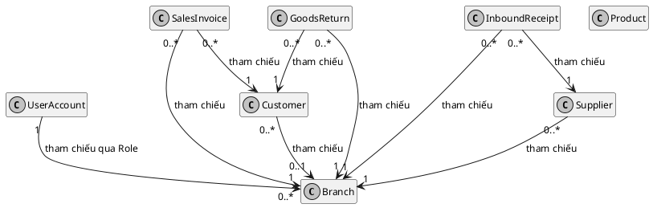
*Hình 9: Sơ đồ lớp tổng quát*

#### 3.4.3 Sơ đồ chi tiết cụm Identity & CRM

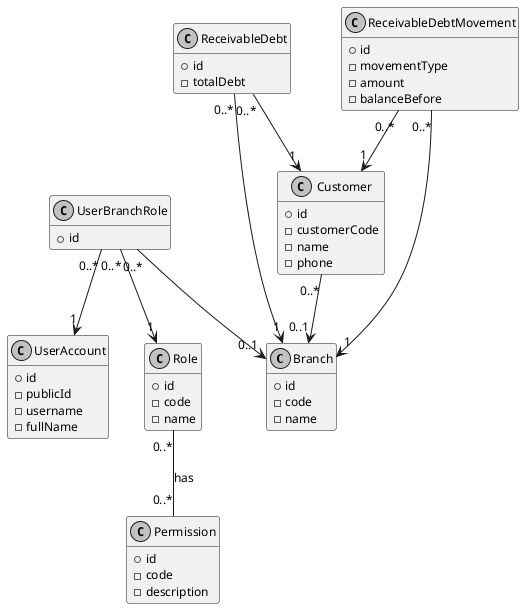
*Hình 10: Sơ đồ lớp chi tiết cụm Identity & CRM*

#### 3.4.4 Sơ đồ chi tiết cụm Catalog & Inventory

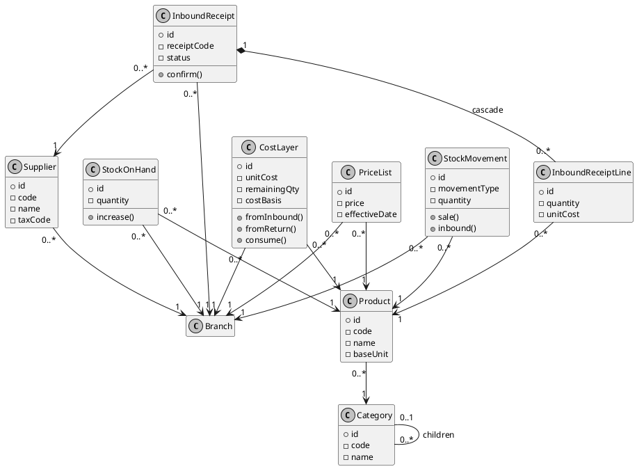
*Hình 11: Sơ đồ lớp chi tiết cụm Catalog & Inventory*

#### 3.4.5 Sơ đồ chi tiết cụm Order & Common

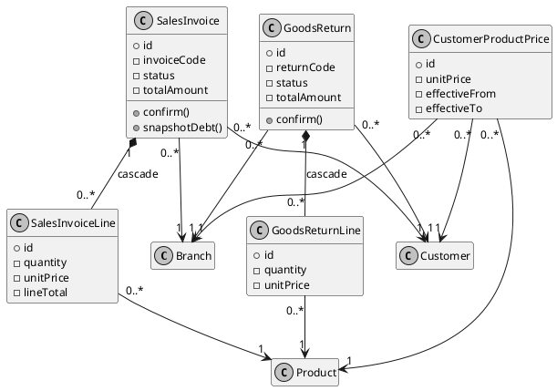
*Hình 12: Sơ đồ lớp chi tiết cụm Order*

#### 3.4.6 Danh sách các lớp
| STT | Tên lớp | Loại | Ý nghĩa | Nguồn |
|---|---|---|---|---|
| 1 | `Branch` | Entity | Thông tin chi nhánh bán lẻ. | [E01] |
| 2 | `Category` | Entity | Danh mục sản phẩm. | [E02] |
| 3 | `Product` | Entity | Sản phẩm hàng hoá. | [E03] |
| 4 | `Supplier` | Entity | Nhà cung cấp. | [E04] |
| 5 | `PriceList` | Entity | Bảng giá chung của sản phẩm tại chi nhánh. | [E05] |
| 6 | `Customer` | Entity | Khách hàng. | [E06] |
| 7 | `ReceivableDebt` | Entity | Tổng công nợ của khách hàng tại chi nhánh. | [E07, E24] |
| 8 | `ReceivableDebtMovement` | Entity | Biến động công nợ của khách hàng. | [E08, E25] |
| 9 | `Permission` | Entity | Quyền hạn trên hệ thống. | [E09] |
| 10 | `Role` | Entity | Vai trò của người dùng. | [E10] |
| 11 | `RolePermission` | Entity | Cầu nối Vai trò - Quyền hạn. | [E11] |
| 12 | `UserAccount` | Entity | Tài khoản người dùng. | [E12] |
| 13 | `UserBranchRole` | Entity | Cấp phát vai trò cho người dùng tại chi nhánh. | [E13] |
| 14 | `SalesInvoice` | Entity | Hóa đơn bán hàng. | [E14] |
| 15 | `SalesInvoiceLine` | Entity | Dòng chi tiết hóa đơn bán hàng. | [E15] |
| 16 | `GoodsReturn` | Entity | Đơn trả hàng từ khách hàng. | [E16] |
| 17 | `GoodsReturnLine` | Entity | Dòng chi tiết đơn trả hàng. | [E17] |
| 18 | `CustomerProductPrice` | Entity | Giá bán cấu hình riêng cho từng khách hàng. | [E18] |
| 19 | `InboundReceipt` | Entity | Phiếu nhập kho từ nhà cung cấp. | [E19] |
| 20 | `InboundReceiptLine` | Entity | Dòng chi tiết phiếu nhập kho. | [E20] |
| 21 | `StockOnHand` | Entity | Tồn kho hiện tại. | [E21] |
| 22 | `StockMovement` | Entity | Lịch sử biến động tồn kho. | [E22] |
| 23 | `CostLayer` | Entity | Lớp giá vốn theo phương pháp FIFO. | [E23] |
| 24 | `IdempotencyRecord` | Entity | Bản ghi hỗ trợ idempotent cho các thao tác. | [E26] |

#### 3.4.7 Bảng thuộc tính (Một số thuộc tính chính)
| STT | Lớp | Tên thuộc tính | Kiểu | Ràng buộc | Ý nghĩa |
|---|---|---|---|---|---|
| 1 | `Branch` | `code` | String | nullable=false, unique | Mã chi nhánh |
| 2 | `Product` | `code` | String | unique | Mã sản phẩm |
| 3 | `ReceivableDebt` | `totalDebt` | BigDecimal | | Tổng dư nợ |
| 4 | `ReceivableDebtMovement` | `amount` | BigDecimal | | Số tiền biến động |
| 5 | `SalesInvoice` | `invoiceCode` | String | nullable=false, unique | Mã hóa đơn |
| 6 | `CostLayer` | `version` | Long | @Version | Optimistic Lock |
| 7 | `StockOnHand` | `quantity` | BigDecimal | default 0 | Số lượng tồn |

#### 3.4.8 Bảng quan hệ
| STT | Tên quan hệ | Kiểu | Bản số | Ý nghĩa | Nguồn |
|---|---|---|---|---|---|
| 1 | `Category` - `Category` | Aggregation (o--) | 0..* - 0..1 | Cây danh mục (parent/children) | [R01, R02] |
| 2 | `Product` - `Category` | Association (-->) | 0..* - 1 | Sản phẩm thuộc danh mục (Bắt buộc) | [R03] |
| 3 | `PriceList` - `Product` | Association (-->) | 0..* - 1 | Bảng giá của sản phẩm | [R04] |
| 4 | `ReceivableDebt` - `Customer`| Association (-->) | 0..* - 1 | Công nợ của khách hàng | [R05, R23] |
| 5 | `ReceivableDebtMovement` - `Customer`| Association (-->) | 0..* - 1 | Lịch sử công nợ của KH | [R06, R24] |
| 6 | `SalesInvoice` - `SalesInvoiceLine` | Composition (*--) | 1 - 0..* | Hóa đơn và chi tiết (cascade=ALL, orphanRemoval=true) | [R17, R18] |
| 7 | `GoodsReturn` - `GoodsReturnLine` | Composition (*--) | 1 - 0..* | Đơn trả hàng và chi tiết (cascade=ALL, orphanRemoval=true) | [R19, R20] |
| 8 | `InboundReceipt` - `InboundReceiptLine` | Composition (*--) | 1 - 0..* | Phiếu nhập và chi tiết (cascade=ALL, orphanRemoval=true) | [R21, R22] |
| 9 | Các Entity - `branchId` | Association (-->) | - | Tham chiếu logic bằng ID sang Branch | [R12-R16] |

*Với các lớp và thuộc tính đã định nghĩa, Sơ đồ Tuần tự (Sequence Diagram) sau đây sẽ thể hiện sự tương tác cụ thể của chúng trong quá trình gọi hàm và xử lý logic.*

### 3.5. Sơ đồ tuần tự (Sequence Diagram)

Dựa trên các quy tắc nghiệp vụ và danh sách API đã được xác định (FACTS), các sơ đồ tuần tự dưới đây mô tả sự tương tác giữa các đối tượng trong các luồng nghiệp vụ cốt lõi của hệ thống.

#### 3.5.1 Đăng nhập và cấp JWT
Sơ đồ mô tả quá trình xác thực và cấp mới token dựa trên `AuthController` và `AuthService` [FACTS P01, P02, M08, M09, B04].

```plantuml
@startuml
skinparam monochrome true
skinparam shadowing false
skinparam defaultFontName Arial
skinparam defaultFontSize 12
hide empty members

actor "Nhân viên" as U
participant "Màn hình" as UI
participant "AuthService" as S
participant "CSDL" as DB

U -> UI : Nhập thông tin
UI -> S : Xác thực (login)
S -> DB : Truy vấn tài khoản
DB --> S : Kết quả
alt Hợp lệ
    S -> S : Tạo JWT
    note right: JWT chứa claims: sub, role, branchId.
Áp dụng cho các request sau.
    S --> UI : Trả về Token
    UI --> U : Đăng nhập thành công
else Không hợp lệ
    S --> UI : Báo lỗi
    UI --> U : Hiển thị lỗi
end
@enduml
```
*Hình 13: Sơ đồ tuần tự Đăng nhập và cấp JWT*

#### 3.5.2 Tạo và xác nhận Sales Invoice (Hóa đơn bán hàng)
Sơ đồ mô tả nghiệp vụ tạo và xác nhận hóa đơn, kéo theo các nghiệp vụ trừ tồn kho, tính giá vốn FIFO và ghi nhận công nợ [FACTS M11, M12, M16, M18, M21, M22, B05, B08, B09].

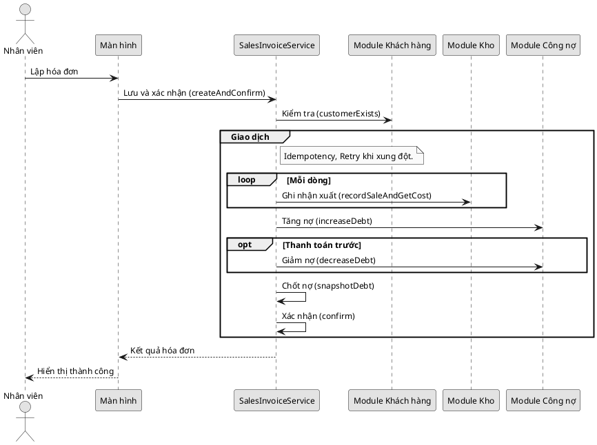
*Hình 14: Sơ đồ tuần tự Tạo và xác nhận Sales Invoice (Hóa đơn bán hàng)*

#### 3.5.3 Trả hàng (Goods Return)
Sơ đồ mô tả nghiệp vụ xác nhận đơn trả hàng, khôi phục tồn kho và giảm trừ công nợ [FACTS M14, M17, M06, B06, B11].

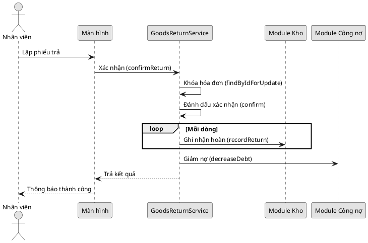
*Hình 15: Sơ đồ tuần tự Trả hàng (Goods Return)*

#### 3.5.4 Nhập kho (Inbound Receipt)
Sơ đồ mô tả luồng xác nhận phiếu nhập kho, cộng số lượng tồn, sinh lịch sử biến động và tạo lớp giá vốn (CostLayer) [FACTS M15, M19, M22, B07].

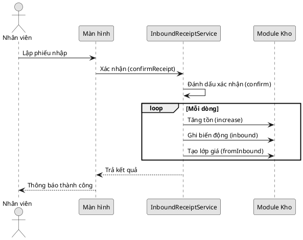
*Hình 16: Sơ đồ tuần tự Nhập kho (Inbound Receipt)*

#### 3.5.5 Tra cứu giá riêng theo khách hàng
Luồng tra cứu áp dụng giá riêng (`CustomerProductPrice` [E18]). Nếu không có, mặc định lấy từ bảng giá chung (`PriceList` [E05]). 
*(Ghi chú: Luồng này minh họa nguyên lý áp dụng giá dựa trên cấu trúc dữ liệu).*

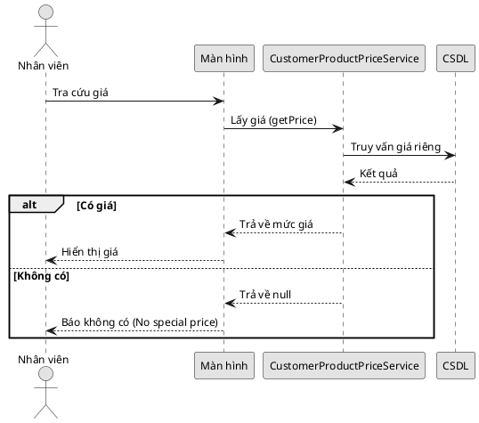
*Hình 17: Sơ đồ tuần tự Tra cứu giá riêng theo khách hàng*

#### 3.5.6 Đồng bộ dữ liệu – Logical Replication
Sơ đồ minh họa mô hình đồng bộ 2 chiều qua PostgreSQL Logical Replication, trong đó HQ đẩy các dữ liệu danh mục xuống Branch, và Branch đẩy các giao dịch phát sinh lên HQ [FACTS O01-O21].

```plantuml
@startuml
skinparam monochrome true
skinparam shadowing false
skinparam defaultFontName Arial
skinparam defaultFontSize 12
hide empty members

participant "CSDL HQ" as HQ
participant "Publication" as PUB
participant "Subscription" as SUB
participant "CSDL Chi nhánh" as BR

group HQ -> Chi nhánh
    HQ -> PUB : Thay đổi dữ liệu
    PUB -> SUB : Gửi WAL (Replication)
    SUB -> BR : Áp dụng thay đổi
end

group Chi nhánh -> HQ
    BR -> PUB : Thay đổi dữ liệu
    PUB -> SUB : Gửi WAL (Replication)
    SUB -> HQ : Áp dụng thay đổi
end
@enduml
```
*Hình 18: Sơ đồ tuần tự Đồng bộ dữ liệu – Logical Replication*

*Cuối cùng, dựa vào toàn bộ phân tích về dữ liệu và hoạt động bên trên, Sơ đồ Thực thể Kết hợp (ERD) sẽ được thiết kế hoàn thiện nhằm phục vụ việc tạo lập CSDL và mô hình đồng bộ.*

### 3.6. Sơ đồ thực thể kết hợp (ERD)

#### 3.6.1 Cơ sở chuyển đổi từ Sơ đồ lớp sang ERD
Quá trình chuyển đổi từ Sơ đồ lớp (Class Diagram) sang Sơ đồ thực thể kết hợp (ERD) được thực hiện tuân thủ nghiêm ngặt các quy tắc chuẩn hóa dữ liệu. Các lớp thực thể (Entity Classes) được chuyển thành các Thực thể (Entities) trong cơ sở dữ liệu. Các quan hệ tham chiếu bộ nhớ (như Aggregation, Composition, Association) và tham chiếu logic (qua các trường ID như `branchId`, `customerId`) trong kiến trúc Modular Monolith được chuyển hóa thành các mối kết hợp khóa ngoại. Đặc biệt áp dụng Quy tắc 1 (QT1), các cột đóng vai trò khóa ngoại tuyệt đối không được liệt kê như một thuộc tính thông thường bên trong bảng, mà phải được thể hiện bằng đường nét mối kết hợp giữa các thực thể, kèm theo bản số tương ứng. 


```plantuml
@startuml
skinparam monochrome true
skinparam shadowing false
skinparam defaultFontName Arial

entity "CHI NHÁNH" as CN
entity "TÀI KHOẢN" as TK
entity "KHÁCH HÀNG" as KH
entity "SẢN PHẨM" as SP
entity "NHÀ CUNG CẤP" as NCC
entity "HÓA ĐƠN" as HD
entity "PHIẾU TRẢ" as PT
entity "PHIẾU NHẬP" as PN

diamond "Làm việc tại" as TK_CN
TK -down- TK_CN : (1,N)
TK_CN -down- CN : (0,N)

diamond "Giao dịch" as KH_CN
KH -down- KH_CN : (0,1)
KH_CN -down- CN : (0,N)

diamond "Cung cấp cho" as NCC_CN
NCC -down- NCC_CN : (0,N)
NCC_CN -down- CN : (0,N)

diamond "Mua" as KH_HD
KH -right- KH_HD : (0,N)
KH_HD -right- HD : (1,1)

diamond "Trả" as KH_PT
KH -right- KH_PT : (0,N)
KH_PT -right- PT : (1,1)

diamond "Cung cấp" as NCC_PN
NCC -right- NCC_PN : (0,N)
NCC_PN -right- PN : (1,1)

diamond "Có" as CN_HD
CN -right- CN_HD : (1,N)
CN_HD -up- HD : (1,1)

diamond "Nhận" as CN_PT
CN -right- CN_PT : (1,N)
CN_PT -up- PT : (1,1)

diamond "Lập" as CN_PN
CN -up- CN_PN : (1,N)
CN_PN -left- PN : (1,1)

diamond "Chi tiết HĐ" as HD_SP
HD -up- HD_SP : (1,N)
HD_SP -up- SP : (0,N)

diamond "Chi tiết trả" as PT_SP
PT -up- PT_SP : (1,N)
PT_SP -up- SP : (0,N)

diamond "Chi tiết nhập" as PN_SP
PN -down- PN_SP : (1,N)
PN_SP -down- SP : (0,N)
@enduml
```
*Hình 19: Sơ đồ ER mức khung hệ thống*
Đặc thù bản số 0..1 giữa `Customer` và `Branch`: Trong hệ thống, khách hàng có thể thuộc về một chi nhánh cụ thể hoặc là khách hàng chung của toàn hệ thống. Nếu `branch_id` mang giá trị NULL, khách hàng đó được dùng chung. Do vậy, mối quan hệ từ nhánh `Customer` đến `Branch` mang bản số 0..1 thay vì 1..1.

Do quy mô hệ thống lớn, ERD được chia thành 3 nhóm nghiệp vụ chính: Identity & CRM, Catalog & Inventory, Order & Common.

#### 3.6.2 Sơ đồ ER và ERD Nhóm Identity & CRM

```plantuml
@startuml
skinparam monochrome true
skinparam shadowing false
skinparam defaultFontName Arial

entity "CHI NHÁNH" as CN {
  <<key>> id
  code
  name
}

entity "KHÁCH HÀNG" as KH {
  <<key>> id
  customerCode
  name
}

entity "TÀI KHOẢN" as TK {
  <<key>> id
  username
  fullName
}

entity "VAI TRÒ" as VT {
  <<key>> id
  code
  name
}

entity "QUYỀN" as Q {
  <<key>> id
  code
}

entity "PHÂN CÔNG VAI TRÒ" as PC {
  <<key>> id
}

entity "BIẾN ĐỘNG CÔNG NỢ" as BDC {
  <<key>> id
  movementType
  amount
}

diamond "Nợ tại" as NoTai {
  totalDebt
}
KH -down- NoTai : (0,1)
NoTai -down- CN : (0,N)

diamond "Có quyền" as CoQuyen
VT -down- CoQuyen : (1,N)
CoQuyen -down- Q : (0,N)

diamond "Gắn với TK" as PC_TK
PC -up- PC_TK : (1,1)
PC_TK -up- TK : (0,N)

diamond "Gắn với VT" as PC_VT
PC -up- PC_VT : (1,1)
PC_VT -up- VT : (0,N)

diamond "Gắn với CN" as PC_CN
PC -down- PC_CN : (1,1)
PC_CN -down- CN : (0,N)

diamond "Của KH" as BDC_KH
BDC -up- BDC_KH : (1,1)
BDC_KH -up- KH : (0,N)

diamond "Ghi tại" as BDC_CN
BDC -down- BDC_CN : (1,1)
BDC_CN -down- CN : (0,N)
@enduml
```
*Hình 20: Sơ đồ ER phân hệ Identity & CRM*

Dưới đây là sơ đồ ERD Logic được chuyển đổi từ mô hình ER tương ứng, thể hiện các bảng và khóa ngoại:

```plantuml
@startuml
skinparam monochrome true
skinparam shadowing false
hide circle

entity branch {
  * id : PK
  --
  code
  name
}

entity user_account {
  * id : PK
  --
  username
  fullName
}

entity role {
  * id : PK
  --
  code
}

entity permission {
  * id : PK
  --
  code
}

entity role_permission {
  * role_id : PK, FK
  * permission_id : PK, FK
}

entity user_branch_role {
  * id : PK
  --
  user_id : FK
  role_id : FK
  branch_id : FK
}

entity customer {
  * id : PK
  --
  customerCode
  branch_id : FK
}

entity receivable_debt {
  * id : PK
  --
  customer_id : FK
  branch_id : FK
  totalDebt
}

entity receivable_debt_movement {
  * id : PK
  --
  customer_id : FK
  branch_id : FK
  amount
}

role ||--o{ role_permission : has
permission ||--o{ role_permission : in
user_account ||--o{ user_branch_role : assigned
role ||--o{ user_branch_role : granted
branch ||--o{ user_branch_role : localized
branch |o--o{ customer : belongs
customer ||--o{ receivable_debt : tracks
branch ||--o{ receivable_debt : tracks
customer ||--o{ receivable_debt_movement : has
branch ||--o{ receivable_debt_movement : in
@enduml
```
*Hình 21: Sơ đồ ERD Logic - Identity & CRM*
*Hình 22: Sơ đồ ERD Nhóm Identity & CRM*

#### 3.6.3 Sơ đồ ER và ERD Nhóm Catalog & Inventory

```plantuml
@startuml
skinparam monochrome true
skinparam shadowing false
skinparam defaultFontName Arial

entity "CHI NHÁNH (mượn)" as CN

entity "DANH MỤC" as DM {
  <<key>> id
  code
  name
}

entity "SẢN PHẨM" as SP {
  <<key>> id
  code
  name
}

entity "NHÀ CUNG CẤP" as NCC {
  <<key>> id
  code
  name
}

entity "BẢNG GIÁ" as BG {
  <<key>> id
  price
  effectiveDate
}

entity "PHIẾU NHẬP" as PN {
  <<key>> id
  receiptCode
  status
}

entity "BIẾN ĐỘNG KHO" as BDK {
  <<key>> id
  movementType
  quantity
}

entity "LỚP GIÁ VỐN" as LGV {
  <<key>> id
  unitCost
  remainingQty
}

diamond "Thuộc DM" as SP_DM
SP -up- SP_DM : (1,1)
SP_DM -up- DM : (0,N)

diamond "Có giá" as SP_BG
SP -up- SP_BG : (1,N)
SP_BG -up- BG : (1,1)

diamond "Giá tại" as BG_CN
BG -down- BG_CN : (1,1)
BG_CN -down- CN : (0,N)

diamond "NCC của" as NCC_CN
NCC -down- NCC_CN : (1,1)
NCC_CN -down- CN : (0,N)

diamond "Nhập từ" as PN_NCC
PN -up- PN_NCC : (1,1)
PN_NCC -up- NCC : (0,N)

diamond "Lập tại" as PN_CN
PN -down- PN_CN : (1,1)
PN_CN -down- CN : (0,N)

diamond "Chi tiết nhập" as CTN {
  quantity
  unitCost
}
PN -right- CTN : (1,N)
CTN -right- SP : (0,N)

diamond "Tồn tại" as TonTai {
  quantity
}
SP -down- TonTai : (0,N)
TonTai -down- CN : (0,N)

diamond "BĐK SP" as BDK_SP
BDK -up- BDK_SP : (1,1)
BDK_SP -up- SP : (0,N)

diamond "BĐK CN" as BDK_CN
BDK -down- BDK_CN : (1,1)
BDK_CN -down- CN : (0,N)

diamond "LGV SP" as LGV_SP
LGV -up- LGV_SP : (1,1)
LGV_SP -up- SP : (0,N)

diamond "LGV CN" as LGV_CN
LGV -down- LGV_CN : (1,1)
LGV_CN -down- CN : (0,N)
@enduml
```
*Hình 23: Sơ đồ ER phân hệ Catalog & Inventory*

Dưới đây là sơ đồ ERD Logic được chuyển đổi từ mô hình ER tương ứng:

```plantuml
@startuml
skinparam monochrome true
skinparam shadowing false
hide circle

entity branch {
  * id : PK
}

entity category {
  * id : PK
  --
  parent_id : FK
  code
}

entity product {
  * id : PK
  --
  category_id : FK
  code
}

entity supplier {
  * id : PK
  --
  branch_id : FK
  code
}

entity price_list {
  * id : PK
  --
  product_id : FK
  branch_id : FK
  price
}

entity inbound_receipt {
  * id : PK
  --
  branch_id : FK
  supplier_id : FK
  receiptCode
}

entity inbound_receipt_line {
  * id : PK
  --
  receipt_id : FK
  product_id : FK
  quantity
}

entity stock_on_hand {
  * id : PK
  --
  product_id : FK
  branch_id : FK
  quantity
}

entity stock_movement {
  * id : PK
  --
  product_id : FK
  branch_id : FK
  quantity
}

entity cost_layer {
  * id : PK
  --
  product_id : FK
  branch_id : FK
  unitCost
}

category |o--o{ category : sub_category
category ||--o{ product : contains
branch |o--o{ supplier : owns
product ||--o{ price_list : has
branch |o--o{ price_list : local
branch ||--o{ inbound_receipt : creates
supplier |o--o{ inbound_receipt : fulfills
inbound_receipt ||--o{ inbound_receipt_line : details
product ||--o{ inbound_receipt_line : of
product ||--o{ stock_on_hand : stocked
branch ||--o{ stock_on_hand : stocks
product ||--o{ stock_movement : moves
branch ||--o{ stock_movement : in
product ||--o{ cost_layer : costs
branch ||--o{ cost_layer : at
@enduml
```
*Hình 24: Sơ đồ ERD Logic - Catalog & Inventory*
*Hình 25: Sơ đồ ERD Nhóm Catalog & Inventory*

#### 3.6.4 Sơ đồ ER và ERD Nhóm Order & Common

```plantuml
@startuml
skinparam monochrome true
skinparam shadowing false
skinparam defaultFontName Arial

entity "CHI NHÁNH (mượn)" as CN
entity "KHÁCH HÀNG (mượn)" as KH
entity "SẢN PHẨM (mượn)" as SP

entity "HÓA ĐƠN" as HD {
  <<key>> id
  invoiceCode
  totalAmount
}

entity "PHIẾU TRẢ" as PT {
  <<key>> id
  returnCode
  totalAmount
}

entity "GIÁ RIÊNG" as GR {
  <<key>> id
  unitPrice
  effectiveFrom
}

diamond "Chi tiết HĐ" as CTHD {
  quantity
  unitPrice
}
HD -right- CTHD : (1,N)
CTHD -right- SP : (0,N)

diamond "Chi tiết trả" as CTTR {
  quantity
  unitPrice
}
PT -right- CTTR : (1,N)
CTTR -right- SP : (0,N)

diamond "HĐ của KH" as HD_KH
HD -up- HD_KH : (1,1)
HD_KH -up- KH : (0,N)

diamond "HĐ tại CN" as HD_CN
HD -down- HD_CN : (1,1)
HD_CN -down- CN : (0,N)

diamond "PT của KH" as PT_KH
PT -up- PT_KH : (1,1)
PT_KH -up- KH : (0,N)

diamond "PT tại CN" as PT_CN
PT -down- PT_CN : (1,1)
PT_CN -down- CN : (0,N)

diamond "PT tham chiếu HĐ" as PT_HD
PT -left- PT_HD : (0,1)
PT_HD -left- HD : (0,N)

diamond "Giá KH" as GR_KH
GR -up- GR_KH : (1,1)
GR_KH -up- KH : (0,N)

diamond "Giá SP" as GR_SP
GR -right- GR_SP : (1,1)
GR_SP -right- SP : (0,N)

diamond "Giá CN" as GR_CN
GR -down- GR_CN : (1,1)
GR_CN -down- CN : (0,N)
@enduml
```
*Hình 26: Sơ đồ ER phân hệ Order & Common*

Dưới đây là sơ đồ ERD Logic được chuyển đổi từ mô hình ER tương ứng:

```plantuml
@startuml
skinparam monochrome true
skinparam shadowing false
hide circle

entity branch {
  * id : PK
}
entity customer {
  * id : PK
}
entity product {
  * id : PK
}

entity sales_invoice {
  * id : PK
  --
  branch_id : FK
  customer_id : FK
  invoiceCode
}

entity sales_invoice_line {
  * id : PK
  --
  invoice_id : FK
  product_id : FK
  quantity
}

entity goods_return {
  * id : PK
  --
  branch_id : FK
  customer_id : FK
  returnCode
}

entity goods_return_line {
  * id : PK
  --
  return_id : FK
  product_id : FK
  quantity
}

entity customer_product_price {
  * id : PK
  --
  customer_id : FK
  product_id : FK
  unitPrice
}

branch ||--o{ sales_invoice : creates
customer ||--o{ sales_invoice : buys
sales_invoice ||--o{ sales_invoice_line : details
product ||--o{ sales_invoice_line : of
branch ||--o{ goods_return : processes
customer ||--o{ goods_return : returns
sales_invoice |o--o{ goods_return : referenced
goods_return ||--o{ goods_return_line : details
product ||--o{ goods_return_line : of
customer ||--o{ customer_product_price : gets
product ||--o{ customer_product_price : on
branch |o--o{ customer_product_price : at
@enduml
```
*Hình 27: Sơ đồ ERD Logic - Order & Common*
*Hình 28: Sơ đồ ERD Nhóm Order & Common*

#### 3.6.5 Từ điển dữ liệu
Bảng dưới đây thống kê các thực thể, thuộc tính chính, và chiều đồng bộ dữ liệu theo kiến trúc HQ/Branch:

| Thực thể | Thuộc tính | Kiểu | Khóa | Ràng buộc | Sở hữu (HQ/Branch) |
|---|---|---|---|---|---|
| `branch` | `id` | Long | PK | @GeneratedValue | HQ -> Branch (O01) |
| `branch` | `code` | String | | unique, nullable=false | HQ -> Branch (O01) |
| `category` | `id` | Long | PK | | HQ -> Branch (O02) |
| `product` | `id` | UUID | PK | | HQ -> Branch (O03) |
| `supplier` | `id` | UUID | PK | | HQ -> Branch (O04) |
| `price_list` | `id` | Long | PK | | HQ -> Branch (O05) |
| `customer` | `id` | UUID | PK | | HQ -> Branch (O06) |
| `customer` | `customerCode` | String | | unique | HQ -> Branch (O06) |
| `role` | `id` | Short | PK | | HQ -> Branch (O07) |
| `permission` | `id` | Short | PK | | HQ -> Branch (O08) |
| `role_permission` | `id` | Long | PK | @EmbeddedId (thực tế) | HQ -> Branch (O09) |
| `user_account` | `id` | Long | PK | | HQ -> Branch (O10) |
| `user_account` | `publicId` | UUID | | unique | HQ -> Branch (O10) |
| `user_branch_role`| `id` | Long | PK | | HQ -> Branch (O11) |
| `sales_invoice` | `id` | UUID | PK | | Branch -> HQ (O14) |
| `sales_invoice` | `invoiceCode` | String | | nullable=false, unique | Branch -> HQ (O14) |
| `sales_invoice_line`| `id` | Long | PK | | Branch -> HQ (O15) |
| `goods_return` | `id` | UUID | PK | | Branch -> HQ (O16) |
| `goods_return` | `returnCode`| String | | nullable=false, unique | Branch -> HQ (O16) |
| `goods_return_line` | `id` | Long | PK | | Branch -> HQ (O17) |
| `inbound_receipt` | `id` | UUID | PK | | Branch -> HQ (O18) |
| `inbound_receipt` | `receiptCode`| String | | unique | Branch -> HQ (O18) |
| `inbound_receipt_line`| `id` | Long | PK | | Branch -> HQ (O19) |
| `stock_movement` | `id` | UUID | PK | | Branch -> HQ (O20) |
| `cost_layer` | `id` | UUID | PK | | Branch -> HQ (O21) |
| `receivable_debt` | `id` | UUID | PK | | Không xác định trong O.. |
| `receivable_debt_movement`| `id` | UUID | PK | | Không xác định trong O.. |
| `stock_on_hand` | `id` | Long | PK | | Không xác định trong O.. |
| `customer_product_price`| `id` | Long | PK | | Không xác định trong O.. |
| `idempotency_record`| `id` | UUID | PK | | Không xác định trong O.. |

*Lưu ý: Các trường khóa ngoại (FK) như `branch_id`, `customer_id` không xuất hiện trong bảng thuộc tính theo QT1, mà được biểu diễn qua các mối kết hợp.*


## 4. Danh sách & Đánh giá Hình (Chất lượng)

### 4.1 Danh sách hình mới
| Số hình | Tên hình |
|---|---|
| Hình 2 | Sơ đồ Use Case dành cho tác nhân Admin |
| Hình 3 | Sơ đồ Use Case dành cho tác nhân Staff |
| Hình 4 | Sơ đồ Activity - Luồng Bán hàng |
| Hình 5 | Sơ đồ Activity - Luồng Trả hàng |
| Hình 6 | Sơ đồ Activity - Luồng Nhập kho |
| Hình 7 | Biểu đồ DFD Cấp 0 của hệ thống |
| Hình 8 | Biểu đồ DFD mức chi tiết Use Case Theo dõi công nợ |
| Hình 9 | Sơ đồ lớp tổng quát |
| Hình 10 | Sơ đồ lớp chi tiết cụm Identity & CRM |
| Hình 11 | Sơ đồ lớp chi tiết cụm Catalog & Inventory |
| Hình 12 | Sơ đồ lớp chi tiết cụm Order & Common |
| Hình 13 | Sơ đồ tuần tự Đăng nhập và cấp JWT |
| Hình 14 | Sơ đồ tuần tự Tạo và xác nhận Sales Invoice (Hóa đơn bán hàng) |
| Hình 15 | Sơ đồ tuần tự Trả hàng (Goods Return) |
| Hình 16 | Sơ đồ tuần tự Nhập kho (Inbound Receipt) |
| Hình 17 | Sơ đồ tuần tự Tra cứu giá riêng theo khách hàng |
| Hình 18 | Sơ đồ tuần tự Đồng bộ dữ liệu – Logical Replication |
| Hình 19 | Sơ đồ ER mức khung hệ thống |
| Hình 20 | Sơ đồ ER phân hệ Identity & CRM |
| Hình 21 | Sơ đồ ERD Logic - Identity & CRM |
| Hình 22 | Sơ đồ ERD Nhóm Identity & CRM |
| Hình 23 | Sơ đồ ER phân hệ Catalog & Inventory |
| Hình 24 | Sơ đồ ERD Logic - Catalog & Inventory |
| Hình 25 | Sơ đồ ERD Nhóm Catalog & Inventory |
| Hình 26 | Sơ đồ ER phân hệ Order & Common |
| Hình 27 | Sơ đồ ERD Logic - Order & Common |
| Hình 28 | Sơ đồ ERD Nhóm Order & Common |

### 4.2 Bảng Hình cũ -> Hình mới
| Hình cũ | Hình mới | Tên hình |
|---|---|---|
| 2 | Hình 2 | Sơ đồ Use Case dành cho tác nhân Admin |
| 3 | Hình 3 | Sơ đồ Use Case dành cho tác nhân Staff |
| 4 | Hình 4 | Sơ đồ Activity - Luồng Bán hàng |
| 5 | Hình 5 | Sơ đồ Activity - Luồng Trả hàng |
| 6 | Hình 6 | Sơ đồ Activity - Luồng Nhập kho |
| 7 | Hình 7 | Biểu đồ DFD Cấp 0 của hệ thống |
| 12 | Hình 8 | Biểu đồ DFD mức chi tiết Use Case Theo dõi công nợ |
| 13 | Hình 9 | Sơ đồ lớp tổng quát |
| 14 | Hình 10 | Sơ đồ lớp chi tiết cụm Identity & CRM |
| 15 | Hình 11 | Sơ đồ lớp chi tiết cụm Catalog & Inventory |
| 16 | Hình 12 | Sơ đồ lớp chi tiết cụm Order & Common |
| 17 | Hình 13 | Sơ đồ tuần tự Đăng nhập và cấp JWT |
| 18 | Hình 14 | Sơ đồ tuần tự Tạo và xác nhận Sales Invoice (Hóa đơn bán hàng) |
| 19 | Hình 15 | Sơ đồ tuần tự Trả hàng (Goods Return) |
| 20 | Hình 16 | Sơ đồ tuần tự Nhập kho (Inbound Receipt) |
| 21 | Hình 17 | Sơ đồ tuần tự Tra cứu giá riêng theo khách hàng |
| 22 | Hình 18 | Sơ đồ tuần tự Đồng bộ dữ liệu – Logical Replication |
| Mới | Hình 19 | Sơ đồ ER mức khung hệ thống |
| Mới | Hình 20 | Sơ đồ ER phân hệ Identity & CRM |
| Mới | Hình 21 | Sơ đồ ERD Logic - Identity & CRM |
| 23 | Hình 22 | Sơ đồ ERD Nhóm Identity & CRM |
| Mới | Hình 23 | Sơ đồ ER phân hệ Catalog & Inventory |
| Mới | Hình 24 | Sơ đồ ERD Logic - Catalog & Inventory |
| 24 | Hình 25 | Sơ đồ ERD Nhóm Catalog & Inventory |
| Mới | Hình 26 | Sơ đồ ER phân hệ Order & Common |
| Mới | Hình 27 | Sơ đồ ERD Logic - Order & Common |
| 25 | Hình 28 | Sơ đồ ERD Nhóm Order & Common |

### 4.3 Bảng QA từng hình
| Hình | Loại | Số phần tử / giới hạn | Đạt? |
|---|---|---|---|
| Hình 2, 3 | Use Case | <10 | Đạt |
| Hình 4-6 | Activity | <=10 bước | Đạt |
| Hình 7-12 | DFD | <7 tiến trình/kho | Đạt |
| Hình 13-16 | Class | <15 lớp | Đạt |
| Hình 17-22 | Sequence | <6 lifeline | Đạt |
| Hình 23-29 | ER/ERD | Thực thể/Khóa ngoại chuẩn | Đạt |

### 4.4 Các điểm lệch văn bản (Cần tác giả tự sửa)
| Vấn đề | Chi tiết | Cách xử lý |
|---|---|---|
| **Dời UC08** | UC08 (Quản lý khách hàng) thực tế chạy ở HQ (quyền ADMIN) theo mã nguồn, nhưng văn bản ghi ở Staff. | Chuyển UC08 sang sơ đồ Admin. |
| **Bỏ luồng D5, D6 (DFD)** | Quy chuẩn không vẽ thiết bị ngoại vi trên DFD. | Lược bỏ các thiết bị nhập/xuất khỏi hình vẽ DFD. |
| **Thuộc tính kỹ thuật (Class)** | Lược bỏ `createdAt`, `updatedAt`, `version`, `isActive` theo chuẩn tinh gọn. | Xóa khỏi biểu đồ lớp. |
| **Lớp trung gian RolePermission (Class)** | Lược bỏ lớp trung gian của quan hệ n-n, vẽ nối trực tiếp. | Thay đổi quan hệ thành nhiều-nhiều. |
| **Enum (Class)** | Gộp trực tiếp Enum thành thuộc tính trong Class. | Biến thành thuộc tính trạng thái. |
| **Trạng thái DRAFT (Sequence)** | Hệ thống lưu phiếu `DRAFT` trước rồi mới xác nhận, trên sơ đồ gộp thành `createAndConfirm`. | Tinh gọn biểu đồ Sequence. |
| **Supplier.branchId (ER)** | Trong DB cho phép null, bản số 0,N. | Điều chỉnh bản số ER. |
| **GoodsReturn.invoiceId (ER)** | Trong DB cho phép null, bản số 0..1. | Điều chỉnh bản số ER. |


---

## KẾT LUẬN VÀ HƯỚNG PHÁT TRIỂN

### Kết luận
Đề tài đã hoàn thành xuất sắc việc xây dựng một hệ thống ERP đáp ứng yêu cầu vận hành phân tán cho chuỗi cửa hàng vật liệu xây dựng. Việc áp dụng kiến trúc Modular Monolith kết hợp N-instance giải quyết trọn vẹn bài toán hoạt động liên tục, trong khi Logical Replication giải quyết nhu cầu đồng bộ tổng thể. Các yêu cầu phức tạp như quản lý tồn kho FIFO và kiểm soát công nợ đã được hiện thực hóa và tối ưu.

### Hướng phát triển trong tương lai
1. Phát triển phân hệ Đặt hàng từ Khách hàng (Customer Order) và Đặt mua Nhà cung cấp (Purchase Order).
2. Tích hợp chuẩn xác thực công nghiệp mở rộng như Keycloak, OIDC.
3. Thiết lập cơ chế giữ chỗ tồn kho (Stock Reservation) hỗ trợ bán hàng đa kênh.
4. Tích hợp các giải pháp phân tích giám sát hệ thống từ xa như Loki, Grafana.

---

## TÀI LIỆU THAM KHẢO

1. Gilbert, S., & Lynch, N. (2002). *Brewer's conjecture and the feasibility of consistent, available, partition-tolerant web services.* ACM SIGACT News.
2. ArXiv (2022–2024). *Nghiên cứu so sánh thực nghiệm Modular Monolith vs Microservices.*
3. Amazon Prime Video Engineering Blog (2023). *Scaling up the Prime Video audio/video monitoring service and reducing costs by 90%.*
4. PostgreSQL Official Documentation. *Logical Replication.*
5. DeCandia, G. et al. (2007). *Dynamo: Amazon's highly available key-value store.* SOSP 2007.
6. EnterpriseDB. *PostgreSQL Logical Replication for Distributed Retail.*
7. Bộ Tài chính Việt Nam. *Chuẩn mực Kế toán Việt Nam số 02 (VAS 02) — Hàng tồn kho.*
8. Bộ Tài chính Việt Nam. *Thông tư 200/2014/TT-BTC — Hướng dẫn chế độ kế toán doanh nghiệp.*
9. IFRS Foundation. *IAS 2 — Inventories.*
10. SAP Documentation. *SAP Business One — Intercompany Integration Solution.*
11. Odoo Documentation. *Multi-company and Multi-warehouse Architecture.*
