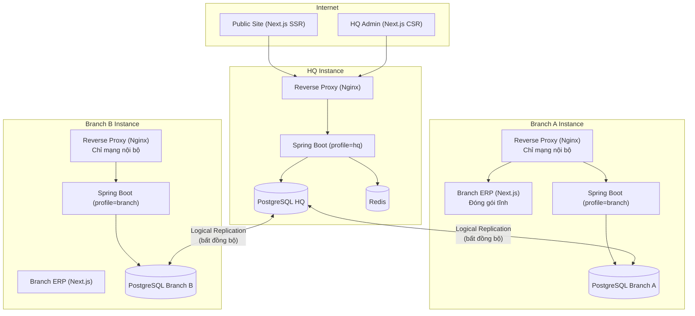
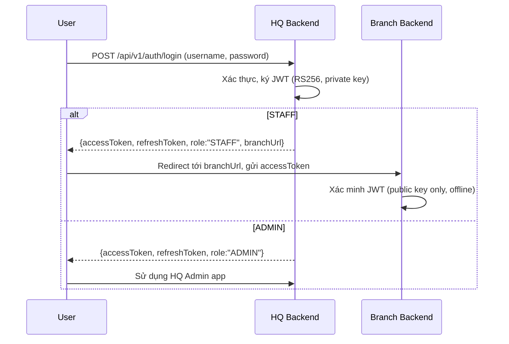
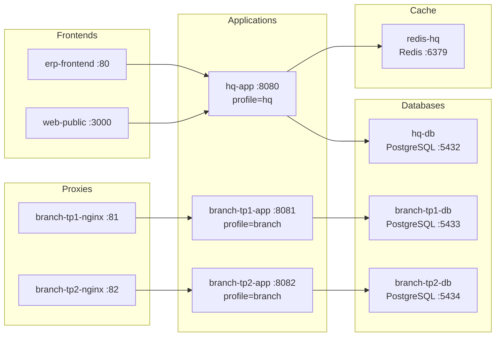

# BÁO CÁO TỔNG QUAN HỆ THỐNG
## Website & ERP Cửa hàng Vật liệu Xây dựng & Thiết bị Thông minh Nhà

> **Phiên bản kiến trúc:** v4  
> **Ngày cập nhật:** 2026-08-26

---

## MỤC LỤC

1. [Giới thiệu dự án](#1-giới-thiệu-dự-án)
2. [Yêu cầu hệ thống](#2-yêu-cầu-hệ-thống)
3. [Kiến trúc tổng thể](#3-kiến-trúc-tổng-thể)
4. [Thiết kế cơ sở dữ liệu](#4-thiết-kế-cơ-sở-dữ-liệu)
5. [Danh sách API Endpoints](#5-danh-sách-api-endpoints)
6. [Bảo mật & Phân quyền](#6-bảo-mật--phân-quyền)
7. [Hạ tầng triển khai](#7-hạ-tầng-triển-khai)
8. [Cross-cutting Concerns (AOP)](#8-cross-cutting-concerns)
9. [Trạng thái hiện tại & Testing](#9-trạng-thái-hiện-tại--testing)

---

## 1. Giới thiệu dự án

### 1.1. Bài toán

Cửa hàng vật liệu xây dựng và thiết bị thông minh nhà (VLXD & TTNT) hoạt động theo mô hình **chuỗi chi nhánh** — 1 trụ sở chính (HQ) quản lý tập trung danh mục sản phẩm, giá niêm yết, khách hàng; mỗi chi nhánh tự vận hành nghiệp vụ bán hàng, kho, công nợ độc lập.

**Thách thức chính:**
- Chi nhánh cần hoạt động **liên tục** kể cả khi mất kết nối tới HQ
- Dữ liệu master (sản phẩm, giá, khách hàng) phải **đồng bộ** từ HQ xuống các chi nhánh
- Hệ thống phải đảm bảo **tính toàn vẹn dữ liệu** trong môi trường phân tán

### 1.2. Phạm vi hệ thống

| Thành phần | Mô tả |
|---|---|
| **Website công khai** | Giới thiệu cửa hàng, danh mục sản phẩm, nhận yêu cầu báo giá (RFQ) |
| **ERP chi nhánh** | Bán hàng, quản lý kho, công nợ, đặt hàng khách, trả hàng, mua hàng NCC |
| **Quản trị HQ** | CRUD sản phẩm/danh mục/giá, quản lý chi nhánh & người dùng, Dashboard tổng hợp |

### 1.3. Công nghệ sử dụng

| Lớp | Công nghệ |
|---|---|
| Backend | Java 21, Spring Boot 3.4.0, Spring Security, Spring Data JPA, Spring AOP |
| Cơ sở dữ liệu | PostgreSQL 15 (Logical Replication), Redis 7 (HQ only) |
| Frontend | Next.js (3 ứng dụng độc lập: `public-site`, `hq-admin`, `branch-erp`) |
| Xác thực | JWT RS256 (thư viện jjwt 0.12.5) |
| Triển khai | Docker, Docker Compose, Nginx |
| Testing | JUnit 5, Mockito, H2 in-memory, Spring Boot Test |
| Tài liệu API | SpringDoc OpenAPI (Swagger UI) |
| Khác | Lombok, MapStruct, Spring Retry, Apache POI (Excel), OpenPDF |

---

## 2. Yêu cầu hệ thống

### 2.1. Yêu cầu chức năng

#### Nhóm 1 — Bán hàng (Sales)
| Mã | Chức năng | Mô tả tóm tắt |
|---|---|---|
| FR01 | Tạo hoá đơn bán hàng | Tạo draft → xác nhận, tự động trừ kho và cập nhật công nợ |
| FR02 | Cho phép bán khống (âm kho) | Hệ thống cho phép tồn kho âm có kiểm soát |
| FR03 | Snapshot giá vốn | Lưu cứng giá vốn trung bình tại thời điểm bán |
| FR04 | Snapshot công nợ | Lưu cứng số dư nợ trước/sau lên hoá đơn |
| FR05 | Giá riêng theo khách hàng | Lưu giá bán gần nhất cho từng cặp khách hàng × sản phẩm |

#### Nhóm 2 — Đặt hàng & Trả hàng
| Mã | Chức năng | Mô tả tóm tắt |
|---|---|---|
| FR06 | Đơn đặt hàng khách (Customer Order) | Ghi nhận đặt hàng trước, tự động tạo hoá đơn khi xác nhận |
| FR07 | Trả hàng (Goods Return) | Nhận lại hàng từ khách, cộng lại kho, giảm công nợ |
| FR08 | Kiểm tra vượt số lượng trả hàng | Không cho trả nhiều hơn số lượng đã bán trong hoá đơn gốc |

#### Nhóm 3 — Kho (Inventory)
| Mã | Chức năng | Mô tả tóm tắt |
|---|---|---|
| FR09 | Phiếu nhập kho (Inbound Receipt) | Nhập hàng từ nhà cung cấp, tăng tồn kho, tính giá vốn trung bình |
| FR10 | Phiếu xuất kho (Outbound Receipt) | Xuất kho nội bộ (chuyển kho, hư hỏng) |
| FR11 | Chuyển kho nội bộ (Stock Transfer) | Chuyển hàng giữa 2 chi nhánh: Request → Ship → Receive |
| FR12 | Xem tồn kho thời gian thực | Tra cứu số lượng tồn theo sản phẩm × chi nhánh |

#### Nhóm 4 — Mua hàng (Procurement)
| Mã | Chức năng | Mô tả tóm tắt |
|---|---|---|
| FR13 | Đơn đặt hàng NCC (Purchase Order) | Theo dõi tiến độ nhập hàng từ nhà cung cấp |
| FR14 | Tự động khớp PO khi nhập kho | InboundReceipt liên kết PO, cập nhật `received_quantity` |

#### Nhóm 5 — Quản lý chung
| Mã | Chức năng | Mô tả tóm tắt |
|---|---|---|
| FR15 | CRUD Sản phẩm & Danh mục | Quản lý master data, thuộc tính động (EAV), cache JSONB |
| FR16 | CRUD Khách hàng | Quản lý thông tin khách hàng (master data tại HQ) |
| FR17 | CRUD Chi nhánh | Quản lý thông tin chi nhánh |
| FR18 | Quản lý người dùng & Phân quyền | RBAC 2 role (STAFF/ADMIN) |
| FR19 | Yêu cầu báo giá (RFQ) | Khách hàng gửi RFQ qua public site, Admin claim cho chi nhánh |

#### Nhóm 6 — Báo cáo & Phân tích
| Mã | Chức năng | Mô tả tóm tắt |
|---|---|---|
| FR20 | Dashboard tổng hợp | Doanh thu, lợi nhuận, sản phẩm bán chạy (star-schema, ETL) |
| FR21 | Cảnh báo tồn kho thấp | Cấu hình ngưỡng, gửi thông báo khi dưới mức tối thiểu |
| FR22 | Xuất báo cáo Excel/PDF | Xuất dữ liệu dashboard sang file |

### 2.2. Yêu cầu phi chức năng

| Nhóm | Yêu cầu |
|---|---|
| **Hiệu năng** | Trang bán hàng phản hồi < 500ms cho nghiệp vụ tạo hoá đơn |
| **Sẵn sàng cao** | Chi nhánh hoạt động độc lập khi mất kết nối HQ |
| **Nhất quán dữ liệu** | Eventual consistency qua PostgreSQL Logical Replication |
| **Bảo mật** | JWT RS256, RBAC 2 role, 3 lớp phòng thủ (network/app/DB) |
| **Khả năng mở rộng** | Thêm chi nhánh = thêm 1 instance + 1 DB, không sửa code |
| **Khả năng bảo trì** | Cùng 1 artifact, khác cấu hình qua Spring Profiles |

---

## 3. Kiến trúc tổng thể

### 3.1. Mô hình kiến trúc

**Modular Monolith** — Một mã nguồn Java duy nhất, triển khai thành **N+1 instance** riêng biệt:
- **1 instance HQ** (trụ sở): quản lý master data, xác thực, dashboard
- **N instance Branch** (chi nhánh): vận hành nghiệp vụ bán hàng/kho/công nợ

### 3.2. Sơ đồ tổng thể



### 3.3. Nguyên tắc phân tách HQ / Branch

| Khía cạnh | HQ | Branch |
|---|---|---|
| **Chức năng** | CRUD master data, Auth, Dashboard, RFQ claim | Bán hàng, Kho, Công nợ, Đặt hàng, Trả hàng |
| **JWT** | Ký (private key) + Xác minh (public key) | Chỉ xác minh (public key) |
| **Redis** | Có (cache catalog, token revocation) | Không có |
| **Master data** | Đọc + Ghi | Chỉ đọc (nhận qua replication) |
| **Kết nối mạng** | Public internet | Chỉ mạng nội bộ / VPN chi nhánh |

### 3.4. Kiến trúc Frontend — 3 ứng dụng độc lập

```
apps/
 ├── public-site/     → Next.js SSR/SSG, deploy tập trung (CDN)
 ├── hq-admin/        → Next.js CSR, deploy cùng HQ
 └── branch-erp/      → Next.js CSR, đóng gói tĩnh cùng Docker image mỗi Branch

packages/
 └── ui-shared/       → Design system dùng chung (component, style tokens)
```

**Lý do tách 3 app:** Tập người dùng không giao nhau (STAFF ≠ ADMIN), ràng buộc triển khai khác nhau (branch-erp phải chạy offline), giảm bề mặt tấn công.

---

## 4. Thiết kế cơ sở dữ liệu

### 4.1. Nguyên tắc thiết kế

- **Chuẩn 3NF trước** — Mọi bảng đạt 3NF trước khi cân nhắc denormalize
- **Denormalize có chủ đích** — Chỉ phá chuẩn ở các điểm đã đánh dấu `[DENORMALIZED]` kèm lý do
- **UUID cho giao dịch** — Tránh xung đột PK khi hợp nhất dữ liệu từ nhiều chi nhánh
- **Cho phép tồn kho âm** — Quyết định nghiệp vụ đã chốt (bán khống có kiểm soát)
- **Optimistic Locking** — Cột `version` trên `stock_on_hand`, `customer_order_line`

### 4.2. Sơ đồ quan hệ thực thể (ER Diagram)

```mermaid
erDiagram
    %% ===== IDENTITY =====
    branch {
        BIGSERIAL id PK
        VARCHAR code UK
        VARCHAR name
        VARCHAR internal_url
        BOOLEAN is_active
    }
    user_account {
        BIGSERIAL id PK
        VARCHAR username UK
        VARCHAR password_hash
        VARCHAR full_name
        BOOLEAN is_active
    }
    role {
        SMALLSERIAL id PK
        VARCHAR code UK
        VARCHAR name
    }
    user_branch_role {
        BIGSERIAL id PK
        BIGINT user_id FK
        SMALLINT role_id FK
        BIGINT branch_id FK
    }
    user_account ||--o{ user_branch_role : "has roles"
    role ||--o{ user_branch_role : "assigned to"
    branch ||--o{ user_branch_role : "scoped to"

    %% ===== CATALOG =====
    category {
        BIGSERIAL id PK
        BIGINT parent_id FK
        VARCHAR code UK
        VARCHAR name
    }
    product {
        BIGSERIAL id PK
        BIGINT category_id FK
        VARCHAR sku UK
        VARCHAR name
        JSONB attributes_cache
    }
    price_list {
        BIGSERIAL id PK
        BIGINT product_id FK
        BIGINT branch_id FK
        NUMERIC price
        DATE effective_date
    }
    category ||--o{ product : "contains"
    category ||--o{ category : "parent/child"
    product ||--o{ price_list : "priced at"

    %% ===== CRM =====
    customer {
        BIGSERIAL id PK
        VARCHAR code UK
        VARCHAR full_name
        VARCHAR customer_type
    }
    receivable_debt {
        BIGINT customer_id PK
        BIGINT branch_id PK
        NUMERIC current_balance
    }
    customer ||--o{ receivable_debt : "owes"

    %% ===== ORDER =====
    sales_invoice {
        UUID id PK
        VARCHAR invoice_no
        BIGINT customer_id FK
        BIGINT branch_id FK
        VARCHAR status
        NUMERIC total_amount
        NUMERIC previous_debt
        NUMERIC remaining_debt
    }
    sales_invoice_line {
        BIGSERIAL id PK
        UUID invoice_id FK
        BIGINT product_id FK
        NUMERIC quantity
        NUMERIC unit_price
        NUMERIC unit_cost_snapshot
    }
    customer_order {
        UUID id PK
        VARCHAR order_no
        BIGINT customer_id FK
        BIGINT branch_id FK
        VARCHAR status
    }
    goods_return {
        UUID id PK
        VARCHAR return_no
        BIGINT customer_id FK
        BIGINT branch_id FK
        UUID original_invoice_id FK
        VARCHAR status
    }
    customer ||--o{ sales_invoice : "buys"
    sales_invoice ||--|{ sales_invoice_line : "has lines"
    product ||--o{ sales_invoice_line : "sold as"
    customer ||--o{ customer_order : "orders"
    customer ||--o{ goods_return : "returns"
    sales_invoice ||--o{ goods_return : "returned from"

    %% ===== INVENTORY =====
    stock_on_hand {
        BIGINT product_id PK
        BIGINT branch_id PK
        NUMERIC quantity
        NUMERIC avg_cost
        BIGINT version
    }
    inbound_receipt {
        UUID id PK
        VARCHAR receipt_no
        BIGINT branch_id FK
        VARCHAR status
    }
    outbound_receipt {
        UUID id PK
        VARCHAR receipt_no
        BIGINT branch_id FK
        VARCHAR reason
        VARCHAR status
    }
    stock_transfer {
        UUID id PK
        VARCHAR transfer_no
        BIGINT from_branch_id FK
        BIGINT to_branch_id FK
        VARCHAR status
    }
    product ||--o{ stock_on_hand : "stocked at"
    branch ||--o{ stock_on_hand : "holds"

    %% ===== PROCUREMENT =====
    supplier {
        BIGSERIAL id PK
        BIGINT branch_id FK
        VARCHAR code
        VARCHAR name
    }
    supplier_purchase_order {
        UUID id PK
        VARCHAR po_no
        BIGINT supplier_id FK
        BIGINT branch_id FK
        VARCHAR status
    }
    supplier ||--o{ supplier_purchase_order : "supplies"
```



### 4.3. Phân loại bảng theo mô hình Hub-and-Spoke

#### Bảng Master (HQ → Branch, chỉ đọc tại Branch)
| Bảng | Module | Mô tả |
|---|---|---|
| `branch` | Identity | Danh sách chi nhánh |
| `user_account` | Identity | Tài khoản người dùng |
| `role`, `permission`, `role_permission` | Identity | Phân quyền |
| `user_branch_role` | Identity | Gán quyền cho user tại chi nhánh |
| `product` | Catalog | Sản phẩm (bao gồm `attributes_cache` JSONB) |
| `category` | Catalog | Danh mục sản phẩm (cấu trúc cây) |
| `attribute_definition`, `category_attribute` | Catalog | Định nghĩa thuộc tính động (EAV) |
| `product_attribute_value` | Catalog | Giá trị thuộc tính sản phẩm |
| `price_list` | Catalog | Giá niêm yết theo chi nhánh + ngày hiệu lực |
| `unit_of_measure`, `unit_conversion` | Catalog | Đơn vị tính và quy đổi |
| `customer` | CRM | Khách hàng |

#### Bảng Branch-local (mỗi chi nhánh giữ dữ liệu riêng)
| Bảng | Module | Mô tả |
|---|---|---|
| `stock_on_hand` | Inventory | Tồn kho tức thời (cho phép âm) |
| `inbound_receipt` + `_line` | Inventory | Phiếu nhập kho |
| `outbound_receipt` + `_line` | Inventory | Phiếu xuất kho nội bộ |
| `stock_transfer` + `_line` | Inventory | Phiếu chuyển kho |
| `sales_invoice` + `_line` | Order | Hoá đơn bán hàng |
| `customer_order` + `_line` | Order | Đơn đặt hàng khách |
| `goods_return` + `_line` | Order | Phiếu trả hàng |
| `receivable_debt` | CRM | Công nợ phải thu (theo khách × chi nhánh) |
| `customer_product_price` | CRM | Giá riêng khách hàng (cache giá lần bán gần nhất) |
| `supplier` | Procurement | Nhà cung cấp (mỗi chi nhánh tự quản lý) |
| `payable_debt` | Procurement | Công nợ phải trả NCC |
| `supplier_purchase_order` + `_line` | Procurement | Đơn đặt hàng NCC |
| `idempotency_record` | Common | Bản ghi chống lặp giao dịch |
| `audit_log` | Common | Nhật ký thao tác |

#### Bảng Analytics (Star-schema, ETL)
| Bảng | Mô tả |
|---|---|
| `dim_date` | Bảng chiều thời gian |
| `fact_sales` | Bảng fact doanh thu (denormalize hoàn toàn) |
| `fact_stock_movement` | Bảng fact biến động kho |

### 4.4. Chiến lược đồng bộ dữ liệu (Logical Replication)

```
HQ DB ──── PUBLICATION ────→ Branch DB (SUBSCRIPTION)
           product, category, price_list, customer, ...
           (Row filter theo branch_id nếu bảng có cột đó)

Branch DB ── PUBLICATION ──→ HQ DB (SUBSCRIPTION)
             sales_invoice, goods_return, inbound_receipt, ...
             (Cho mục đích báo cáo tổng hợp)
```

- **Cơ chế:** PostgreSQL 15 Logical Replication
- **Chiều HQ → Branch:** Bất đồng bộ, dùng row filter
- **Chiều Branch → HQ:** Bất đồng bộ, toàn bộ dữ liệu giao dịch

---

## 5. Danh sách API Endpoints

### 5.1. Public (không cần xác thực)

| Method | Endpoint | Mô tả |
|---|---|---|
| `POST` | `/api/v1/auth/login` | Đăng nhập (chỉ HQ) |
| `POST` | `/api/v1/auth/refresh` | Làm mới token (chỉ HQ) |
| `POST` | `/api/v1/auth/revoke` | Thu hồi refresh token (chỉ HQ) |
| `GET` | `/api/v1/public/catalog/products` | Danh sách sản phẩm công khai |
| `GET` | `/api/v1/public/catalog/products/{id}` | Chi tiết sản phẩm công khai |
| `POST` | `/api/v1/public/rfqs` | Gửi yêu cầu báo giá |
| `GET` | `/api/health` | Health check |

### 5.2. Catalog (Quản lý sản phẩm)

| Method | Endpoint | Quyền | Instance | Mô tả |
|---|---|---|---|---|
| `GET` | `/api/v1/catalog/products` | ADMIN, STAFF | Tất cả | Danh sách sản phẩm (hỗ trợ search, branch price) |
| `GET` | `/api/v1/catalog/products/{id}` | ADMIN, STAFF | Tất cả | Chi tiết sản phẩm |
| `POST` | `/api/v1/catalog/products` | ADMIN | HQ | Tạo sản phẩm mới |
| `PUT` | `/api/v1/catalog/products/{id}` | ADMIN | HQ | Cập nhật sản phẩm |

### 5.3. Bán hàng & Đơn hàng

| Method | Endpoint | AOP | Mô tả |
|---|---|---|---|
| `POST` | `/api/v1/sales-invoices` | `@BranchScoped` | Tạo hoá đơn nháp |
| `POST` | `/api/v1/sales-invoices/{id}/confirm` | `@BranchScoped` `@IdempotencyProtected` | Xác nhận hoá đơn |
| `POST` | `/api/v1/orders` | `@BranchScoped` | Tạo đơn đặt hàng nháp |
| `POST` | `/api/v1/orders/{id}/confirm` | `@BranchScoped` `@IdempotencyProtected` | Xác nhận đơn hàng → tự động tạo hoá đơn |
| `POST` | `/api/v1/goods-returns` | `@BranchScoped` | Tạo phiếu trả hàng nháp |
| `POST` | `/api/v1/goods-returns/{id}/confirm` | `@BranchScoped` `@IdempotencyProtected` | Xác nhận trả hàng → nhập kho + giảm nợ |
| `GET` | `/api/v1/customer-prices/{custId}/product/{prodId}` | `@BranchScoped` | Tra cứu giá riêng khách hàng |

### 5.4. Kho

| Method | Endpoint | AOP | Mô tả |
|---|---|---|---|
| `POST` | `/api/v1/inventory/inbound` | `@BranchScoped` | Tạo phiếu nhập kho nháp |
| `POST` | `/api/v1/inventory/inbound/{id}/confirm` | `@BranchScoped` `@IdempotencyProtected` | Xác nhận nhập kho |

### 5.5. Mua hàng & Chuyển kho

| Method | Endpoint | AOP | Mô tả |
|---|---|---|---|
| `POST` | `/api/v1/procurement/purchase-orders` | `@BranchScoped` | Tạo đơn đặt hàng NCC |
| `POST` | `/api/v1/procurement/purchase-orders/{id}/confirm` | `@BranchScoped` `@IdempotencyProtected` | Xác nhận PO |
| `POST` | `/api/v1/procurement/stock-transfers` | `@BranchScoped` | Tạo phiếu chuyển kho |
| `POST` | `/api/v1/procurement/stock-transfers/{id}/ship` | `@BranchScoped` `@IdempotencyProtected` | Xuất kho chuyển hàng |
| `POST` | `/api/v1/procurement/stock-transfers/{id}/receive` | `@BranchScoped` `@IdempotencyProtected` | Nhập kho nhận hàng |

### 5.6. Quản trị & Analytics

| Method | Endpoint | Quyền | Mô tả |
|---|---|---|---|
| `POST` | `/api/v1/branches` | ADMIN | Tạo chi nhánh |
| `GET` | `/api/v1/branches` | Authenticated | Danh sách chi nhánh |
| `PUT` | `/api/v1/branches/{id}` | ADMIN | Cập nhật chi nhánh |
| `DELETE` | `/api/v1/branches/{id}` | ADMIN | Xoá chi nhánh |
| `POST` | `/api/v1/admin/rfqs/{id}/claim` | ADMIN | Phân bổ RFQ cho chi nhánh |
| `GET` | `/api/v1/analytics/dashboard` | ADMIN | Dashboard tổng hợp |
| `GET` | `/api/v1/analytics/export/excel` | ADMIN | Xuất báo cáo Excel |

---

## 6. Bảo mật & Phân quyền

### 6.1. Mô hình RBAC — 2 Role duy nhất (v4)

| Role | Phạm vi | Instance | branchId trong JWT |
|---|---|---|---|
| `STAFF` | Toàn quyền trong phạm vi 1 chi nhánh cố định | Branch | Giá trị cụ thể (VD: `2`) |
| `ADMIN` | Toàn quyền toàn hệ thống | HQ | `null` |

### 6.2. Luồng xác thực JWT RS256



### 6.3. Ba lớp phòng thủ bảo vệ master data tại Branch

| Lớp | Cơ chế | Chặn được gì |
|---|---|---|
| **1. Mạng** | Nginx whitelist IP nội bộ/VPN | Mọi kết nối từ bên ngoài, kể cả có JWT hợp lệ |
| **2. Ứng dụng** | `@ConditionalOnProperty(havingValue="HQ")` | Bean ghi master data không tồn tại tại Branch |
| **3. Cơ sở dữ liệu** | PostgreSQL `app_user` chỉ có SELECT trên bảng master | Phòng ngừa cả bug tầng ứng dụng |

---

## 7. Hạ tầng triển khai

### 7.1. Docker Compose — Môi trường phát triển



### 7.2. Cấu hình Nginx Branch

```nginx
# Whitelist IP nội bộ chi nhánh (lớp phòng thủ 1)
allow 192.168.1.0/24;  # Dải IP nội bộ chi nhánh
allow 10.0.0.0/8;       # VPN
deny all;

location / {
    proxy_pass http://branch-tp1-app:8080;
    proxy_set_header Host $host;
    proxy_set_header X-Real-IP $remote_addr;
}
```

---

## 8. Cross-cutting Concerns

### 8.1. Aspect-Oriented Programming (AOP)

| Aspect | Annotation | Chức năng |
|---|---|---|
| **IdempotencyAspect** | `@IdempotencyProtected` | Chống lặp giao dịch qua `Idempotency-Key` header. Lưu hash(method+URI+body) + response snapshot. Trả kết quả cũ nếu key trùng |
| **BranchScopedAspect** | `@BranchScoped` | Kiểm tra `branchId` trong JWT, ngăn request không có branchId truy cập endpoint chi nhánh |
| **AuditAspect** | `@Auditable(action="...")` | Ghi nhật ký thao tác (cần chuyển sang SLF4J) |
| **LogExecutionTimeAspect** | `@LogExecutionTime` | Đo thời gian thực thi method |
| **Spring Retry** | `@Retryable` | Tự động retry khi gặp `ObjectOptimisticLockingFailureException` (tối đa 3 lần, backoff 100ms) |

### 8.2. Luồng xử lý giao dịch (Draft → Confirm)

Mọi thực thể giao dịch (SalesInvoice, GoodsReturn, CustomerOrder, InboundReceipt, OutboundReceipt, StockTransfer, PurchaseOrder) đều tuân theo luồng:

1. **Tạo nháp (Draft)** — Lưu dữ liệu, chưa ảnh hưởng kho/nợ
2. **Xác nhận (Confirm)** — Thực thi nghiệp vụ (trừ/cộng kho, cập nhật nợ), chống lặp bằng Idempotency, chống tranh chấp bằng Optimistic Locking + Retry

---

## 9. Trạng thái hiện tại & Testing

### 9.1. Các Sprint đã hoàn thành

| Sprint | Chủ đề | Ngày |
|---|---|---|
| 0.1 | Nền tảng N-Instance & JWT RS256 | 2026-08-19 |
| 1.1 | Refactoring & Bug Fixes | 2026-08-19 |
| 1.2 | Catalog & Logical Replication | 2026-08-19 |
| 2.1 | Inventory Core & Concurrency | 2026-08-20 |
| 2.2 | Sales & Idempotency | 2026-08-21 |
| 2.3 | Procurement & Idempotency | 2026-08-21 |
| 2.4 | Customer Order & Goods Return | 2026-08-21 |
| 2.5 | Phase 2 Completion | 2026-08-23 |
| 4.0 | Frontend Monorepo & API Facade | 2026-08-24 |
| 5.0 | OpenAPI Integration | 2026-08-25 |

### 9.2. Tổng quan Test

- **30 test files** (JUnit 5 + Mockito + H2)
- **Test categories:** Unit tests, Integration tests, Architecture tests, E2E (Playwright)
- **Modules phủ tốt:** Inventory (concurrency), GoodsReturn (idempotency + rollback), Auth
- **Modules cần bổ sung test:** CustomerOrder, Customer CRUD, Token Refresh, PayableDebt
- **Chưa có JaCoCo** — không đo được coverage % tự động

### 9.3. Số liệu codebase

| Metric | Giá trị |
|---|---|
| Tổng source files (Java) | ~66 |
| Tổng test files (Java) | ~30 |
| Tổng bảng CSDL | 25+ |
| Tổng API endpoints | 28+ |
| Spring Profiles | 4 (hq, branch, test, local) |
| Docker services | 10 (3 DB + Redis + 3 App + 2 Nginx + Frontend) |
