# DIAGRAM — MERMAID CODE

> File này chứa mã Mermaid cho toàn bộ sơ đồ được tham chiếu bằng placeholder `[DIAGRAM — Hình X-Y: ...]` trong file `noi-dung-bao-cao-final.md`. Dán từng khối code vào công cụ vẽ Mermaid (mermaid.live, VS Code plugin, Draw.io "Insert → Mermaid", v.v.) để tự tạo hình ảnh và chèn vào đúng vị trí placeholder tương ứng. Toàn bộ 37 sơ đồ dưới đây đã được biên dịch thử (render-validate) bằng `mmdc` (Mermaid CLI) để đảm bảo không có lỗi cú pháp trước khi bàn giao — xem ghi chú ở cuối file.
>
> Quy ước: giữ phong cách đen trắng tối giản theo đúng UML thuần (không tô màu trừ khi cần phân biệt điểm Start/End của Activity Diagram); Actor dùng hình chữ nhật; Use Case dùng hình stadium; Data Store dùng hình trụ.

---

## Hình 2-1: Kiến trúc tổng thể HQ + Branch

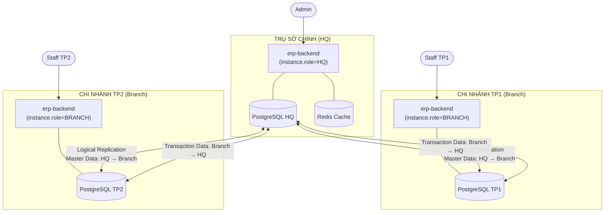

---

## Hình 2-2: Kiến trúc Module Backend

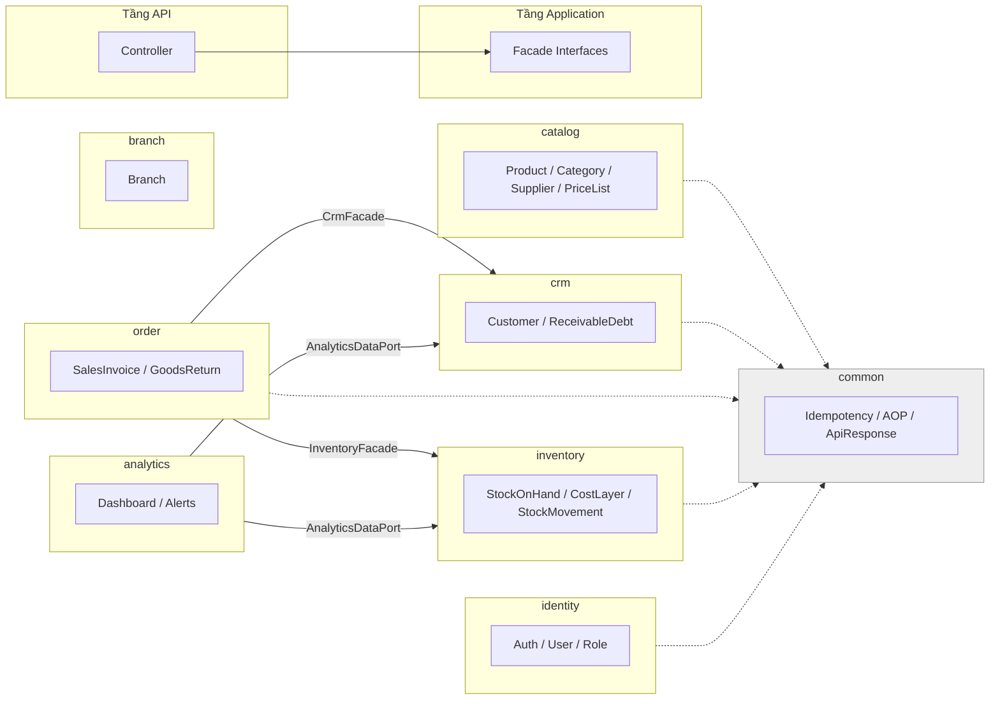

---

## Hình 2-3: Deployment / Runtime Topology

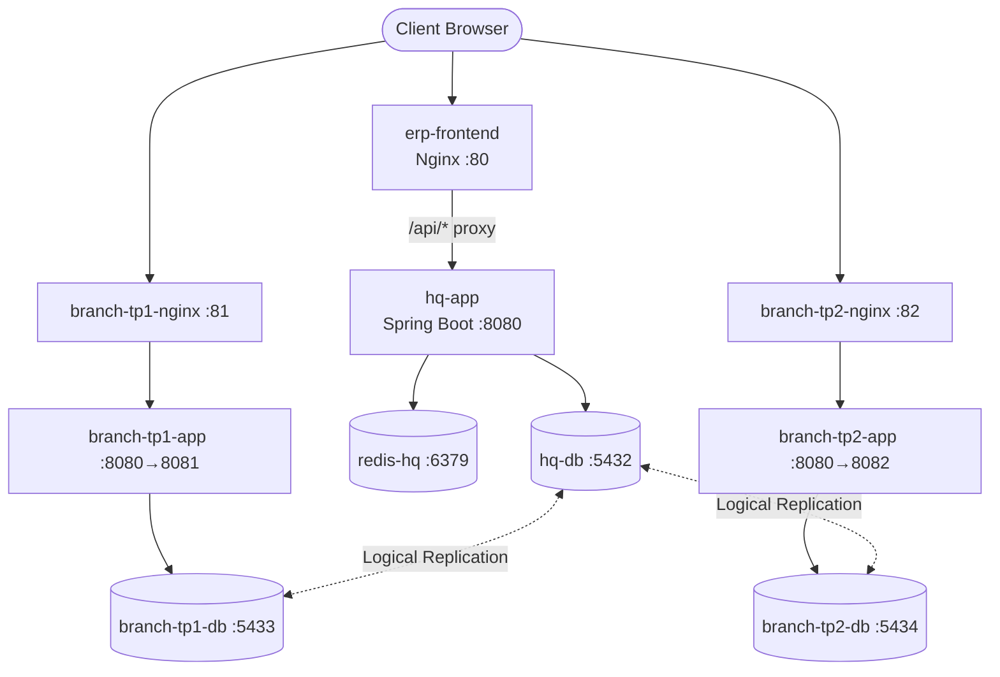

---

## Hình 2-4: Cơ chế Logical Replication (Publication/Subscription)

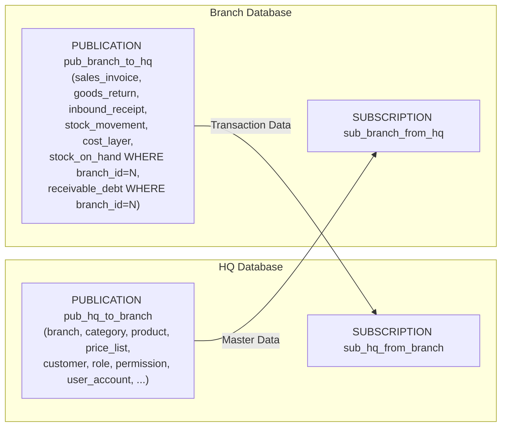

---

## Hình 2-5: Kiến trúc bảo mật (JWT RS256 + Branch Scope)

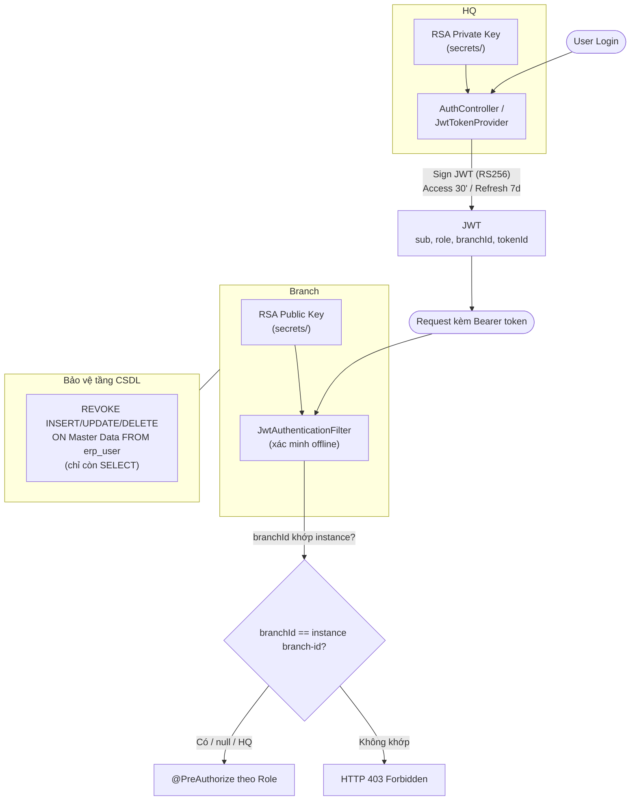

---

## Hình 3-1: Sơ đồ phân cấp chức năng — Admin

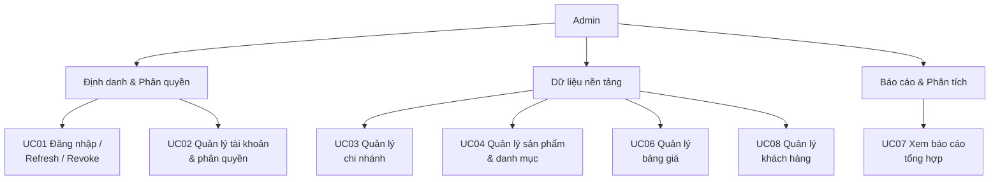

---

## Hình 3-2: Sơ đồ phân cấp chức năng — Staff

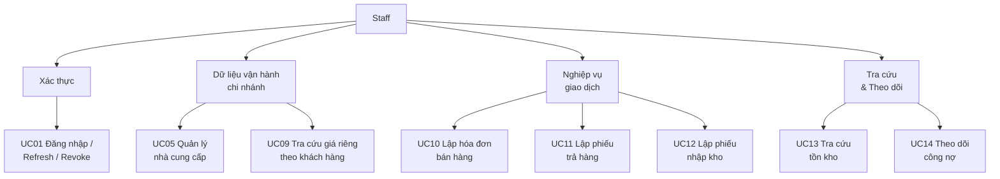

---

## Hình 3-3: Sơ đồ Use Case tổng quát — Admin

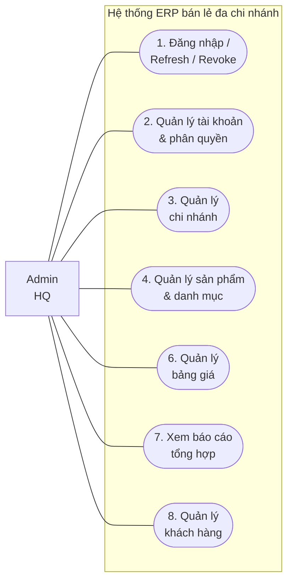

---

## Hình 3-4: Sơ đồ Use Case tổng quát — Staff

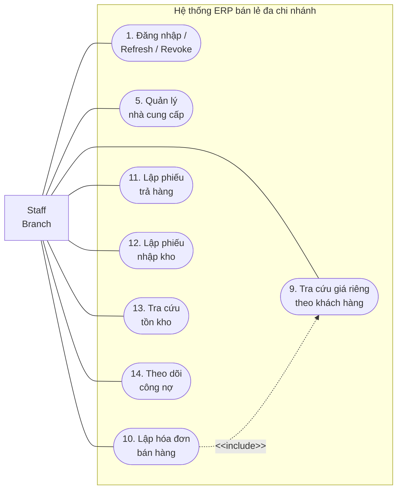

---

## Hình 3-5: Sequence — Đăng nhập / Refresh / Revoke (UC01)

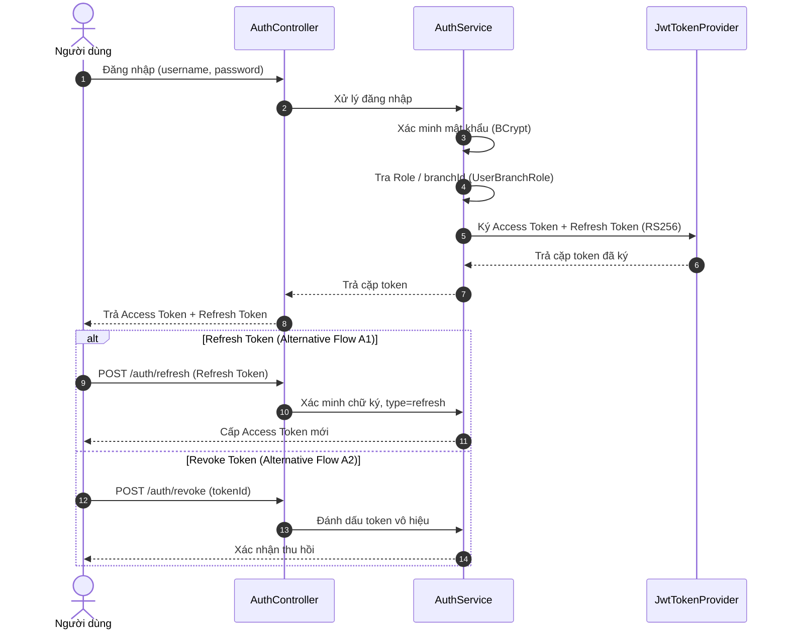

---

## Hình 3-6: Sequence — Tra cứu giá riêng theo khách hàng (UC09)

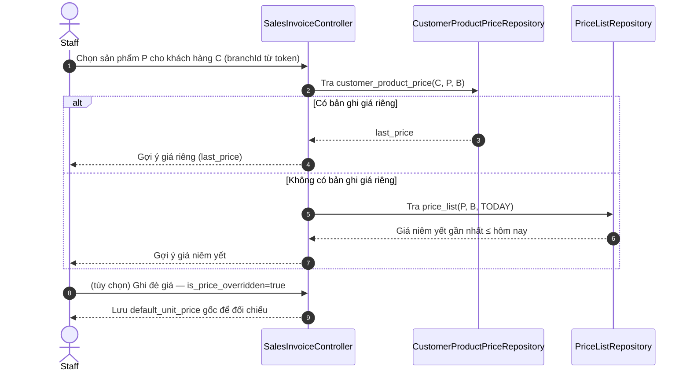

---

## Hình 3-7: Activity — Lập hóa đơn bán hàng (UC10)

```mermaid
flowchart TD
    START((Bắt đầu)) --> S1["1. Staff chọn khách hàng,<br/>thêm dòng sản phẩm"]
    S1 --> S2["2. Staff nhập amount_paid"]
    S2 --> S3["3. Gửi yêu cầu xác nhận<br/>(Idempotency-Key)"]
    S3 --> S4{"4. Khách hàng<br/>hợp lệ?"}
    S4 -- Không --> ERR1["Từ chối — khách hàng<br/>không tồn tại"] --> ENDERR((Kết thúc))
    S4 -- Có --> S5["5. Tạo hóa đơn nháp<br/>(header + dòng chi tiết)"]
    S5 --> S6["6. Khóa Cost Layer còn hàng<br/>(FOR UPDATE, created_at ASC)"]
    S6 --> S7["7. Tiêu thụ FIFO,<br/>ghi Stock Movement (SALE)"]
    S7 --> S8["8. Ghi unit_cost_snapshot<br/>từng dòng"]
    S8 --> S9["9. Snapshot công nợ<br/>(previous/total/remaining)"]
    S9 --> D1{"amount_paid =<br/>total_amount?"}
    D1 -- "Đúng (A1)" --> S14["14. remaining_debt = 0"]
    D1 -- "Sai (A2: mua chịu<br/>một phần/toàn bộ)" --> S15["15. Ghi remaining_debt<br/>= phần chưa trả"]
    S14 --> S10["10. Cập nhật<br/>receivable_debt.current_balance"]
    S15 --> S10
    S10 --> S11["11. Cập nhật<br/>customer_product_price.last_price"]
    S11 --> S12["12. invoice.confirm()<br/>DRAFT → CONFIRMED"]
    S12 --> S13["13. Lưu, commit transaction"]
    S13 --> END((Kết thúc))

    style START fill:#000,stroke:#000
    style END fill:#000,stroke:#000
    style ENDERR fill:#000,stroke:#000
```

---

## Hình 3-8: Sequence — Lập hóa đơn bán hàng (UC10)

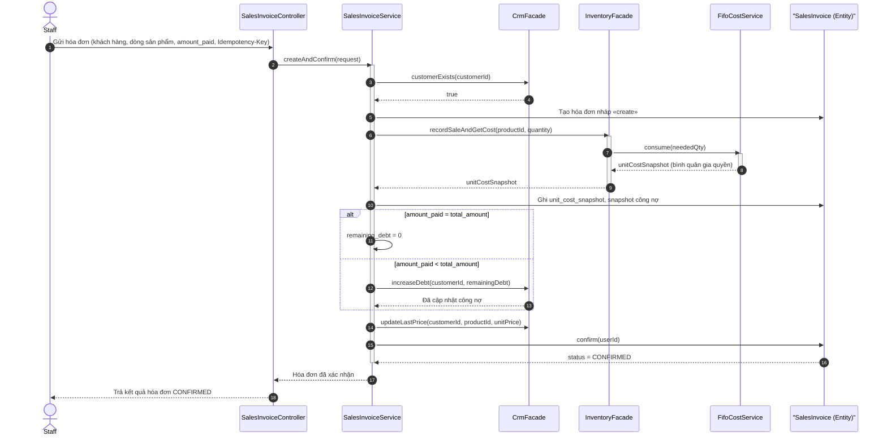

---

## Hình 3-9: Activity — Lập phiếu trả hàng (UC11)

```mermaid
flowchart TD
    START((Bắt đầu)) --> S1["1. Staff lập phiếu trả (DRAFT)<br/>chọn khách hàng, sản phẩm, số lượng"]
    S1 --> S2["2. Staff gửi yêu cầu xác nhận"]
    S2 --> S3{"3. Có liên kết<br/>hóa đơn gốc?"}
    S3 -- "Có" --> S4["4. Khóa hóa đơn gốc<br/>(findByIdForUpdate)"]
    S4 --> QTY{"Số lượng trả<br/>≤ đã mua?"}
    QTY -- Không --> REJECT["Từ chối xác nhận<br/>(giữ nguyên DRAFT)"] --> ENDERR((Kết thúc))
    QTY -- Có --> S5
    S3 -- "Không (Alt. Flow —<br/>Bước 10, bỏ qua Bước 4)" --> S5["5. goodsReturn.confirm()<br/>DRAFT → CONFIRMED"]
    S5 --> S6["6. Tạo Cost Layer mới<br/>unit_cost = return_price"]
    S6 --> S7["7. Ghi Stock Movement (RETURN),<br/>tăng Stock On Hand"]
    S7 --> S8["8. Giảm Receivable Debt<br/>(-total_return_amount)"]
    S8 --> S9["9. Lưu và ghi log kết quả"]
    S9 --> END((Kết thúc))

    style START fill:#000,stroke:#000
    style END fill:#000,stroke:#000
    style ENDERR fill:#000,stroke:#000
```

---

## Hình 3-10: Sequence — Lập phiếu trả hàng (UC11)

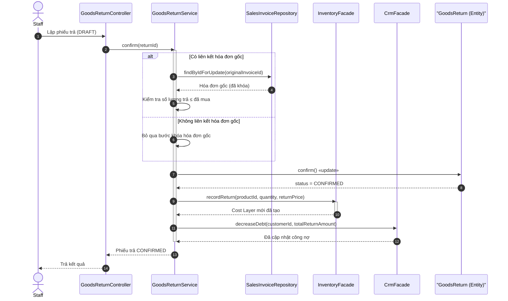

---

## Hình 3-11: Activity — Lập phiếu nhập kho (UC12)

```mermaid
flowchart TD
    START((Bắt đầu)) --> S1["1. Staff lập phiếu nhập (DRAFT)<br/>chọn NCC, sản phẩm, SL, đơn giá"]
    S1 --> S2["2. Staff gửi yêu cầu xác nhận"]
    S2 --> CHK{"Đơn giá ≥ 0 và<br/>số lượng > 0?"}
    CHK -- Không --> ERR["Từ chối — vi phạm<br/>ràng buộc dữ liệu"] --> ENDERR((Kết thúc))
    CHK -- Có --> S3["3. receipt.confirm()<br/>DRAFT → CONFIRMED"]
    S3 --> S4["4. Tăng Stock On Hand<br/>(stock.increase)"]
    S4 --> S5["5. Ghi Stock Movement (INBOUND)"]
    S5 --> S6["6. Tạo Cost Layer mới<br/>(CostLayer.fromInbound)"]
    S6 --> S7["7. Lưu kết quả"]
    S7 --> END((Kết thúc))

    style START fill:#000,stroke:#000
    style END fill:#000,stroke:#000
    style ENDERR fill:#000,stroke:#000
```

---

## Hình 3-12: Sequence — Lập phiếu nhập kho (UC12)

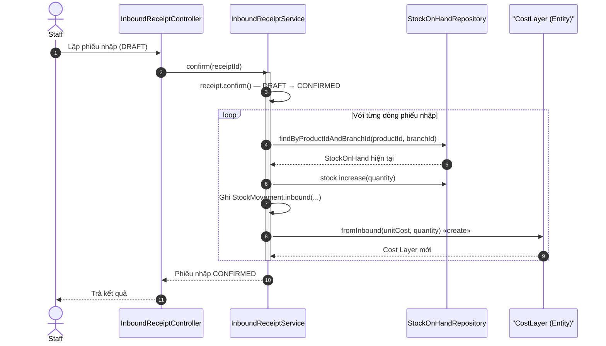

---

## Hình 3-13: Sequence — Đồng bộ dữ liệu (Logical Replication, UC15)

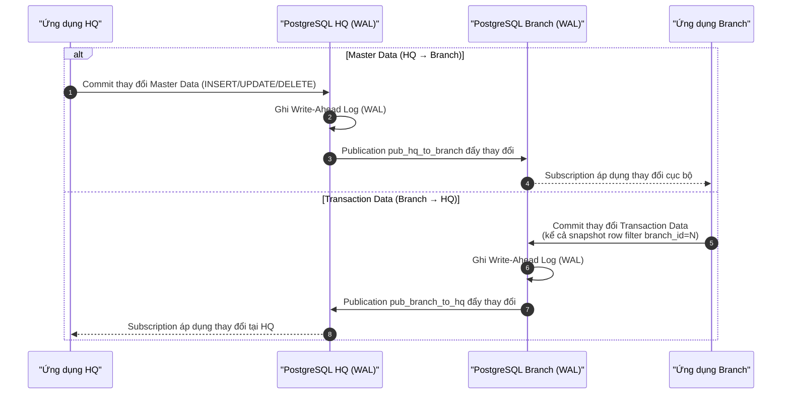
## Hình 3-14: DFD Cấp 0 (Context Diagram)

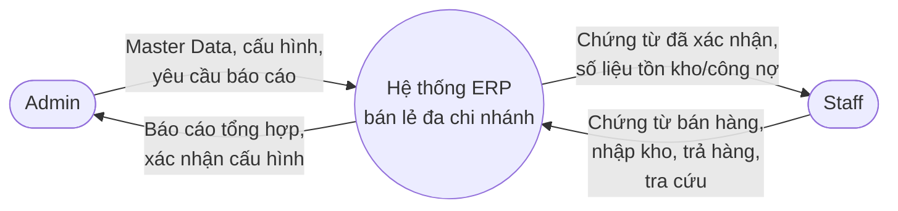

---

## Hình 3-15: DFD — Lập hóa đơn bán hàng

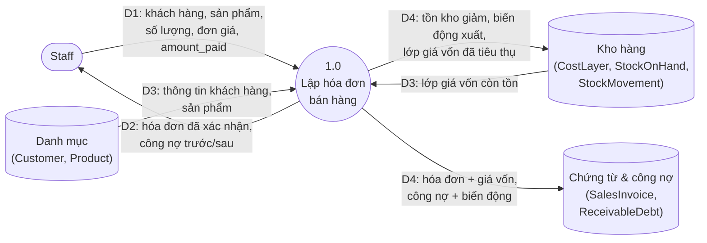

---

## Hình 3-16: DFD — Lập phiếu trả hàng

```mermaid
flowchart LR
    STAFF(["Staff"])
    P1(("2.0<br/>Lập phiếu<br/>trả hàng"))
    DS3[("Chứng từ<br/>(SalesInvoice,<br/>GoodsReturn)")]
    DS2[("Kho hàng<br/>(CostLayer, StockOnHand,<br/>StockMovement)")]
    DS4[("Công nợ<br/>(ReceivableDebt)")]

    STAFF -->|"D1: hóa đơn gốc (tùy chọn),<br/>khách hàng, sản phẩm trả, lý do"| P1
    P1 -->|"D2: phiếu trả đã xác nhận,<br/>số tiền giảm công nợ"| STAFF
    DS3 -->|"D3: phiếu trả nháp,<br/>hóa đơn gốc"| P1
    P1 -->|"D4: phiếu trả đã xác nhận"| DS3
    P1 -->|"D4: tồn kho tăng, biến động trả,<br/>lớp giá vốn hoàn trả"| DS2
    P1 -->|"D4: công nợ giảm,<br/>biến động công nợ"| DS4
```

---

## Hình 3-17: DFD — Lập phiếu nhập kho

```mermaid
flowchart LR
    STAFF(["Staff"])
    P1(("3.0<br/>Lập phiếu<br/>nhập kho"))
    DS1[("Danh mục<br/>(Supplier, Product)")]
    DS3[("Chứng từ<br/>(InboundReceipt)")]
    DS2[("Kho hàng<br/>(CostLayer, StockOnHand,<br/>StockMovement)")]

    STAFF -->|"D1: nhà cung cấp, sản phẩm,<br/>số lượng, đơn giá nhập"| P1
    P1 -->|"D2: phiếu nhập đã xác nhận"| STAFF
    DS1 -->|"D3: nhà cung cấp, sản phẩm"| P1
    P1 -->|"D3: phiếu nhập nháp"| DS3
    P1 -->|"D4: phiếu nhập đã xác nhận"| DS3
    P1 -->|"D4: tồn kho tăng, biến động nhập,<br/>lớp giá vốn mới"| DS2
```

---

## Hình 3-18: DFD — Tra cứu giá riêng theo khách hàng

```mermaid
flowchart LR
    STAFF(["Staff"])
    P1(("4.0<br/>Tra cứu<br/>giá riêng"))
    DS5[("Giá riêng theo<br/>khách hàng<br/>(CustomerProductPrice)")]
    DS6[("Giá niêm yết<br/>(PriceList)")]

    STAFF -->|"D1: khách hàng, sản phẩm<br/>(chi nhánh từ token)"| P1
    P1 -->|"D2: đơn giá gợi ý<br/>hoặc thông báo chưa có giá"| STAFF
    DS5 -->|"D3: giá riêng theo<br/>khách hàng-sản phẩm-chi nhánh"| P1
    DS6 -->|"D3: giá niêm yết hiệu lực"| P1
```

---

## Hình 3-19: DFD — Theo dõi công nợ

```mermaid
flowchart LR
    STAFF(["Staff / Admin"])
    P1(("5.0<br/>Theo dõi<br/>công nợ"))
    DS1[("Danh mục<br/>(Customer)")]
    DS4[("Công nợ<br/>(ReceivableDebt,<br/>ReceivableDebtMovement)")]

    STAFF -->|"D1: khách hàng cần tra cứu"| P1
    P1 -->|"D2: số dư công nợ,<br/>lịch sử biến động"| STAFF
    DS1 -->|"D3: thông tin khách hàng"| P1
    DS4 -->|"D3: tổng công nợ,<br/>lịch sử biến động"| P1
```

---

## Hình 3-20: Class Diagram tổng quát (mức Structural)

```mermaid
classDiagram
    class Branch["1. Branch"] {
      code
      name
      isActive
    }
    class Category["2. Category"] {
      code
      name
    }
    class Product["3. Product"] {
      sku
      name
    }
    class Customer["6. Customer"] {
      code
      fullName
    }
    class ReceivableDebt["7. ReceivableDebt"] {
      currentBalance
    }
    class SalesInvoice["14. SalesInvoice"] {
      invoiceNo
      status
      totalAmount
      remainingDebt
    }
    class SalesInvoiceLine["15. SalesInvoiceLine"] {
      quantity
      unitPrice
      unitCostSnapshot
    }
    class GoodsReturn["16. GoodsReturn"] {
      returnNo
      status
    }
    class InboundReceipt["19. InboundReceipt"] {
      receiptNo
      status
    }
    class StockOnHand["21. StockOnHand"] {
      quantity
      version
    }
    class CostLayer["23. CostLayer"] {
      unitCost
      remainingQty
    }
    class StockMovement["22. StockMovement"] {
      movementType
      quantity
    }
    class UserAccount["12. UserAccount"] {
      username
    }
    class Role["10. Role"] {
      code
    }

    Category "0..1" o-- "0..*" Category : cha/con
    Product "1" --> "0..*" Category : thuộc danh mục
    Customer "1" --> "0..*" ReceivableDebt : có công nợ tại chi nhánh
    SalesInvoice "1" *-- "0..*" SalesInvoiceLine : composition
    GoodsReturn "1" *-- "0..*" GoodsReturnLine : composition
    InboundReceipt "1" *-- "0..*" InboundReceiptLine : composition
    SalesInvoice ..> Customer : customerId (logic ref)
    SalesInvoice ..> Branch : branchId (logic ref)
    CostLayer ..> InboundReceipt : inboundMovementId (logic ref)
    UserAccount "1" --> "0..*" Role : qua UserBranchRole
```

---

## Hình 3-21: ER mức khung hệ thống

```mermaid
erDiagram
    BRANCH ||--o{ USER_BRANCH_ROLE : "phân quyền tại"
    BRANCH ||--o{ SUPPLIER : "sở hữu (branch-owned)"
    BRANCH ||--o{ SALES_INVOICE : "phát sinh tại"
    BRANCH ||--o{ INBOUND_RECEIPT : "phát sinh tại"
    BRANCH ||--o{ RECEIVABLE_DEBT : "sổ nợ riêng tại"
    CATEGORY ||--o{ PRODUCT : "phân loại"
    PRODUCT ||--o{ PRICE_LIST : "có giá theo"
    CUSTOMER ||--o{ SALES_INVOICE : "mua hàng qua"
    CUSTOMER ||--o{ RECEIVABLE_DEBT : "có công nợ"
    SALES_INVOICE ||--|{ SALES_INVOICE_LINE : "gồm"
    GOODS_RETURN ||--|{ GOODS_RETURN_LINE : "gồm"
    INBOUND_RECEIPT ||--|{ INBOUND_RECEIPT_LINE : "gồm"
    PRODUCT ||--o{ STOCK_ON_HAND : "tồn kho"
    PRODUCT ||--o{ COST_LAYER : "lớp giá"
```

---

## Hình 3-22: ER — Identity & CRM

```mermaid
erDiagram
    USER_ACCOUNT ||--o{ USER_BRANCH_ROLE : "được gán"
    ROLE ||--o{ USER_BRANCH_ROLE : "áp dụng"
    BRANCH ||--o{ USER_BRANCH_ROLE : "phạm vi (nullable)"
    ROLE ||--o{ ROLE_PERMISSION : "có"
    PERMISSION ||--o{ ROLE_PERMISSION : "thuộc"
    CUSTOMER ||--o{ RECEIVABLE_DEBT : "công nợ theo chi nhánh"
    CUSTOMER ||--o{ RECEIVABLE_DEBT_MOVEMENT : "lịch sử biến động"
    CUSTOMER ||--o{ CUSTOMER_PRODUCT_PRICE : "giá riêng"
    BRANCH ||--o{ RECEIVABLE_DEBT : "sổ nợ tại"
```

---

## Hình 3-23: ERD Logic — Identity & CRM

```mermaid
erDiagram
    USER_ACCOUNT {
        bigint id PK
        varchar username UK
        varchar password_hash
        boolean is_active
    }
    ROLE {
        smallint id PK
        varchar code UK
    }
    PERMISSION {
        smallint id PK
        varchar code UK
    }
    ROLE_PERMISSION {
        smallint role_id PK,FK
        smallint permission_id PK,FK
    }
    USER_BRANCH_ROLE {
        bigint id PK
        bigint user_id FK
        smallint role_id FK
        bigint branch_id FK "nullable"
    }
    CUSTOMER {
        bigint id PK
        varchar code UK
        varchar full_name
    }
    RECEIVABLE_DEBT {
        bigint customer_id PK,FK
        bigint branch_id PK,FK
        numeric current_balance
    }
    RECEIVABLE_DEBT_MOVEMENT {
        uuid id PK
        bigint customer_id FK
        bigint branch_id FK
        varchar movement_type
        numeric amount
    }
    CUSTOMER_PRODUCT_PRICE {
        bigint customer_id PK,FK
        bigint product_id PK,FK
        bigint branch_id PK,FK
        numeric last_price
    }

    USER_ACCOUNT ||--o{ USER_BRANCH_ROLE : id
    ROLE ||--o{ USER_BRANCH_ROLE : id
    ROLE ||--o{ ROLE_PERMISSION : id
    PERMISSION ||--o{ ROLE_PERMISSION : id
    CUSTOMER ||--o{ RECEIVABLE_DEBT : id
    CUSTOMER ||--o{ RECEIVABLE_DEBT_MOVEMENT : id
    CUSTOMER ||--o{ CUSTOMER_PRODUCT_PRICE : id
```

---

## Hình 3-24: ER — Catalog

```mermaid
erDiagram
    CATEGORY ||--o{ CATEGORY : "cha/con"
    CATEGORY ||--o{ PRODUCT : "phân loại"
    PRODUCT ||--o{ PRICE_LIST : "có giá theo thời gian"
    BRANCH ||--o{ PRICE_LIST : "áp dụng tại"
    BRANCH ||--o{ SUPPLIER : "sở hữu"
```

---

## Hình 3-25: ER — Inventory

```mermaid
erDiagram
    PRODUCT ||--o{ STOCK_ON_HAND : "tồn kho theo chi nhánh"
    PRODUCT ||--o{ COST_LAYER : "lớp giá theo chi nhánh"
    PRODUCT ||--o{ STOCK_MOVEMENT : "biến động"
    BRANCH ||--o{ STOCK_ON_HAND : "tại"
    BRANCH ||--o{ COST_LAYER : "tại"
    SUPPLIER ||--o{ INBOUND_RECEIPT : "cung cấp"
    INBOUND_RECEIPT ||--|{ INBOUND_RECEIPT_LINE : "gồm"
    INBOUND_RECEIPT_LINE ||--o| COST_LAYER : "sinh ra"
```

---

## Hình 3-26: ERD Logic — Catalog & Inventory

```mermaid
erDiagram
    CATEGORY {
        bigint id PK
        bigint parent_id FK "self-ref"
        varchar code UK
    }
    PRODUCT {
        bigint id PK
        bigint category_id FK
        varchar sku UK
        varchar name
    }
    PRICE_LIST {
        bigint id PK
        bigint product_id FK
        bigint branch_id FK
        numeric price
        date effective_date
    }
    SUPPLIER {
        bigint id PK
        bigint branch_id FK
        varchar code
    }
    STOCK_ON_HAND {
        bigint product_id PK,FK
        bigint branch_id PK,FK
        numeric quantity
        bigint version
    }
    STOCK_MOVEMENT {
        uuid id PK
        bigint product_id FK
        bigint branch_id FK
        varchar movement_type
        numeric quantity
        varchar ref_type
        uuid ref_id
    }
    COST_LAYER {
        uuid id PK
        bigint product_id FK
        bigint branch_id FK
        numeric unit_cost
        numeric initial_qty
        numeric remaining_qty
        uuid inbound_movement_id FK
    }
    INBOUND_RECEIPT {
        uuid id PK
        varchar receipt_no
        bigint branch_id FK
        bigint supplier_id FK
        varchar status
    }
    INBOUND_RECEIPT_LINE {
        bigint id PK
        uuid receipt_id FK
        bigint product_id FK
        numeric quantity
        numeric unit_cost
    }

    CATEGORY ||--o{ CATEGORY : parent_id
    CATEGORY ||--o{ PRODUCT : id
    PRODUCT ||--o{ PRICE_LIST : id
    PRODUCT ||--o{ STOCK_ON_HAND : id
    PRODUCT ||--o{ STOCK_MOVEMENT : id
    PRODUCT ||--o{ COST_LAYER : id
    SUPPLIER ||--o{ INBOUND_RECEIPT : id
    INBOUND_RECEIPT ||--|{ INBOUND_RECEIPT_LINE : id
    INBOUND_RECEIPT ||--o{ COST_LAYER : inbound_movement_id
```

---

## Hình 3-27: ER — Order

```mermaid
erDiagram
    CUSTOMER ||--o{ SALES_INVOICE : "mua hàng"
    BRANCH ||--o{ SALES_INVOICE : "phát sinh tại"
    SALES_INVOICE ||--|{ SALES_INVOICE_LINE : "gồm"
    PRODUCT ||--o{ SALES_INVOICE_LINE : "bán"
    CUSTOMER ||--o{ GOODS_RETURN : "trả hàng"
    SALES_INVOICE ||--o| GOODS_RETURN : "liên kết gốc (tùy chọn)"
    GOODS_RETURN ||--|{ GOODS_RETURN_LINE : "gồm"
    PRODUCT ||--o{ GOODS_RETURN_LINE : "trả"
```

---

## Hình 3-28: ERD Logic — Order

```mermaid
erDiagram
    SALES_INVOICE {
        uuid id PK
        varchar invoice_no
        bigint customer_id FK
        bigint branch_id FK
        varchar status
        numeric previous_debt
        numeric total_amount
        numeric amount_paid
        numeric remaining_debt
    }
    SALES_INVOICE_LINE {
        bigint id PK
        uuid invoice_id FK
        bigint product_id FK
        numeric quantity
        numeric default_unit_price
        numeric unit_price
        boolean is_price_overridden
        numeric unit_cost_snapshot
    }
    GOODS_RETURN {
        uuid id PK
        varchar return_no
        bigint customer_id FK
        bigint branch_id FK
        uuid original_invoice_id FK "nullable"
        numeric total_return_amount
        varchar status
    }
    GOODS_RETURN_LINE {
        bigint id PK
        uuid return_id FK
        bigint product_id FK
        numeric quantity
        numeric return_price
    }

    SALES_INVOICE ||--|{ SALES_INVOICE_LINE : id
    SALES_INVOICE ||--o| GOODS_RETURN : original_invoice_id
    GOODS_RETURN ||--|{ GOODS_RETURN_LINE : id
```

---

## Hình 3-29: Class Diagram tổng quát (mức Analysis)

```mermaid
classDiagram
    class Branch["1. Branch"] {
      code
      name
      isActive
    }
    class Category["2. Category"] {
      code
      name
    }
    class Product["3. Product"] {
      sku
      name
    }
    class Customer["6. Customer"] {
      code
      fullName
    }
    class ReceivableDebt["7. ReceivableDebt"] {
      currentBalance
      increase(amount: Decimal): Void
      decrease(amount: Decimal): Void
    }
    class SalesInvoice["14. SalesInvoice"] {
      invoiceNo
      status
      totalAmount
      remainingDebt
      confirm(userId: Long): Void
    }
    class SalesInvoiceLine["15. SalesInvoiceLine"] {
      quantity
      unitPrice
      unitCostSnapshot
    }
    class GoodsReturn["16. GoodsReturn"] {
      returnNo
      status
      confirm(): Void
    }
    class InboundReceipt["19. InboundReceipt"] {
      receiptNo
      status
      confirm(): Void
    }
    class StockOnHand["21. StockOnHand"] {
      quantity
      version
      increase(qty: Decimal): Void
      decreaseAllowNegative(qty: Decimal): Void
    }
    class CostLayer["23. CostLayer"] {
      unitCost
      remainingQty
      consume(neededQty: Decimal): Decimal
    }
    class StockMovement["22. StockMovement"] {
      movementType
      quantity
    }
    class UserAccount["12. UserAccount"] {
      username
    }
    class Role["10. Role"] {
      code
    }

    Category "0..1" o-- "0..*" Category : cha/con
    Product "1" --> "0..*" Category : thuộc danh mục
    Customer "1" --> "0..*" ReceivableDebt : có công nợ tại chi nhánh
    SalesInvoice "1" *-- "0..*" SalesInvoiceLine : composition
    GoodsReturn "1" *-- "0..*" GoodsReturnLine : composition
    InboundReceipt "1" *-- "0..*" InboundReceiptLine : composition
    SalesInvoice ..> Customer : customerId (logic ref)
    SalesInvoice ..> Branch : branchId (logic ref)
    CostLayer ..> InboundReceipt : inboundMovementId (logic ref)
    UserAccount "1" --> "0..*" Role : qua UserBranchRole
```

---

## Hình 3-30: Class Diagram mức Design — Cụm Identity & CRM

```mermaid
classDiagram
    class UserAccount["12. UserAccount"] {
      -id: Long
      -username: Varchar
      -passwordHash: Varchar
      -fullName: Varchar
      -isActive: Boolean
    }
    class Role["10. Role"] {
      -id: Short
      -code: Varchar
      -name: Varchar
    }
    class Permission["9. Permission"] {
      -id: Short
      -code: Varchar
    }
    class RolePermission["11. RolePermission"] {
      -roleId: Short
      -permissionId: Short
    }
    class UserBranchRole["13. UserBranchRole"] {
      -id: Long
      -userId: Long
      -roleId: Short
      -branchId: Long
    }
    class Customer["6. Customer"] {
      -id: Long
      -code: Varchar
      -fullName: Varchar
      -phone: Varchar
    }
    class ReceivableDebt["7. ReceivableDebt"] {
      -customerId: Long
      -branchId: Long
      -currentBalance: Decimal
      +increase(amount: Decimal): Void
      +decrease(amount: Decimal): Void
    }
    class ReceivableDebtMovement["8. ReceivableDebtMovement"] {
      -id: UUID
      -customerId: Long
      -branchId: Long
      -movementType: ReceivableDebtMovementType
      -amount: Decimal
    }
    class ReceivableDebtMovementType["«enumeration» ReceivableDebtMovementType"] {
      <<enumeration>>
      SALE
      PAYMENT
      RETURN
    }
    class CustomerProductPrice["18. CustomerProductPrice"] {
      -customerId: Long
      -productId: Long
      -branchId: Long
      -lastPrice: Decimal
    }

    UserAccount "1" --> "0..*" UserBranchRole
    Role "1" --> "0..*" UserBranchRole
    Role "0..*" -- "0..*" Permission : RolePermission
    RolePermission --> Role
    RolePermission --> Permission
    Customer "1" --> "0..*" ReceivableDebt : theo chi nhánh
    Customer "1" --> "0..*" ReceivableDebtMovement
    Customer "1" --> "0..*" CustomerProductPrice
    ReceivableDebtMovement ..> ReceivableDebtMovementType
```

---

## Hình 3-31: Class Diagram mức Design — Cụm Catalog & Inventory

```mermaid
classDiagram
    class Category["2. Category"] {
      -id: Long
      -parentId: Long
      -code: Varchar
      -name: Varchar
    }
    class Product["3. Product"] {
      -id: Long
      -categoryId: Long
      -sku: Varchar
      -name: Varchar
    }
    class Supplier["4. Supplier"] {
      -id: Long
      -branchId: Long
      -code: Varchar
      -name: Varchar
    }
    class PriceList["5. PriceList"] {
      -id: Long
      -productId: Long
      -branchId: Long
      -price: Decimal
      -effectiveDate: Date
    }
    class StockOnHand["21. StockOnHand"] {
      -productId: Long
      -branchId: Long
      -quantity: Decimal
      -version: Long
      +increase(qty: Decimal): Void
      +decreaseAllowNegative(qty: Decimal): Void
    }
    class StockMovement["22. StockMovement"] {
      -id: UUID
      -productId: Long
      -branchId: Long
      -movementType: MovementType
      -quantity: Decimal
      -refType: Varchar
      -refId: UUID
    }
    class MovementType["«enumeration» MovementType"] {
      <<enumeration>>
      SALE
      INBOUND
      RETURN
    }
    class CostLayer["23. CostLayer"] {
      -id: UUID
      -productId: Long
      -branchId: Long
      -unitCost: Decimal
      -initialQty: Decimal
      -remainingQty: Decimal
      -version: Long
      +consume(neededQty: Decimal): Decimal
    }
    class InboundReceipt["19. InboundReceipt"] {
      -id: UUID
      -receiptNo: Varchar
      -branchId: Long
      -supplierId: Long
      -status: InboundReceiptStatus
      +confirm(): Void
    }
    class InboundReceiptStatus["«enumeration» InboundReceiptStatus"] {
      <<enumeration>>
      DRAFT
      CONFIRMED
    }
    class InboundReceiptLine["20. InboundReceiptLine"] {
      -id: Long
      -receiptId: UUID
      -productId: Long
      -quantity: Decimal
      -unitCost: Decimal
    }

    Category "0..1" o-- "0..*" Category
    Product "0..*" --> "1" Category
    PriceList "0..*" --> "1" Product
    InboundReceipt "1" *-- "0..*" InboundReceiptLine
    InboundReceipt ..> Supplier : supplierId
    InboundReceiptLine ..> Product : productId
    CostLayer ..> Product : productId
    CostLayer ..> InboundReceipt : inboundMovementId
    StockMovement ..> Product : productId
    StockOnHand ..> Product : productId
    InboundReceipt ..> InboundReceiptStatus
    StockMovement ..> MovementType
```

---

## Hình 3-32: Class Diagram mức Design — Cụm Order

```mermaid
classDiagram
    class SalesInvoice["14. SalesInvoice"] {
      -id: UUID
      -invoiceNo: Varchar
      -customerId: Long
      -branchId: Long
      -status: SalesInvoiceStatus
      -previousDebt: Decimal
      -totalAmount: Decimal
      -amountPaid: Decimal
      -remainingDebt: Decimal
      +confirm(userId: Long): Void
    }
    class SalesInvoiceStatus["«enumeration» SalesInvoiceStatus"] {
      <<enumeration>>
      DRAFT
      CONFIRMED
    }
    class SalesInvoiceLine["15. SalesInvoiceLine"] {
      -id: Long
      -invoiceId: UUID
      -productId: Long
      -quantity: Decimal
      -defaultUnitPrice: Decimal
      -unitPrice: Decimal
      -isPriceOverridden: Boolean
      -unitCostSnapshot: Decimal
    }
    class GoodsReturn["16. GoodsReturn"] {
      -id: UUID
      -returnNo: Varchar
      -customerId: Long
      -branchId: Long
      -originalInvoiceId: UUID
      -totalReturnAmount: Decimal
      -status: GoodsReturnStatus
      +confirm(): Void
    }
    class GoodsReturnStatus["«enumeration» GoodsReturnStatus"] {
      <<enumeration>>
      DRAFT
      CONFIRMED
    }
    class GoodsReturnLine["17. GoodsReturnLine"] {
      -id: Long
      -returnId: UUID
      -productId: Long
      -quantity: Decimal
      -returnPrice: Decimal
    }
    class InventoryFacade["«interface» InventoryFacade"] {
      <<interface>>
      +recordSaleAndGetCost(productId: Long, quantity: Decimal): Decimal
      +recordReturn(productId: Long, quantity: Decimal, returnPrice: Decimal): Void
    }
    class CrmFacade["«interface» CrmFacade"] {
      <<interface>>
      +customerExists(customerId: Long): Boolean
      +increaseDebt(customerId: Long, amount: Decimal): Void
      +decreaseDebt(customerId: Long, amount: Decimal): Void
    }

    SalesInvoice "1" *-- "0..*" SalesInvoiceLine
    GoodsReturn "1" *-- "0..*" GoodsReturnLine
    GoodsReturn ..> SalesInvoice : originalInvoiceId (tùy chọn)
    SalesInvoice ..> InventoryFacade : recordSaleAndGetCost
    SalesInvoice ..> CrmFacade : customerExists / increaseDebt
    GoodsReturn ..> InventoryFacade : recordReturn
    GoodsReturn ..> CrmFacade : decreaseDebt
    SalesInvoice ..> SalesInvoiceStatus
    GoodsReturn ..> GoodsReturnStatus
```
