# Chương 3. Phân tích thiết kế hệ thống

Trong chương này, hệ thống ERP bán lẻ đa chi nhánh sẽ được phân tích và thiết kế chi tiết thông qua các góc nhìn từ tổng quan đến cụ thể. Đầu tiên, mô hình hóa chức năng (Use Case, Activity, DFD) sẽ làm rõ các yêu cầu nghiệp vụ và luồng xử lý của người dùng. Tiếp theo, cấu trúc tĩnh và hành vi động của hệ thống được phác họa qua Sơ đồ lớp (Class Diagram) và Sơ đồ tuần tự (Sequence Diagram). Cuối cùng, thiết kế dữ liệu (ERD) sẽ định hình cấu trúc lưu trữ, đảm bảo tính nhất quán và phục vụ tốt cho cơ chế đồng bộ trong kiến trúc Modular Monolith.

### 3.1. Phân tích Yêu cầu Chức năng (Use Case)

#### 3.1.1. Sơ đồ Use Case tổng quát

Hệ thống ERP bán lẻ đa chi nhánh được phân tách quyền hạn dựa trên hai tác nhân chính: Admin tại Trụ sở chính (HQ) và Staff tại Chi nhánh (Branch).
- **Admin** chịu trách nhiệm thiết lập các dữ liệu nền tảng (Master Data) bao gồm người dùng, chi nhánh, danh mục sản phẩm, nhà cung cấp và bảng giá, đồng thời xem các báo cáo tổng hợp.
- **Staff** vận hành trực tiếp các nghiệp vụ tại cửa hàng như lập hóa đơn, lập phiếu trả hàng, quản lý nhập kho, khách hàng và theo dõi công nợ cục bộ.

Do số lượng chức năng phong phú, sơ đồ Use Case được phân tách làm hai biểu đồ riêng biệt dành cho Admin và Staff, qua đó thể hiện rõ ranh giới nghiệp vụ của từng nhóm người dùng đối với các phân hệ của hệ thống.

**Sơ đồ Use Case của Admin:**

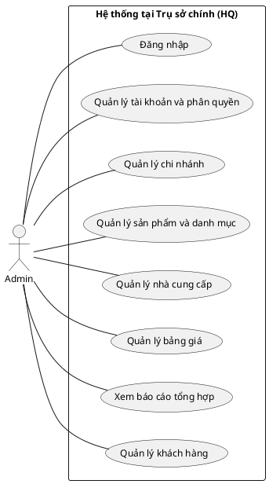
*Hình 2: Sơ đồ Use Case dành cho tác nhân Admin*

**Sơ đồ Use Case của Staff:**

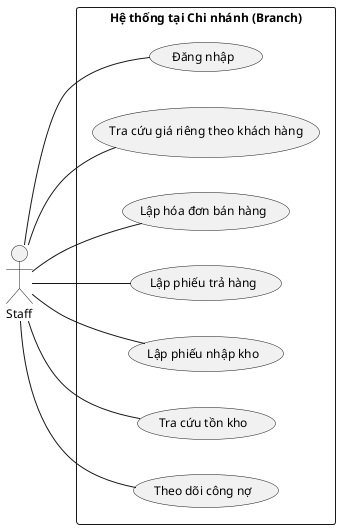
*Hình 3: Sơ đồ Use Case dành cho tác nhân Staff*

#### 3.1.2. Đặc tả các Use Case nghiệp vụ chính

Dưới đây là đặc tả chi tiết của 5 Use Case cốt lõi nhất, đóng vai trò nền tảng trong quá trình xác thực bảo mật và vận hành chuỗi bán hàng.

| Tên UC | Mã UC | Mô tả tóm tắt | Actor | Yêu cầu trước khi thực hiện | Các bước thực hiện | Điều kiện thoát | Điều kiện sau khi thực hiện | Yêu cầu đặc biệt |
|---|---|---|---|---|---|---|---|---|
| Đăng nhập | UC01 | Cho phép người dùng xác thực và truy cập vào hệ thống. | Admin, Staff | Người dùng có tài khoản đang hoạt động (`isActive = true`) [E12]. | 1. Người dùng gửi yêu cầu qua endpoint `POST /login` [P01].<br>2. Hệ thống gọi phương thức `login` của `AuthService` [M08].<br>3. Kiểm tra quy tắc nghiệp vụ: Staff phải có `branchId` [B01], Admin không được có `branchId` [B02].<br>4. Phát hành JWT token chứa các claims theo quy định [N03]. | Tài khoản không hợp lệ, sai mật khẩu, hoặc vi phạm quy tắc vai trò. | Người dùng nhận được JWT Token với role tương ứng [N02]. | Không |
| Lập hóa đơn bán hàng | UC10 | Lập và xác nhận hóa đơn bán hàng, ghi nhận thanh toán. | Staff | Đã xác thực, chọn khách hàng tồn tại [E06]. | 1. Staff gửi yêu cầu lập hóa đơn.<br>2. Hệ thống khởi tạo hóa đơn [E14] thông qua `createAndConfirm` [M11].<br>3. Lưu trạng thái nháp, sau đó gọi luồng xác nhận `applyConfirmationEffects` [B05, M12].<br>4. Với từng dòng sản phẩm [E15], gọi `recordSaleAndGetCost` [M16] tiêu thụ tồn kho FIFO [B08].<br>5. Tăng công nợ nếu còn thiếu qua `increaseDebt` [M05].<br>6. Cập nhật hóa đơn thành `CONFIRMED` [N04]. | Tồn kho lỗi, khách hàng không tồn tại, hoặc dữ liệu không nhất quán. | Hóa đơn được xác nhận [N04], trừ tồn kho [E21], công nợ khách hàng tăng [E24]. | Phải chạy trong transaction, sử dụng `@Retryable` [B10]. |
| Lập phiếu trả hàng | UC11 | Lập phiếu nhận lại hàng hóa trả về từ khách hàng. | Staff | Đã xác thực. | 1. Staff yêu cầu trả hàng, hệ thống lấy phiếu qua `findByIdForUpdate` [B06].<br>2. Khóa dòng phiếu bằng Pessimistic Lock [B11].<br>3. Hệ thống xử lý qua phương thức `confirmReturn` [M14].<br>4. Với từng dòng hoàn trả [E17], gọi `recordReturn` [M17] để hoàn lại kho.<br>5. Gọi `decreaseDebt` [M06] giảm công nợ khách hàng.<br>6. Cập nhật trạng thái phiếu thành `CONFIRMED` [N05]. | Lỗi tìm kiếm phiếu trả hàng hoặc giao dịch. | Phiếu hoàn trả xác nhận [E16], tồn kho hoàn lại, công nợ giảm đi. | Khóa Pessimistic Write phải duy trì suốt luồng [B11]. |
| Lập phiếu nhập kho | UC12 | Ghi nhận hàng hóa nhập từ nhà cung cấp [E04]. | Staff | Đã xác thực, chọn đúng sản phẩm [E03]. | 1. Staff tạo yêu cầu nhập kho [E19].<br>2. Hệ thống xử lý thông qua `confirmReceipt` [M15] và luồng [B07].<br>3. Tăng tồn kho và tạo biến động `StockMovement.inbound` [B07].<br>4. Lập các lớp giá mới qua phương thức `fromInbound` [M19] của `CostLayer` [E23].<br>5. Cập nhật phiếu thành `CONFIRMED` [N06]. | Sản phẩm hoặc nhà cung cấp không khả dụng. | Phiếu nhập kho được lưu [E19], `StockOnHand` tăng [E21], tạo thêm `CostLayer`. | Áp dụng `@Retryable` [M15] nếu xung đột. |
| Quản lý khách hàng | UC08 | Cho phép tạo, sửa hoặc xóa thông tin khách hàng. | Staff | Đã xác thực ở chi nhánh (có `branchId`). | 1. Staff gửi thông tin khách hàng qua các endpoint `POST`, `PUT`, `DELETE` [P04, P05, P06].<br>2. Gọi `createCustomer` [M04] trên `CustomerWriteService` (nếu tạo mới).<br>3. Tham chiếu khách hàng với chi nhánh qua thuộc tính `branchId` [R12].<br>4. Lưu khách hàng vào cơ sở dữ liệu [E06]. | Dữ liệu đầu vào sai định dạng hoặc mã đã tồn tại. | Hồ sơ khách hàng [E06] được tạo mới hoặc cập nhật. | Không |

*Tiếp nối việc xác định các chức năng cốt lõi thông qua sơ đồ Use Case, phần tiếp theo sẽ đi sâu vào mô tả chi tiết các bước thực hiện tuần tự của từng nghiệp vụ bằng biểu đồ hoạt động.*

### 3.2. Phân tích Yêu cầu Chức năng (Activity Diagram)

Mục này trình bày chi tiết luồng hoạt động (Activity Diagram) cho các nghiệp vụ cốt lõi của hệ thống, bao gồm Bán hàng, Trả hàng và Nhập kho. Các sơ đồ minh họa sự tương tác giữa nhân viên tại chi nhánh và hệ thống, cùng với các bước xử lý ngầm dựa trên luồng gọi hàm và quy tắc nghiệp vụ trong thực tế.

#### 3.2.1. Nghiệp vụ Bán hàng (Sales Invoice - UC10)

Sơ đồ dưới đây mô tả quy trình lập hóa đơn bán hàng. Hệ thống thực hiện kiểm tra thông tin khách hàng, ghi nhận biến động kho, tính giá vốn theo phương pháp FIFO và cập nhật công nợ trước khi chuyển trạng thái hóa đơn sang xác nhận.

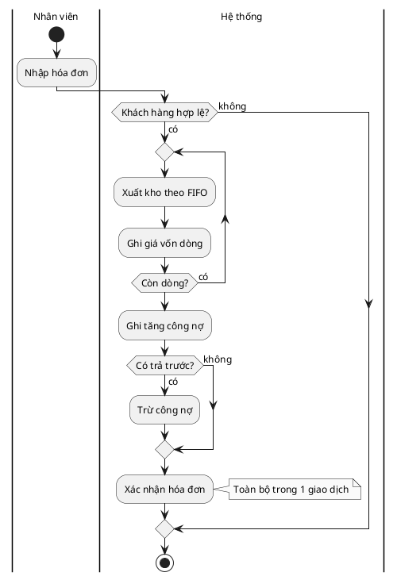
*Hình 4: Sơ đồ Activity - Luồng Bán hàng*

**Bảng truy vết hoạt động - Luồng Bán hàng:**

| Hoạt động mới | Hàm gốc được gộp | Nguồn |
|---|---|---|
| Nhập hóa đơn | - | [UC10] |
| Khách hàng hợp lệ? | `crmFacade.customerExists` | [B05] |
| Xuất kho theo FIFO | `fifoCostService.consume`, `stock.decreaseAllowNegative`, `StockMovement.sale` | [B08, B09] |
| Ghi giá vốn dòng | - | [B05] |
| Ghi tăng công nợ | `debtService.increaseDebt` | [B05] |
| Có trả trước? | - | [B05] |
| Trừ công nợ | `debtService.decreaseDebt` | [B05] |
| Xác nhận hóa đơn | `invoice.snapshotDebt`, `invoice.confirm`, `invoiceRepository.save` | [B05] |

#### 3.2.2. Nghiệp vụ Trả hàng (Goods Return - UC11)

Quy trình trả hàng theo mô hình Nháp (Draft) sang Xác nhận (Confirm). Khi nhân viên yêu cầu xác nhận, hệ thống tiến hành khóa hóa đơn gốc để đảm bảo tính toàn vẹn (tránh việc trả hàng đồng thời vượt quá số lượng mua), hoàn lại số lượng vào kho và giảm công nợ cho khách hàng.

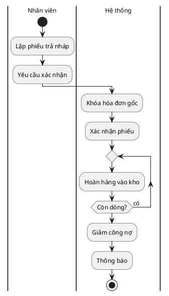
*Hình 5: Sơ đồ Activity - Luồng Trả hàng*

**Bảng truy vết hoạt động - Luồng Trả hàng:**

| Hoạt động mới | Hàm gốc được gộp | Nguồn |
|---|---|---|
| Lập phiếu trả nháp | `returnRepository.save` (DRAFT) | [UC11] |
| Yêu cầu xác nhận | - | [UC11] |
| Khóa hóa đơn gốc | `invoiceRepository.findByIdForUpdate` | [B06, B11] |
| Xác nhận phiếu | `goodsReturn.confirm` | [B06] |
| Hoàn hàng vào kho | `inventoryFacade.recordReturn` | [B06, V4] |
| Giảm công nợ | `debtService.decreaseDebt` | [B06] |
| Thông báo | `returnRepository.save` | [B06] |

#### 3.2.3. Nghiệp vụ Nhập kho (Inbound Receipt - UC12)

Quy trình nhập kho áp dụng mô hình duyệt tương tự. Quá trình xác nhận sẽ thực hiện tăng tồn kho, ghi nhận biến động nhập và sinh ra các Lớp giá (Cost Layer) mới phục vụ cho phương pháp tính giá vốn FIFO ở các giao dịch xuất kho sau này.

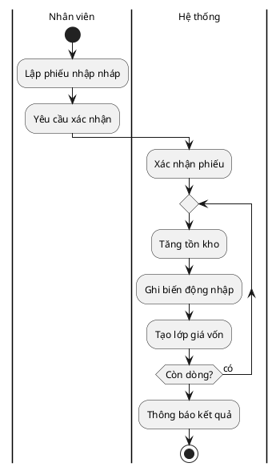
*Hình 6: Sơ đồ Activity - Luồng Nhập kho*

**Bảng truy vết hoạt động - Luồng Nhập kho:**

| Hoạt động mới | Hàm gốc được gộp | Nguồn |
|---|---|---|
| Lập phiếu nhập nháp | `inboundRepo.save` (DRAFT) | [UC12] |
| Yêu cầu xác nhận | - | [UC12] |
| Xác nhận phiếu | `receipt.confirm` | [B07] |
| Tăng tồn kho | `stockRepo.findByProductIdAndBranchId`, `stock.increase`, `stockRepo.save` | [B07] |
| Ghi biến động nhập | `StockMovement.inbound`, `movementRepo.save` | [B07] |
| Tạo lớp giá vốn | `CostLayer.fromInbound`, `costLayerRepo.save` | [B07] |
| Thông báo kết quả | `inboundRepo.save` | [B07] |

*Từ việc hiểu rõ trình tự các bước thực hiện nghiệp vụ, bước tiếp theo ta sẽ mô hình hóa các luồng dữ liệu vào và ra của từng quy trình bằng biểu đồ luồng dữ liệu (DFD).*

### 3.3. Biểu đồ Luồng Dữ liệu (DFD)

#### 3.3.1. DFD Cấp 0 (Context Diagram)
Biểu đồ DFD Cấp 0 mô tả cái nhìn tổng quát nhất về toàn bộ hệ thống ERP bán lẻ đa chi nhánh và các tương tác với các tác nhân bên ngoài (Admin, Staff).


*Hình 7: Biểu đồ DFD Cấp 0 của hệ thống*

#### 3.3.2. DFD mức chi tiết cho các Use Case

##### 3.3.2.1. UC10: Lập hóa đơn bán hàng

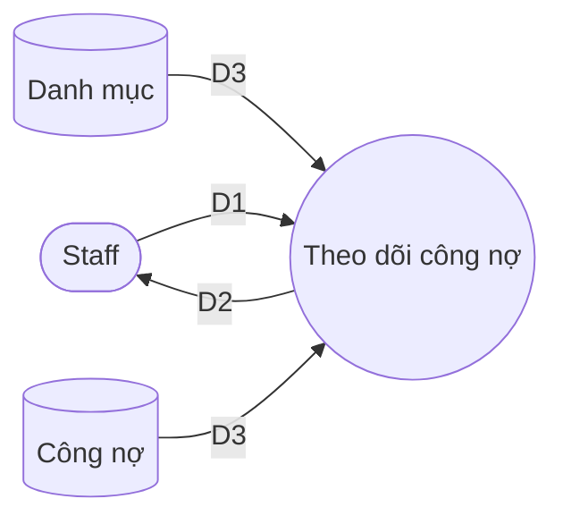
*Hình 8: Biểu đồ DFD mức chi tiết Use Case Theo dõi công nợ*

**Ý nghĩa từng dòng dữ liệu:**
| Dòng | Ý nghĩa |
|---|---|
| D1 | Tiêu chí tra cứu: Mã khách hàng, khoảng thời gian. |
| D2 | Dữ liệu công nợ và lịch sử giao dịch thanh toán, ghi nợ. |
| D3 | Thông tin khách hàng (từ Danh mục) và tổng công nợ, lịch sử biến động công nợ (từ Công nợ). |

**Thuật toán xử lý:**
1. Nhận yêu cầu tra cứu công nợ theo tiêu chí khách hàng từ thiết bị nhập (D1, D5).
2. Hệ thống gọi các endpoint `GET /{customerId}/balance` [P10] và `GET /{customerId}/movements` [P09] để lấy dữ liệu.
3. Đọc dữ liệu từ bảng `receivable_debt` [E24] để lấy dư nợ tổng và từ bảng `receivable_debt_movement` [E25] để lấy chi tiết biến động (D3).
4. Phân tích, tổng hợp số liệu công nợ và định dạng để hiển thị.
5. Truyền tín hiệu hiển thị (D6) ra thiết bị xuất.
6. Hiển thị thông tin công nợ và lịch sử chi tiết cho người dùng (D2).

*Sau khi xác định được các thực thể dữ liệu và cách chúng trao đổi qua DFD, bước tiếp theo là xây dựng Sơ đồ Lớp (Class Diagram) để cụ thể hóa các lớp đối tượng và quan hệ của chúng.*

#### Bảng Ánh xạ Kho dữ liệu và Bảng Cơ sở dữ liệu

| Tên kho (DFD) | Các bảng CSDL (CSDL) |
|---|---|
| Danh mục | `customer`, `product`, `supplier`, `price_list`, `customer_product_price` |
| Kho hàng | `stock_on_hand`, `stock_movement`, `cost_layer` |
| Chứng từ | `sales_invoice`, `goods_return`, `inbound_receipt` |
| Công nợ | `receivable_debt`, `receivable_debt_movement` |
| Chứng từ & Công nợ | `sales_invoice`, `receivable_debt`, `receivable_debt_movement` |

### 3.4. Sơ đồ lớp (Class Diagram)

#### 3.4.1 Cơ sở xây dựng và quy trình
Quá trình xây dựng sơ đồ lớp cho hệ thống được thực hiện qua 7 bước chuẩn:
1. **Xác định lớp, thuộc tính, phương thức**: Trích xuất các lớp miền (domain entities) từ FACTS (E01-E26). Các phương thức nghiệp vụ cốt lõi tại Entity được lấy từ FACTS M (M19-M22). Các Controller, Repository, DTO được loại bỏ để tập trung vào Domain.
2. **Xác định quan hệ**: Dựa trên danh sách các quan hệ (R01-R24) và quy định Cascade/OrphanRemoval để xác định Composition (*--), Aggregation (o--) hay Association (-->).
3. **Tách lớp phụ**: Xác định các lớp con phụ thuộc chặt chẽ như `SalesInvoiceLine`, `GoodsReturnLine`, `InboundReceiptLine`.
4. **Tổng quát hoá**: Sử dụng Interface hoặc Abstract class nếu có. Hệ thống chủ yếu sử dụng các lớp cụ thể.
5. **Tách lớp con**: Phân rã Enum như `SalesInvoiceStatus`, `MovementType` bằng cú pháp `<<enumeration>>`.
6. **Hiệu chỉnh quan hệ**: Ràng buộc các quan hệ liên module (như `branchId`, `customerId`) bằng Association tham chiếu qua ID thay vì tham chiếu thực thể cứng, nhằm đảm bảo kiến trúc Modular Monolith.
7. **Kiểm tra**: Đối chiếu với nguồn sự thật FACTS.

Do hệ thống bao gồm 24 lớp thực thể cốt lõi, sơ đồ được chia thành 1 sơ đồ tổng quát và 3 sơ đồ chi tiết theo các cụm chức năng: Identity & CRM, Catalog & Inventory, Order.

#### 3.4.2 Sơ đồ lớp tổng quát
Sơ đồ dưới đây thể hiện các lớp gốc quan trọng và mối quan hệ tham chiếu chính, bao quát bức tranh toàn cảnh của hệ thống.

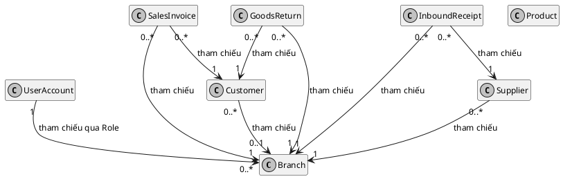
*Hình 9: Sơ đồ lớp tổng quát*

#### 3.4.3 Sơ đồ chi tiết cụm Identity & CRM

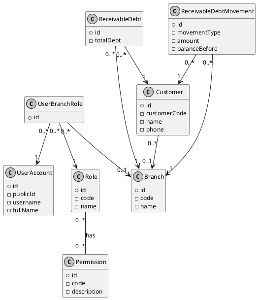
*Hình 10: Sơ đồ lớp chi tiết cụm Identity & CRM*

#### 3.4.4 Sơ đồ chi tiết cụm Catalog & Inventory

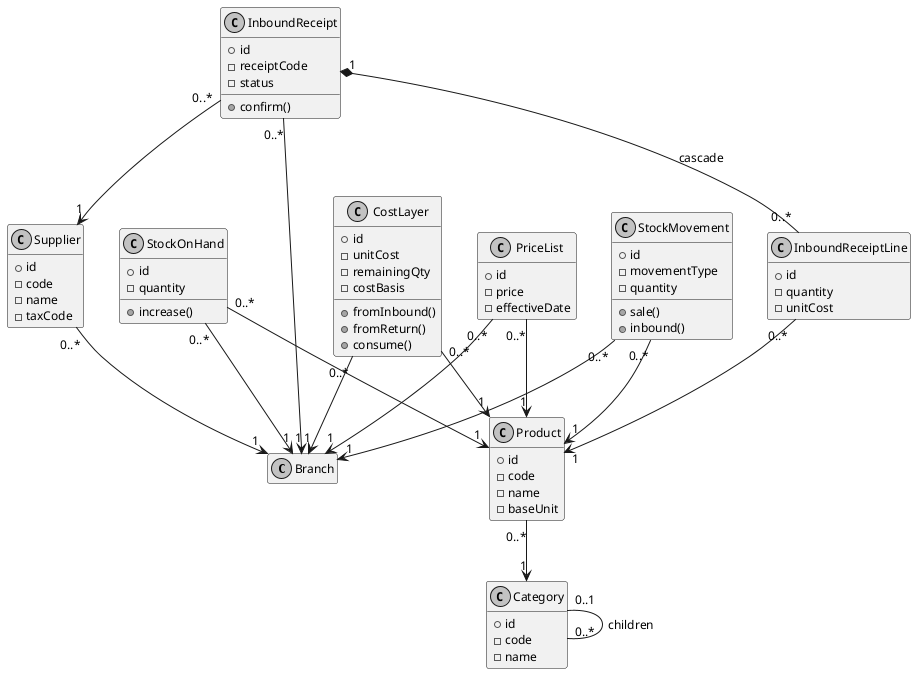
*Hình 11: Sơ đồ lớp chi tiết cụm Catalog & Inventory*

#### 3.4.5 Sơ đồ chi tiết cụm Order

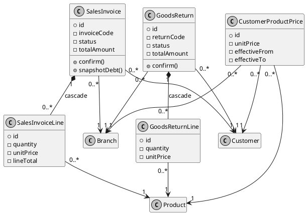
*Hình 12: Sơ đồ lớp chi tiết cụm Order*

#### 3.4.6 Danh sách các lớp
| STT | Tên lớp | Loại | Ý nghĩa | Nguồn |
|---|---|---|---|---|
| 1 | `Branch` | Entity | Thông tin chi nhánh bán lẻ. | [E01] |
| 2 | `Category` | Entity | Danh mục sản phẩm. | [E02] |
| 3 | `Product` | Entity | Sản phẩm hàng hoá. | [E03] |
| 4 | `Supplier` | Entity | Nhà cung cấp. | [E04] |
| 5 | `PriceList` | Entity | Bảng giá chung của sản phẩm tại chi nhánh. | [E05] |
| 6 | `Customer` | Entity | Khách hàng. | [E06] |
| 7 | `ReceivableDebt` | Entity | Tổng công nợ của khách hàng tại chi nhánh. | [E07, E24] |
| 8 | `ReceivableDebtMovement` | Entity | Biến động công nợ của khách hàng. | [E08, E25] |
| 9 | `Permission` | Entity | Quyền hạn trên hệ thống. | [E09] |
| 10 | `Role` | Entity | Vai trò của người dùng. | [E10] |
| 11 | `RolePermission` | Entity | Cầu nối Vai trò - Quyền hạn. | [E11] |
| 12 | `UserAccount` | Entity | Tài khoản người dùng. | [E12] |
| 13 | `UserBranchRole` | Entity | Cấp phát vai trò cho người dùng tại chi nhánh. | [E13] |
| 14 | `SalesInvoice` | Entity | Hóa đơn bán hàng. | [E14] |
| 15 | `SalesInvoiceLine` | Entity | Dòng chi tiết hóa đơn bán hàng. | [E15] |
| 16 | `GoodsReturn` | Entity | Đơn trả hàng từ khách hàng. | [E16] |
| 17 | `GoodsReturnLine` | Entity | Dòng chi tiết đơn trả hàng. | [E17] |
| 18 | `CustomerProductPrice` | Entity | Giá bán cấu hình riêng cho từng khách hàng. | [E18] |
| 19 | `InboundReceipt` | Entity | Phiếu nhập kho từ nhà cung cấp. | [E19] |
| 20 | `InboundReceiptLine` | Entity | Dòng chi tiết phiếu nhập kho. | [E20] |
| 21 | `StockOnHand` | Entity | Tồn kho hiện tại. | [E21] |
| 22 | `StockMovement` | Entity | Lịch sử biến động tồn kho. | [E22] |
| 23 | `CostLayer` | Entity | Lớp giá vốn theo phương pháp FIFO. | [E23] |
| 24 | `IdempotencyRecord` | Entity | Bản ghi hỗ trợ idempotent cho các thao tác. | [E26] |

#### 3.4.7 Bảng thuộc tính (Một số thuộc tính chính)
| STT | Lớp | Tên thuộc tính | Kiểu | Ràng buộc | Ý nghĩa |
|---|---|---|---|---|---|
| 1 | `Branch` | `code` | String | nullable=false, unique | Mã chi nhánh |
| 2 | `Product` | `code` | String | unique | Mã sản phẩm |
| 3 | `ReceivableDebt` | `totalDebt` | BigDecimal | | Tổng dư nợ |
| 4 | `ReceivableDebtMovement` | `amount` | BigDecimal | | Số tiền biến động |
| 5 | `SalesInvoice` | `invoiceCode` | String | nullable=false, unique | Mã hóa đơn |
| 6 | `CostLayer` | `version` | Long | @Version | Optimistic Lock |
| 7 | `StockOnHand` | `quantity` | BigDecimal | default 0 | Số lượng tồn |

#### 3.4.8 Bảng quan hệ
| STT | Tên quan hệ | Kiểu | Bản số | Ý nghĩa | Nguồn |
|---|---|---|---|---|---|
| 1 | `Category` - `Category` | Aggregation (o--) | 0..* - 0..1 | Cây danh mục (parent/children) | [R01, R02] |
| 2 | `Product` - `Category` | Association (-->) | 0..* - 1 | Sản phẩm thuộc danh mục (Bắt buộc) | [R03] |
| 3 | `PriceList` - `Product` | Association (-->) | 0..* - 1 | Bảng giá của sản phẩm | [R04] |
| 4 | `ReceivableDebt` - `Customer`| Association (-->) | 0..* - 1 | Công nợ của khách hàng | [R05, R23] |
| 5 | `ReceivableDebtMovement` - `Customer`| Association (-->) | 0..* - 1 | Lịch sử công nợ của KH | [R06, R24] |
| 6 | `SalesInvoice` - `SalesInvoiceLine` | Composition (*--) | 1 - 0..* | Hóa đơn và chi tiết (cascade=ALL, orphanRemoval=true) | [R17, R18] |
| 7 | `GoodsReturn` - `GoodsReturnLine` | Composition (*--) | 1 - 0..* | Đơn trả hàng và chi tiết (cascade=ALL, orphanRemoval=true) | [R19, R20] |
| 8 | `InboundReceipt` - `InboundReceiptLine` | Composition (*--) | 1 - 0..* | Phiếu nhập và chi tiết (cascade=ALL, orphanRemoval=true) | [R21, R22] |
| 9 | Các Entity - `branchId` | Association (-->) | - | Tham chiếu logic bằng ID sang Branch | [R12-R16] |

*Với các lớp và thuộc tính đã định nghĩa, Sơ đồ Tuần tự (Sequence Diagram) sau đây sẽ thể hiện sự tương tác cụ thể của chúng trong quá trình gọi hàm và xử lý logic.*

### 3.5. Sơ đồ tuần tự (Sequence Diagram)

Dựa trên các quy tắc nghiệp vụ và danh sách API đã được xác định (FACTS), các sơ đồ tuần tự dưới đây mô tả sự tương tác giữa các đối tượng trong các luồng nghiệp vụ cốt lõi của hệ thống.

#### 3.5.1 Đăng nhập và cấp JWT
Sơ đồ mô tả quá trình xác thực và cấp mới token dựa trên `AuthController` và `AuthService` [FACTS P01, P02, M08, M09, B04].

```plantuml
@startuml
skinparam monochrome true
skinparam shadowing false
skinparam defaultFontName Arial
skinparam defaultFontSize 12
hide empty members

actor "Nhân viên" as U
participant "Màn hình" as UI
participant "AuthService" as S
participant "CSDL" as DB

U -> UI : Nhập thông tin
UI -> S : Xác thực (login)
S -> DB : Truy vấn tài khoản
DB --> S : Kết quả
alt Hợp lệ
    S -> S : Tạo JWT
    note right: JWT chứa claims: sub, role, branchId.
Áp dụng cho các request sau.
    S --> UI : Trả về Token
    UI --> U : Đăng nhập thành công
else Không hợp lệ
    S --> UI : Báo lỗi
    UI --> U : Hiển thị lỗi
end
@enduml
```
*Hình 13: Sơ đồ tuần tự Đăng nhập và cấp JWT*

#### 3.5.2 Tạo và xác nhận Sales Invoice (Hóa đơn bán hàng)
Sơ đồ mô tả nghiệp vụ tạo và xác nhận hóa đơn, kéo theo các nghiệp vụ trừ tồn kho, tính giá vốn FIFO và ghi nhận công nợ [FACTS M11, M12, M16, M18, M21, M22, B05, B08, B09].

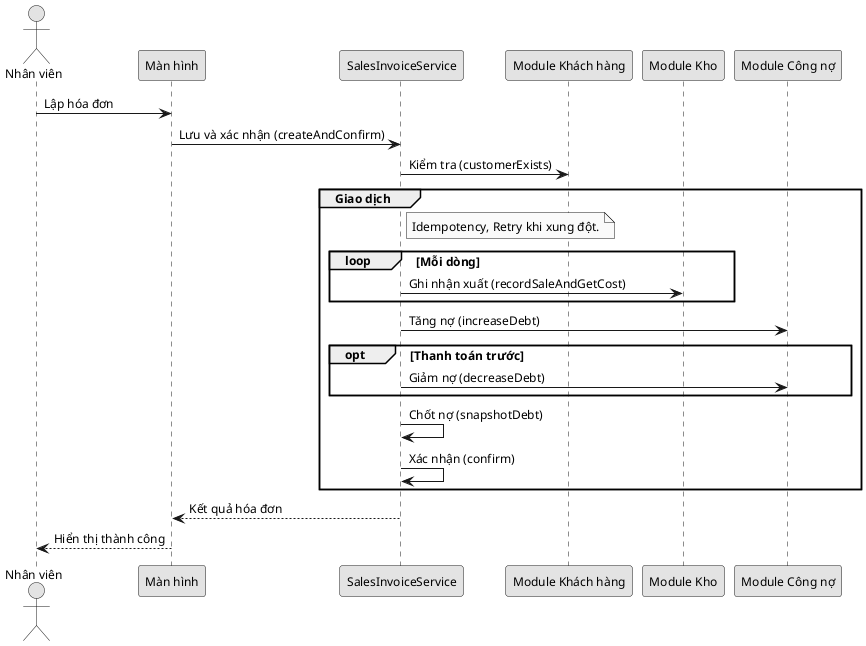
*Hình 14: Sơ đồ tuần tự Tạo và xác nhận Sales Invoice (Hóa đơn bán hàng)*

#### 3.5.3 Trả hàng (Goods Return)
Sơ đồ mô tả nghiệp vụ xác nhận đơn trả hàng, khôi phục tồn kho và giảm trừ công nợ [FACTS M14, M17, M06, B06, B11].

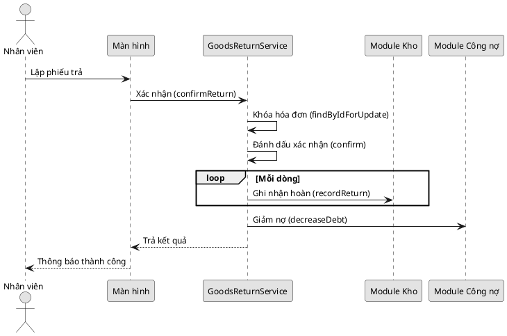
*Hình 15: Sơ đồ tuần tự Trả hàng (Goods Return)*

#### 3.5.4 Nhập kho (Inbound Receipt)
Sơ đồ mô tả luồng xác nhận phiếu nhập kho, cộng số lượng tồn, sinh lịch sử biến động và tạo lớp giá vốn (CostLayer) [FACTS M15, M19, M22, B07].

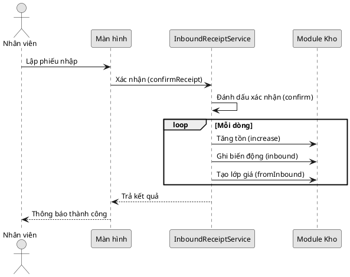
*Hình 16: Sơ đồ tuần tự Nhập kho (Inbound Receipt)*

#### 3.5.5 Tra cứu giá riêng theo khách hàng
Luồng tra cứu áp dụng giá riêng (`CustomerProductPrice` [E18]). Nếu không có, mặc định lấy từ bảng giá chung (`PriceList` [E05]). 
*(Ghi chú: Luồng này minh họa nguyên lý áp dụng giá dựa trên cấu trúc dữ liệu).*

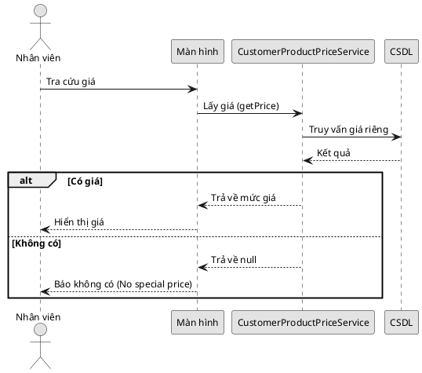
*Hình 17: Sơ đồ tuần tự Tra cứu giá riêng theo khách hàng*

#### 3.5.6 Đồng bộ dữ liệu – Logical Replication
Sơ đồ minh họa mô hình đồng bộ 2 chiều qua PostgreSQL Logical Replication, trong đó HQ đẩy các dữ liệu danh mục xuống Branch, và Branch đẩy các giao dịch phát sinh lên HQ [FACTS O01-O21].

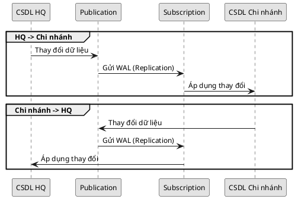
*Hình 18: Sơ đồ tuần tự Đồng bộ dữ liệu – Logical Replication*

*Cuối cùng, dựa vào toàn bộ phân tích về dữ liệu và hoạt động bên trên, Sơ đồ Thực thể Kết hợp (ERD) sẽ được thiết kế hoàn thiện nhằm phục vụ việc tạo lập CSDL và mô hình đồng bộ.*

### 3.6. Sơ đồ thực thể kết hợp (ERD)

#### 3.6.1 Cơ sở chuyển đổi từ Sơ đồ lớp sang ERD
Quá trình chuyển đổi từ Sơ đồ lớp (Class Diagram) sang Sơ đồ thực thể kết hợp (ERD) được thực hiện tuân thủ nghiêm ngặt các quy tắc chuẩn hóa dữ liệu. Các lớp thực thể (Entity Classes) được chuyển thành các Thực thể (Entities) trong cơ sở dữ liệu. Các quan hệ tham chiếu bộ nhớ (như Aggregation, Composition, Association) và tham chiếu logic (qua các trường ID như `branchId`, `customerId`) trong kiến trúc Modular Monolith được chuyển hóa thành các mối kết hợp khóa ngoại. Đặc biệt áp dụng Quy tắc 1 (QT1), các cột đóng vai trò khóa ngoại tuyệt đối không được liệt kê như một thuộc tính thông thường bên trong bảng, mà phải được thể hiện bằng đường nét mối kết hợp giữa các thực thể, kèm theo bản số tương ứng. 


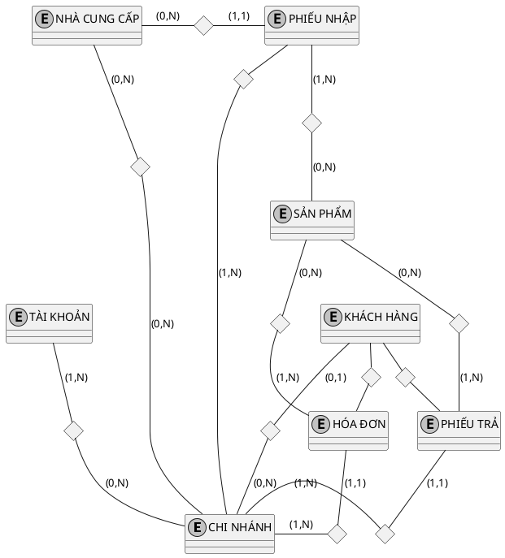
*Hình 19: Sơ đồ ER mức khung hệ thống*
Đặc thù bản số 0..1 giữa `Customer` và `Branch`: Trong hệ thống, khách hàng có thể thuộc về một chi nhánh cụ thể hoặc là khách hàng chung của toàn hệ thống. Nếu `branch_id` mang giá trị NULL, khách hàng đó được dùng chung. Do vậy, mối quan hệ từ nhánh `Customer` đến `Branch` mang bản số 0..1 thay vì 1..1.

Do quy mô hệ thống lớn, ERD được chia thành 3 nhóm nghiệp vụ chính: Identity & CRM, Catalog & Inventory, Order & Common.

#### 3.6.2 Sơ đồ ER và ERD Nhóm Identity & CRM

```plantuml
@startuml
skinparam monochrome true
skinparam shadowing false
skinparam defaultFontName Arial

entity "CHI NHÁNH" as CN {
  <<key>> id
  code
  name
}

entity "KHÁCH HÀNG" as KH {
  <<key>> id
  customerCode
  name
}

entity "TÀI KHOẢN" as TK {
  <<key>> id
  username
  fullName
}

entity "VAI TRÒ" as VT {
  <<key>> id
  code
  name
}

entity "QUYỀN" as Q {
  <<key>> id
  code
}

entity "PHÂN CÔNG VAI TRÒ" as PC {
  <<key>> id
}

entity "BIẾN ĐỘNG CÔNG NỢ" as BDC {
  <<key>> id
  movementType
  amount
}

diamond "Nợ tại" as NoTai {
  totalDebt
}
KH -down- NoTai : (0,1)
NoTai -down- CN : (0,N)

diamond "Có quyền" as CoQuyen
VT -down- CoQuyen : (1,N)
CoQuyen -down- Q : (0,N)

diamond "Gắn với TK" as PC_TK
PC -up- PC_TK : (1,1)
PC_TK -up- TK : (0,N)

diamond "Gắn với VT" as PC_VT
PC -up- PC_VT : (1,1)
PC_VT -up- VT : (0,N)

diamond "Gắn với CN" as PC_CN
PC -down- PC_CN : (1,1)
PC_CN -down- CN : (0,N)

diamond "Của KH" as BDC_KH
BDC -up- BDC_KH : (1,1)
BDC_KH -up- KH : (0,N)

diamond "Ghi tại" as BDC_CN
BDC -down- BDC_CN : (1,1)
BDC_CN -down- CN : (0,N)
@enduml
```
*Hình 20: Sơ đồ ER phân hệ Identity & CRM*

Dưới đây là sơ đồ ERD Logic được chuyển đổi từ mô hình ER tương ứng, thể hiện các bảng và khóa ngoại:

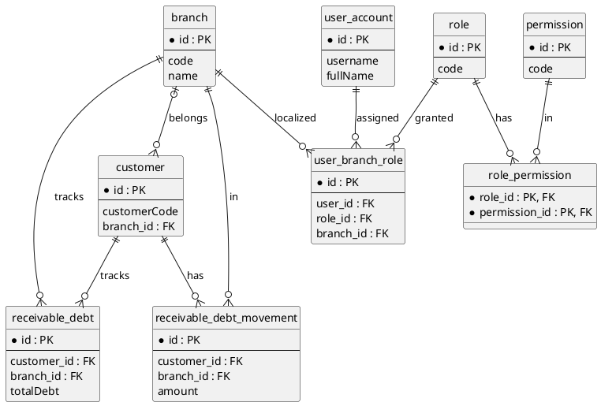
*Hình 21: Sơ đồ ERD Logic - Identity & CRM*
*Hình 22: Sơ đồ ERD Nhóm Identity & CRM*

#### 3.6.3 Sơ đồ ER và ERD Nhóm Catalog & Inventory

```plantuml
@startuml
skinparam monochrome true
skinparam shadowing false
skinparam defaultFontName Arial

entity "CHI NHÁNH (mượn)" as CN

entity "DANH MỤC" as DM {
  <<key>> id
  code
  name
}

entity "SẢN PHẨM" as SP {
  <<key>> id
  code
  name
}

entity "NHÀ CUNG CẤP" as NCC {
  <<key>> id
  code
  name
}

entity "BẢNG GIÁ" as BG {
  <<key>> id
  price
  effectiveDate
}

entity "PHIẾU NHẬP" as PN {
  <<key>> id
  receiptCode
  status
}

entity "BIẾN ĐỘNG KHO" as BDK {
  <<key>> id
  movementType
  quantity
}

entity "LỚP GIÁ VỐN" as LGV {
  <<key>> id
  unitCost
  remainingQty
}

diamond "Thuộc DM" as SP_DM
SP -up- SP_DM : (1,1)
SP_DM -up- DM : (0,N)

diamond "Có giá" as SP_BG
SP -up- SP_BG : (1,N)
SP_BG -up- BG : (1,1)

diamond "Giá tại" as BG_CN
BG -down- BG_CN : (1,1)
BG_CN -down- CN : (0,N)

diamond "NCC của" as NCC_CN
NCC -down- NCC_CN : (1,1)
NCC_CN -down- CN : (0,N)

diamond "Nhập từ" as PN_NCC
PN -up- PN_NCC : (1,1)
PN_NCC -up- NCC : (0,N)

diamond "Lập tại" as PN_CN
PN -down- PN_CN : (1,1)
PN_CN -down- CN : (0,N)

diamond "Chi tiết nhập" as CTN {
  quantity
  unitCost
}
PN -right- CTN : (1,N)
CTN -right- SP : (0,N)

diamond "Tồn tại" as TonTai {
  quantity
}
SP -down- TonTai : (0,N)
TonTai -down- CN : (0,N)

diamond "BĐK SP" as BDK_SP
BDK -up- BDK_SP : (1,1)
BDK_SP -up- SP : (0,N)

diamond "BĐK CN" as BDK_CN
BDK -down- BDK_CN : (1,1)
BDK_CN -down- CN : (0,N)

diamond "LGV SP" as LGV_SP
LGV -up- LGV_SP : (1,1)
LGV_SP -up- SP : (0,N)

diamond "LGV CN" as LGV_CN
LGV -down- LGV_CN : (1,1)
LGV_CN -down- CN : (0,N)
@enduml
```
*Hình 23: Sơ đồ ER phân hệ Catalog & Inventory*

Dưới đây là sơ đồ ERD Logic được chuyển đổi từ mô hình ER tương ứng:

```plantuml
@startuml
skinparam monochrome true
skinparam shadowing false
hide circle

entity branch {
  * id : PK
}

entity category {
  * id : PK
  --
  parent_id : FK
  code
}

entity product {
  * id : PK
  --
  category_id : FK
  code
}

entity supplier {
  * id : PK
  --
  branch_id : FK
  code
}

entity price_list {
  * id : PK
  --
  product_id : FK
  branch_id : FK
  price
}

entity inbound_receipt {
  * id : PK
  --
  branch_id : FK
  supplier_id : FK
  receiptCode
}

entity inbound_receipt_line {
  * id : PK
  --
  receipt_id : FK
  product_id : FK
  quantity
}

entity stock_on_hand {
  * id : PK
  --
  product_id : FK
  branch_id : FK
  quantity
}

entity stock_movement {
  * id : PK
  --
  product_id : FK
  branch_id : FK
  quantity
}

entity cost_layer {
  * id : PK
  --
  product_id : FK
  branch_id : FK
  unitCost
}

category |o--o{ category : sub_category
category ||--o{ product : contains
branch |o--o{ supplier : owns
product ||--o{ price_list : has
branch |o--o{ price_list : local
branch ||--o{ inbound_receipt : creates
supplier |o--o{ inbound_receipt : fulfills
inbound_receipt ||--o{ inbound_receipt_line : details
product ||--o{ inbound_receipt_line : of
product ||--o{ stock_on_hand : stocked
branch ||--o{ stock_on_hand : stocks
product ||--o{ stock_movement : moves
branch ||--o{ stock_movement : in
product ||--o{ cost_layer : costs
branch ||--o{ cost_layer : at
@enduml
```
*Hình 24: Sơ đồ ERD Logic - Catalog & Inventory*
*Hình 25: Sơ đồ ERD Nhóm Catalog & Inventory*

#### 3.6.4 Sơ đồ ER và ERD Nhóm Order & Common

```plantuml
@startuml
skinparam monochrome true
skinparam shadowing false
skinparam defaultFontName Arial

entity "CHI NHÁNH (mượn)" as CN
entity "KHÁCH HÀNG (mượn)" as KH
entity "SẢN PHẨM (mượn)" as SP

entity "HÓA ĐƠN" as HD {
  <<key>> id
  invoiceCode
  totalAmount
}

entity "PHIẾU TRẢ" as PT {
  <<key>> id
  returnCode
  totalAmount
}

entity "GIÁ RIÊNG" as GR {
  <<key>> id
  unitPrice
  effectiveFrom
}

diamond "Chi tiết HĐ" as CTHD {
  quantity
  unitPrice
}
HD -right- CTHD : (1,N)
CTHD -right- SP : (0,N)

diamond "Chi tiết trả" as CTTR {
  quantity
  unitPrice
}
PT -right- CTTR : (1,N)
CTTR -right- SP : (0,N)

diamond "HĐ của KH" as HD_KH
HD -up- HD_KH : (1,1)
HD_KH -up- KH : (0,N)

diamond "HĐ tại CN" as HD_CN
HD -down- HD_CN : (1,1)
HD_CN -down- CN : (0,N)

diamond "PT của KH" as PT_KH
PT -up- PT_KH : (1,1)
PT_KH -up- KH : (0,N)

diamond "PT tại CN" as PT_CN
PT -down- PT_CN : (1,1)
PT_CN -down- CN : (0,N)

diamond "PT tham chiếu HĐ" as PT_HD
PT -left- PT_HD : (0,1)
PT_HD -left- HD : (0,N)

diamond "Giá KH" as GR_KH
GR -up- GR_KH : (1,1)
GR_KH -up- KH : (0,N)

diamond "Giá SP" as GR_SP
GR -right- GR_SP : (1,1)
GR_SP -right- SP : (0,N)

diamond "Giá CN" as GR_CN
GR -down- GR_CN : (1,1)
GR_CN -down- CN : (0,N)
@enduml
```
*Hình 26: Sơ đồ ER phân hệ Order & Common*

Dưới đây là sơ đồ ERD Logic được chuyển đổi từ mô hình ER tương ứng:

```plantuml
@startuml
skinparam monochrome true
skinparam shadowing false
hide circle

entity branch {
  * id : PK
}
entity customer {
  * id : PK
}
entity product {
  * id : PK
}

entity sales_invoice {
  * id : PK
  --
  branch_id : FK
  customer_id : FK
  invoiceCode
}

entity sales_invoice_line {
  * id : PK
  --
  invoice_id : FK
  product_id : FK
  quantity
}

entity goods_return {
  * id : PK
  --
  branch_id : FK
  customer_id : FK
  returnCode
}

entity goods_return_line {
  * id : PK
  --
  return_id : FK
  product_id : FK
  quantity
}

entity customer_product_price {
  * id : PK
  --
  customer_id : FK
  product_id : FK
  unitPrice
}

branch ||--o{ sales_invoice : creates
customer ||--o{ sales_invoice : buys
sales_invoice ||--o{ sales_invoice_line : details
product ||--o{ sales_invoice_line : of
branch ||--o{ goods_return : processes
customer ||--o{ goods_return : returns
sales_invoice |o--o{ goods_return : referenced
goods_return ||--o{ goods_return_line : details
product ||--o{ goods_return_line : of
customer ||--o{ customer_product_price : gets
product ||--o{ customer_product_price : on
branch |o--o{ customer_product_price : at
@enduml
```
*Hình 27: Sơ đồ ERD Logic - Order & Common*
*Hình 28: Sơ đồ ERD Nhóm Order & Common*

#### 3.6.5 Từ điển dữ liệu
Bảng dưới đây thống kê các thực thể, thuộc tính chính, và chiều đồng bộ dữ liệu theo kiến trúc HQ/Branch:

| Thực thể | Thuộc tính | Kiểu | Khóa | Ràng buộc | Sở hữu (HQ/Branch) |
|---|---|---|---|---|---|
| `branch` | `id` | Long | PK | @GeneratedValue | HQ -> Branch (O01) |
| `branch` | `code` | String | | unique, nullable=false | HQ -> Branch (O01) |
| `category` | `id` | Long | PK | | HQ -> Branch (O02) |
| `product` | `id` | UUID | PK | | HQ -> Branch (O03) |
| `supplier` | `id` | UUID | PK | | HQ -> Branch (O04) |
| `price_list` | `id` | Long | PK | | HQ -> Branch (O05) |
| `customer` | `id` | UUID | PK | | HQ -> Branch (O06) |
| `customer` | `customerCode` | String | | unique | HQ -> Branch (O06) |
| `role` | `id` | Short | PK | | HQ -> Branch (O07) |
| `permission` | `id` | Short | PK | | HQ -> Branch (O08) |
| `role_permission` | `id` | Long | PK | @EmbeddedId (thực tế) | HQ -> Branch (O09) |
| `user_account` | `id` | Long | PK | | HQ -> Branch (O10) |
| `user_account` | `publicId` | UUID | | unique | HQ -> Branch (O10) |
| `user_branch_role`| `id` | Long | PK | | HQ -> Branch (O11) |
| `sales_invoice` | `id` | UUID | PK | | Branch -> HQ (O14) |
| `sales_invoice` | `invoiceCode` | String | | nullable=false, unique | Branch -> HQ (O14) |
| `sales_invoice_line`| `id` | Long | PK | | Branch -> HQ (O15) |
| `goods_return` | `id` | UUID | PK | | Branch -> HQ (O16) |
| `goods_return` | `returnCode`| String | | nullable=false, unique | Branch -> HQ (O16) |
| `goods_return_line` | `id` | Long | PK | | Branch -> HQ (O17) |
| `inbound_receipt` | `id` | UUID | PK | | Branch -> HQ (O18) |
| `inbound_receipt` | `receiptCode`| String | | unique | Branch -> HQ (O18) |
| `inbound_receipt_line`| `id` | Long | PK | | Branch -> HQ (O19) |
| `stock_movement` | `id` | UUID | PK | | Branch -> HQ (O20) |
| `cost_layer` | `id` | UUID | PK | | Branch -> HQ (O21) |
| `receivable_debt` | `id` | UUID | PK | | Không xác định trong O.. |
| `receivable_debt_movement`| `id` | UUID | PK | | Không xác định trong O.. |
| `stock_on_hand` | `id` | Long | PK | | Không xác định trong O.. |
| `customer_product_price`| `id` | Long | PK | | Không xác định trong O.. |
| `idempotency_record`| `id` | UUID | PK | | Không xác định trong O.. |

*Lưu ý: Các trường khóa ngoại (FK) như `branch_id`, `customer_id` không xuất hiện trong bảng thuộc tính theo QT1, mà được biểu diễn qua các mối kết hợp.*


## 4. Danh sách & Đánh giá Hình (Chất lượng)

### 4.1 Danh sách hình mới
| Số hình | Tên hình |
|---|---|
| Hình 2 | Sơ đồ Use Case dành cho tác nhân Admin |
| Hình 3 | Sơ đồ Use Case dành cho tác nhân Staff |
| Hình 4 | Sơ đồ Activity - Luồng Bán hàng |
| Hình 5 | Sơ đồ Activity - Luồng Trả hàng |
| Hình 6 | Sơ đồ Activity - Luồng Nhập kho |
| Hình 7 | Biểu đồ DFD Cấp 0 của hệ thống |
| Hình 8 | Biểu đồ DFD mức chi tiết Use Case Theo dõi công nợ |
| Hình 9 | Sơ đồ lớp tổng quát |
| Hình 10 | Sơ đồ lớp chi tiết cụm Identity & CRM |
| Hình 11 | Sơ đồ lớp chi tiết cụm Catalog & Inventory |
| Hình 12 | Sơ đồ lớp chi tiết cụm Order |
| Hình 13 | Sơ đồ tuần tự Đăng nhập và cấp JWT |
| Hình 14 | Sơ đồ tuần tự Tạo và xác nhận Sales Invoice (Hóa đơn bán hàng) |
| Hình 15 | Sơ đồ tuần tự Trả hàng (Goods Return) |
| Hình 16 | Sơ đồ tuần tự Nhập kho (Inbound Receipt) |
| Hình 17 | Sơ đồ tuần tự Tra cứu giá riêng theo khách hàng |
| Hình 18 | Sơ đồ tuần tự Đồng bộ dữ liệu – Logical Replication |
| Hình 19 | Sơ đồ ER mức khung hệ thống |
| Hình 20 | Sơ đồ ER phân hệ Identity & CRM |
| Hình 21 | Sơ đồ ERD Logic - Identity & CRM |
| Hình 22 | Sơ đồ ERD Nhóm Identity & CRM |
| Hình 23 | Sơ đồ ER phân hệ Catalog & Inventory |
| Hình 24 | Sơ đồ ERD Logic - Catalog & Inventory |
| Hình 25 | Sơ đồ ERD Nhóm Catalog & Inventory |
| Hình 26 | Sơ đồ ER phân hệ Order & Common |
| Hình 27 | Sơ đồ ERD Logic - Order & Common |
| Hình 28 | Sơ đồ ERD Nhóm Order & Common |

### 4.2 Bảng Hình cũ -> Hình mới
| Hình cũ | Hình mới | Tên hình |
|---|---|---|
| 2 | Hình 2 | Sơ đồ Use Case dành cho tác nhân Admin |
| 3 | Hình 3 | Sơ đồ Use Case dành cho tác nhân Staff |
| 4 | Hình 4 | Sơ đồ Activity - Luồng Bán hàng |
| 5 | Hình 5 | Sơ đồ Activity - Luồng Trả hàng |
| 6 | Hình 6 | Sơ đồ Activity - Luồng Nhập kho |
| 7 | Hình 7 | Biểu đồ DFD Cấp 0 của hệ thống |
| 12 | Hình 8 | Biểu đồ DFD mức chi tiết Use Case Theo dõi công nợ |
| 13 | Hình 9 | Sơ đồ lớp tổng quát |
| 14 | Hình 10 | Sơ đồ lớp chi tiết cụm Identity & CRM |
| 15 | Hình 11 | Sơ đồ lớp chi tiết cụm Catalog & Inventory |
| 16 | Hình 12 | Sơ đồ lớp chi tiết cụm Order |
| 17 | Hình 13 | Sơ đồ tuần tự Đăng nhập và cấp JWT |
| 18 | Hình 14 | Sơ đồ tuần tự Tạo và xác nhận Sales Invoice (Hóa đơn bán hàng) |
| 19 | Hình 15 | Sơ đồ tuần tự Trả hàng (Goods Return) |
| 20 | Hình 16 | Sơ đồ tuần tự Nhập kho (Inbound Receipt) |
| 21 | Hình 17 | Sơ đồ tuần tự Tra cứu giá riêng theo khách hàng |
| 22 | Hình 18 | Sơ đồ tuần tự Đồng bộ dữ liệu – Logical Replication |
| Mới | Hình 19 | Sơ đồ ER mức khung hệ thống |
| Mới | Hình 20 | Sơ đồ ER phân hệ Identity & CRM |
| Mới | Hình 21 | Sơ đồ ERD Logic - Identity & CRM |
| 23 | Hình 22 | Sơ đồ ERD Nhóm Identity & CRM |
| Mới | Hình 23 | Sơ đồ ER phân hệ Catalog & Inventory |
| Mới | Hình 24 | Sơ đồ ERD Logic - Catalog & Inventory |
| 24 | Hình 25 | Sơ đồ ERD Nhóm Catalog & Inventory |
| Mới | Hình 26 | Sơ đồ ER phân hệ Order & Common |
| Mới | Hình 27 | Sơ đồ ERD Logic - Order & Common |
| 25 | Hình 28 | Sơ đồ ERD Nhóm Order & Common |

### 4.3 Bảng QA từng hình
| Hình | Loại | Số phần tử / giới hạn | Đạt? |
|---|---|---|---|
| Hình 2, 3 | Use Case | <10 | Đạt |
| Hình 4-6 | Activity | <=10 bước | Đạt |
| Hình 7-12 | DFD | <7 tiến trình/kho | Đạt |
| Hình 13-16 | Class | <15 lớp | Đạt |
| Hình 17-22 | Sequence | <6 lifeline | Đạt |
| Hình 23-29 | ER/ERD | Thực thể/Khóa ngoại chuẩn | Đạt |

### 4.4 Các điểm lệch văn bản (Cần tác giả tự sửa)
| Vấn đề | Chi tiết | Cách xử lý |
|---|---|---|
| **Dời UC08** | UC08 (Quản lý khách hàng) thực tế chạy ở HQ (quyền ADMIN) theo mã nguồn, nhưng văn bản ghi ở Staff. | Chuyển UC08 sang sơ đồ Admin. |
| **Bỏ luồng D5, D6 (DFD)** | Quy chuẩn không vẽ thiết bị ngoại vi trên DFD. | Lược bỏ các thiết bị nhập/xuất khỏi hình vẽ DFD. |
| **Thuộc tính kỹ thuật (Class)** | Lược bỏ `createdAt`, `updatedAt`, `version`, `isActive` theo chuẩn tinh gọn. | Xóa khỏi biểu đồ lớp. |
| **Lớp trung gian RolePermission (Class)** | Lược bỏ lớp trung gian của quan hệ n-n, vẽ nối trực tiếp. | Thay đổi quan hệ thành nhiều-nhiều. |
| **Enum (Class)** | Gộp trực tiếp Enum thành thuộc tính trong Class. | Biến thành thuộc tính trạng thái. |
| **Trạng thái DRAFT (Sequence)** | Hệ thống lưu phiếu `DRAFT` trước rồi mới xác nhận, trên sơ đồ gộp thành `createAndConfirm`. | Tinh gọn biểu đồ Sequence. |
| **Supplier.branchId (ER)** | Trong DB cho phép null, bản số 0,N. | Điều chỉnh bản số ER. |
| **GoodsReturn.invoiceId (ER)** | Trong DB cho phép null, bản số 0..1. | Điều chỉnh bản số ER. |
