# Chương 3. Phân tích thiết kế hệ thống

Trong chương này, hệ thống ERP bán lẻ đa chi nhánh sẽ được phân tích và thiết kế chi tiết thông qua các góc nhìn từ tổng quan đến cụ thể. Đầu tiên, mô hình hóa chức năng (Use Case, Activity, DFD) sẽ làm rõ các yêu cầu nghiệp vụ và luồng xử lý của người dùng. Tiếp theo, cấu trúc tĩnh và hành vi động của hệ thống được phác họa qua Sơ đồ lớp (Class Diagram) và Sơ đồ tuần tự (Sequence Diagram). Cuối cùng, thiết kế dữ liệu (ERD) sẽ định hình cấu trúc lưu trữ, đảm bảo tính nhất quán và phục vụ tốt cho cơ chế đồng bộ trong kiến trúc Modular Monolith.

### 3.1. Phân tích Yêu cầu Chức năng (Use Case)

#### 3.1.1. Sơ đồ Use Case tổng quát

Hệ thống ERP bán lẻ đa chi nhánh được phân tách quyền hạn dựa trên hai tác nhân chính: Admin tại Trụ sở chính (HQ) và Staff tại Chi nhánh (Branch).
- **Admin** chịu trách nhiệm thiết lập các dữ liệu nền tảng (Master Data) bao gồm người dùng, chi nhánh, danh mục sản phẩm, nhà cung cấp và bảng giá, đồng thời xem các báo cáo tổng hợp.
- **Staff** vận hành trực tiếp các nghiệp vụ tại cửa hàng như lập hóa đơn, lập phiếu trả hàng, quản lý nhập kho, khách hàng và theo dõi công nợ cục bộ.

Do số lượng chức năng phong phú, sơ đồ Use Case được phân tách làm hai biểu đồ riêng biệt dành cho Admin và Staff, qua đó thể hiện rõ ranh giới nghiệp vụ của từng nhóm người dùng đối với các phân hệ của hệ thống.

**Sơ đồ Use Case của Admin:**

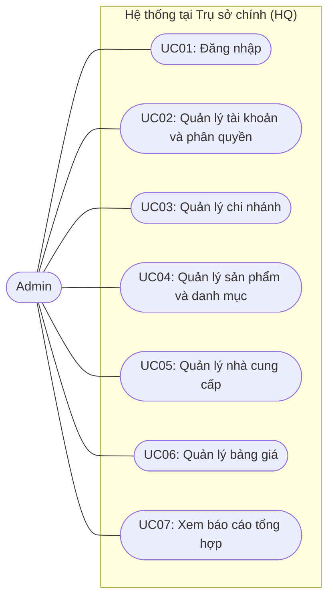
*Hình 2: Sơ đồ Use Case dành cho tác nhân Admin*

**Sơ đồ Use Case của Staff:**

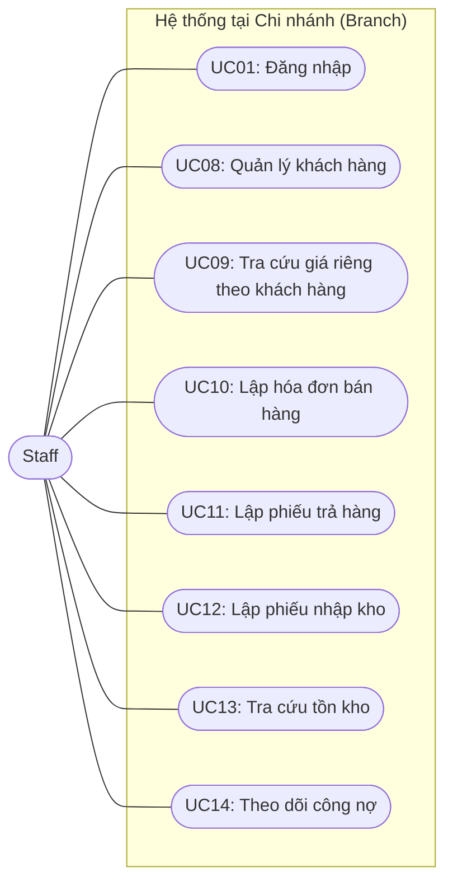
*Hình 3: Sơ đồ Use Case dành cho tác nhân Staff*

#### 3.1.2. Đặc tả các Use Case nghiệp vụ chính

Dưới đây là đặc tả chi tiết của 5 Use Case cốt lõi nhất, đóng vai trò nền tảng trong quá trình xác thực bảo mật và vận hành chuỗi bán hàng.

| Tên UC | Mã UC | Mô tả tóm tắt | Actor | Yêu cầu trước khi thực hiện | Các bước thực hiện | Điều kiện thoát | Điều kiện sau khi thực hiện | Yêu cầu đặc biệt |
|---|---|---|---|---|---|---|---|---|
| Đăng nhập | UC01 | Cho phép người dùng xác thực và truy cập vào hệ thống. | Admin, Staff | Người dùng có tài khoản đang hoạt động (`isActive = true`) [E12]. | 1. Người dùng gửi yêu cầu qua endpoint `POST /login` [P01].<br>2. Hệ thống gọi phương thức `login` của `AuthService` [M08].<br>3. Kiểm tra quy tắc nghiệp vụ: Staff phải có `branchId` [B01], Admin không được có `branchId` [B02].<br>4. Phát hành JWT token chứa các claims theo quy định [N03]. | Tài khoản không hợp lệ, sai mật khẩu, hoặc vi phạm quy tắc vai trò. | Người dùng nhận được JWT Token với role tương ứng [N02]. | Không |
| Lập hóa đơn bán hàng | UC10 | Lập và xác nhận hóa đơn bán hàng, ghi nhận thanh toán. | Staff | Đã xác thực, chọn khách hàng tồn tại [E06]. | 1. Staff gửi yêu cầu lập hóa đơn.<br>2. Hệ thống khởi tạo hóa đơn [E14] thông qua `createAndConfirm` [M11].<br>3. Lưu trạng thái nháp, sau đó gọi luồng xác nhận `applyConfirmationEffects` [B05, M12].<br>4. Với từng dòng sản phẩm [E15], gọi `recordSaleAndGetCost` [M16] tiêu thụ tồn kho FIFO [B08].<br>5. Tăng công nợ nếu còn thiếu qua `increaseDebt` [M05].<br>6. Cập nhật hóa đơn thành `CONFIRMED` [N04]. | Tồn kho lỗi, khách hàng không tồn tại, hoặc dữ liệu không nhất quán. | Hóa đơn được xác nhận [N04], trừ tồn kho [E21], công nợ khách hàng tăng [E24]. | Phải chạy trong transaction, sử dụng `@Retryable` [B10]. |
| Lập phiếu trả hàng | UC11 | Lập phiếu nhận lại hàng hóa trả về từ khách hàng. | Staff | Đã xác thực. | 1. Staff yêu cầu trả hàng, hệ thống lấy phiếu qua `findByIdForUpdate` [B06].<br>2. Khóa dòng phiếu bằng Pessimistic Lock [B11].<br>3. Hệ thống xử lý qua phương thức `confirmReturn` [M14].<br>4. Với từng dòng hoàn trả [E17], gọi `recordReturn` [M17] để hoàn lại kho.<br>5. Gọi `decreaseDebt` [M06] giảm công nợ khách hàng.<br>6. Cập nhật trạng thái phiếu thành `CONFIRMED` [N05]. | Lỗi tìm kiếm phiếu trả hàng hoặc giao dịch. | Phiếu hoàn trả xác nhận [E16], tồn kho hoàn lại, công nợ giảm đi. | Khóa Pessimistic Write phải duy trì suốt luồng [B11]. |
| Lập phiếu nhập kho | UC12 | Ghi nhận hàng hóa nhập từ nhà cung cấp [E04]. | Staff | Đã xác thực, chọn đúng sản phẩm [E03]. | 1. Staff tạo yêu cầu nhập kho [E19].<br>2. Hệ thống xử lý thông qua `confirmReceipt` [M15] và luồng [B07].<br>3. Tăng tồn kho và tạo biến động `StockMovement.inbound` [B07].<br>4. Lập các lớp giá mới qua phương thức `fromInbound` [M19] của `CostLayer` [E23].<br>5. Cập nhật phiếu thành `CONFIRMED` [N06]. | Sản phẩm hoặc nhà cung cấp không khả dụng. | Phiếu nhập kho được lưu [E19], `StockOnHand` tăng [E21], tạo thêm `CostLayer`. | Áp dụng `@Retryable` [M15] nếu xung đột. |
| Quản lý khách hàng | UC08 | Cho phép tạo, sửa hoặc xóa thông tin khách hàng. | Staff | Đã xác thực ở chi nhánh (có `branchId`). | 1. Staff gửi thông tin khách hàng qua các endpoint `POST`, `PUT`, `DELETE` [P04, P05, P06].<br>2. Gọi `createCustomer` [M04] trên `CustomerWriteService` (nếu tạo mới).<br>3. Tham chiếu khách hàng với chi nhánh qua thuộc tính `branchId` [R12].<br>4. Lưu khách hàng vào cơ sở dữ liệu [E06]. | Dữ liệu đầu vào sai định dạng hoặc mã đã tồn tại. | Hồ sơ khách hàng [E06] được tạo mới hoặc cập nhật. | Không |

*Tiếp nối việc xác định các chức năng cốt lõi thông qua sơ đồ Use Case, phần tiếp theo sẽ đi sâu vào mô tả chi tiết các bước thực hiện tuần tự của từng nghiệp vụ bằng biểu đồ hoạt động.*

### 3.2. Phân tích Yêu cầu Chức năng (Activity Diagram)

Mục này trình bày chi tiết luồng hoạt động (Activity Diagram) cho các nghiệp vụ cốt lõi của hệ thống, bao gồm Bán hàng, Trả hàng và Nhập kho. Các sơ đồ minh họa sự tương tác giữa nhân viên tại chi nhánh và hệ thống, cùng với các bước xử lý ngầm dựa trên luồng gọi hàm và quy tắc nghiệp vụ trong thực tế.

#### 3.2.1. Nghiệp vụ Bán hàng (Sales Invoice - UC10)

Sơ đồ dưới đây mô tả quy trình lập hóa đơn bán hàng. Hệ thống thực hiện kiểm tra thông tin khách hàng, ghi nhận biến động kho, tính giá vốn theo phương pháp FIFO và cập nhật công nợ trước khi chuyển trạng thái hóa đơn sang xác nhận.

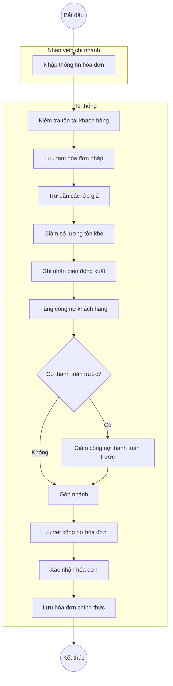
*Hình 4: Sơ đồ Activity - Luồng Bán hàng*

**Bảng truy vết hoạt động - Luồng Bán hàng:**

| Hoạt động (Hệ thống) | Nguồn / Căn cứ (FACTS) |
|---|---|
| Kiểm tra tồn tại khách hàng | `crmFacade.customerExists` [B05] |
| Lưu tạm hóa đơn nháp | `invoiceRepository.save` [B05] (Trạng thái `DRAFT` [N04]) |
| Trừ dần các lớp giá | `fifoCostService.consume` [B09] |
| Giảm số lượng tồn kho | `stock.decreaseAllowNegative` [B08] |
| Ghi nhận biến động xuất | `StockMovement.sale` [B08] |
| Tăng công nợ khách hàng | `debtService.increaseDebt` [B05] |
| Giảm công nợ thanh toán trước | `debtService.decreaseDebt` [B05] |
| Lưu vết công nợ hóa đơn | `invoice.snapshotDebt` [B05] |
| Xác nhận hóa đơn | `invoice.confirm` [B05] (Chuyển sang `CONFIRMED` [N04]) |
| Lưu hóa đơn chính thức | `invoiceRepository.save` [B05] |

#### 3.2.2. Nghiệp vụ Trả hàng (Goods Return - UC11)

Quy trình trả hàng theo mô hình Nháp (Draft) sang Xác nhận (Confirm). Khi nhân viên yêu cầu xác nhận, hệ thống tiến hành khóa hóa đơn gốc để đảm bảo tính toàn vẹn (tránh việc trả hàng đồng thời vượt quá số lượng mua), hoàn lại số lượng vào kho và giảm công nợ cho khách hàng.

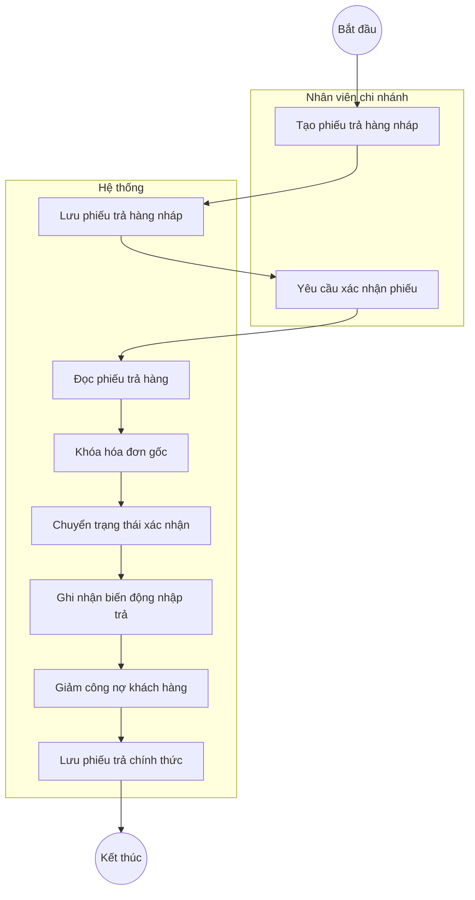
*Hình 5: Sơ đồ Activity - Luồng Trả hàng*

**Bảng truy vết hoạt động - Luồng Trả hàng:**

| Hoạt động (Hệ thống) | Nguồn / Căn cứ (FACTS) |
|---|---|
| Lưu phiếu trả hàng nháp | Trạng thái `DRAFT` [N05] |
| Đọc phiếu trả hàng | `returnRepository.findById` [B06] |
| Khóa hóa đơn gốc | `invoiceRepository.findByIdForUpdate` [B06] |
| Chuyển trạng thái xác nhận | `goodsReturn.confirm` [B06] (Chuyển sang `CONFIRMED` [N05]) |
| Ghi nhận biến động nhập trả | `inventoryFacade.recordReturn` [B06] |
| Giảm công nợ khách hàng | `debtService.decreaseDebt` [B06] |
| Lưu phiếu trả chính thức | `returnRepository.save` [B06] |

#### 3.2.3. Nghiệp vụ Nhập kho (Inbound Receipt - UC12)

Quy trình nhập kho áp dụng mô hình duyệt tương tự. Quá trình xác nhận sẽ thực hiện tăng tồn kho, ghi nhận biến động nhập và sinh ra các Lớp giá (Cost Layer) mới phục vụ cho phương pháp tính giá vốn FIFO ở các giao dịch xuất kho sau này.

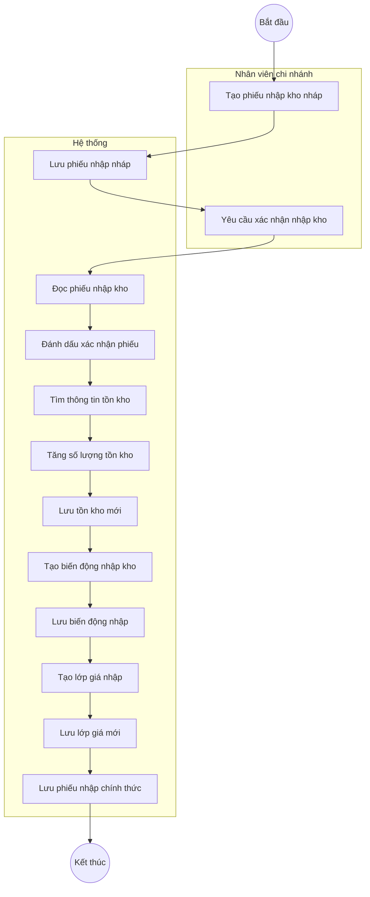
*Hình 6: Sơ đồ Activity - Luồng Nhập kho*

**Bảng truy vết hoạt động - Luồng Nhập kho:**

| Hoạt động (Hệ thống) | Nguồn / Căn cứ (FACTS) |
|---|---|
| Lưu phiếu nhập nháp | Trạng thái `DRAFT` [N06] |
| Đọc phiếu nhập kho | `inboundRepo.findById` [B07] |
| Đánh dấu xác nhận phiếu | `receipt.confirm` [B07] (Chuyển sang `CONFIRMED` [N06]) |
| Tìm thông tin tồn kho | `stockRepo.findByProductIdAndBranchId` [B07] |
| Tăng số lượng tồn kho | `stock.increase` [B07] |
| Lưu tồn kho mới | `stockRepo.save` [B07] |
| Tạo biến động nhập kho | `StockMovement.inbound` [B07] |
| Lưu biến động nhập | `movementRepo.save` [B07] |
| Tạo lớp giá nhập | `CostLayer.fromInbound` [B07] |
| Lưu lớp giá mới | `costLayerRepo.save` [B07] |
| Lưu phiếu nhập chính thức | `inboundRepo.save` [B07] |

*Từ việc hiểu rõ trình tự các bước thực hiện nghiệp vụ, bước tiếp theo ta sẽ mô hình hóa các luồng dữ liệu vào và ra của từng quy trình bằng biểu đồ luồng dữ liệu (DFD).*

### 3.3. Biểu đồ Luồng Dữ liệu (DFD)

#### 3.3.1. DFD Cấp 0 (Context Diagram)
Biểu đồ DFD Cấp 0 mô tả cái nhìn tổng quát nhất về toàn bộ hệ thống ERP bán lẻ đa chi nhánh và các tương tác với các tác nhân bên ngoài (Admin, Staff).

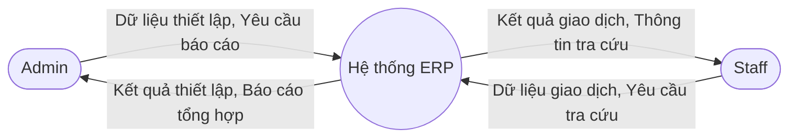
*Hình 7: Biểu đồ DFD Cấp 0 của hệ thống*

#### 3.3.2. DFD mức chi tiết cho các Use Case

##### 3.3.2.1. UC10: Lập hóa đơn bán hàng

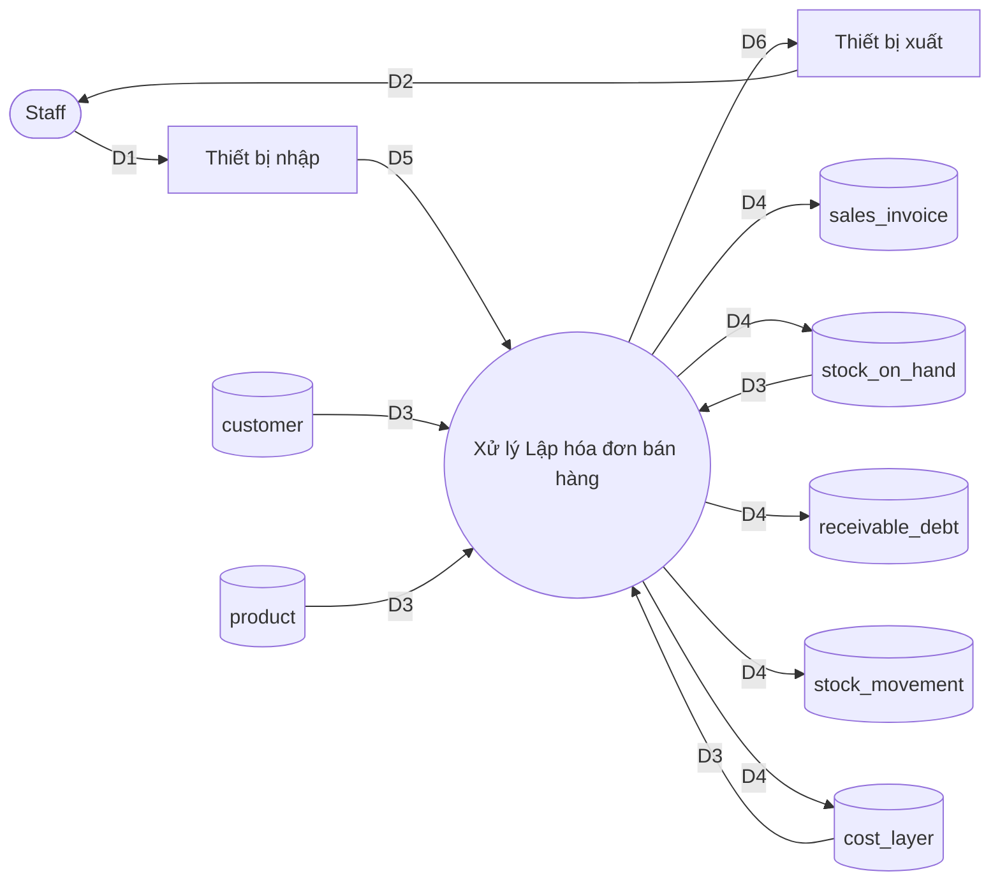
*Hình 8: Biểu đồ DFD mức chi tiết Use Case Lập hóa đơn bán hàng*

**Ý nghĩa từng dòng dữ liệu:**
| Dòng | Ý nghĩa |
|---|---|
| D1 | Thông tin lập hóa đơn: Khách hàng, danh sách sản phẩm, số lượng, phương thức thanh toán. |
| D5 | Tín hiệu điện tử từ bàn phím, chuột hoặc máy quét mã vạch truyền vào xử lý. |
| D3 | Thông tin khách hàng, sản phẩm, và số lượng tồn kho hiện tại để kiểm tra hợp lệ. |
| D4 | Dữ liệu hóa đơn (`sales_invoice` [E14]), dòng hóa đơn (`sales_invoice_line` [E15]), số lượng tồn kho cập nhật (`stock_on_hand` [E21]), biến động công nợ (`receivable_debt` [E24]), ghi lịch sử xuất (`stock_movement` [E22]), và trừ giá vốn (`cost_layer` [E23]). |
| D6 | Tín hiệu hiển thị thông tin hóa đơn và kết quả lên giao diện. |
| D2 | Thông báo lập hóa đơn thành công và hóa đơn chi tiết cho người dùng. |

**Thuật toán xử lý:**
1. Nhận thông tin lập hóa đơn từ thiết bị nhập (D1, D5).
2. Đọc cơ sở dữ liệu `customer` [E06] và `product` [E03] để kiểm tra tính hợp lệ của khách hàng và sản phẩm (D3). Đọc `stock_on_hand` [E21] để đảm bảo đủ tồn kho (D3) [B08].
3. Khởi tạo hóa đơn qua phương thức `createAndConfirm` [M11].
4. Cập nhật tồn kho bằng cách trừ số lượng sản phẩm tương ứng qua `recordSaleAndGetCost` [M16, B08].
5. Tăng công nợ khách hàng nếu có thông qua `increaseDebt` [M05] thuộc luồng `applyConfirmationEffects` [B05, M12].
6. Ghi dữ liệu hóa đơn, tồn kho và công nợ mới xuống cơ sở dữ liệu (D4).
7. Xuất kết quả thành công ra màn hình và in hóa đơn nếu cần (D6, D2).

##### 3.3.2.2. UC11: Lập phiếu trả hàng

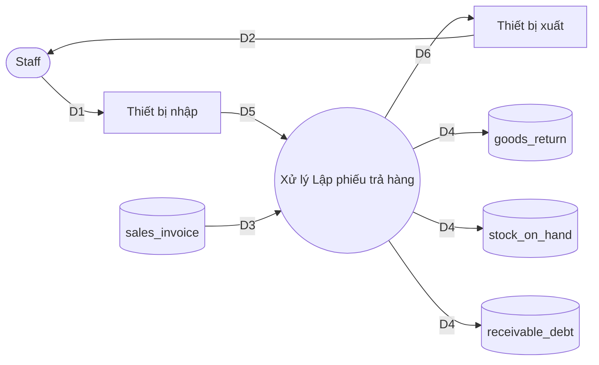
*Hình 9: Biểu đồ DFD mức chi tiết Use Case Lập phiếu trả hàng*

**Ý nghĩa từng dòng dữ liệu:**
| Dòng | Ý nghĩa |
|---|---|
| D1 | Thông tin phiếu trả hàng: Hóa đơn gốc, khách hàng, sản phẩm trả, số lượng, lý do. |
| D5 | Tín hiệu điện tử từ bàn phím, chuột truyền vào hệ thống xử lý. |
| D3 | Thông tin hóa đơn gốc (`sales_invoice` [E14]) để đối chiếu. |
| D4 | Dữ liệu phiếu trả hàng (`goods_return` [E16]), số lượng tồn kho hoàn lại (`stock_on_hand` [E21]), và công nợ được giảm trừ (`receivable_debt` [E24]). |
| D6 | Tín hiệu hiển thị kết quả thao tác trên giao diện. |
| D2 | Thông báo lập phiếu trả hàng thành công. |

**Thuật toán xử lý:**
1. Nhận thông tin phiếu trả hàng từ thiết bị nhập (D1, D5).
2. Tra cứu hóa đơn gốc `sales_invoice` [E14] bằng `findByIdForUpdate` [B06] và áp dụng Pessimistic Lock [B11] để đảm bảo tính toàn vẹn (D3).
3. Hệ thống xử lý hoàn trả thông qua phương thức `confirmReturn` [M14].
4. Gọi `recordReturn` [M17] để hoàn số lượng sản phẩm vào kho [B06].
5. Giảm công nợ khách hàng tương ứng số tiền trả thông qua `decreaseDebt` [M06, B06].
6. Lưu phiếu trả hàng, biến động kho và công nợ xuống cơ sở dữ liệu (D4).
7. Gửi thông báo thành công ra thiết bị xuất (D6, D2).

##### 3.3.2.3. UC12: Lập phiếu nhập kho

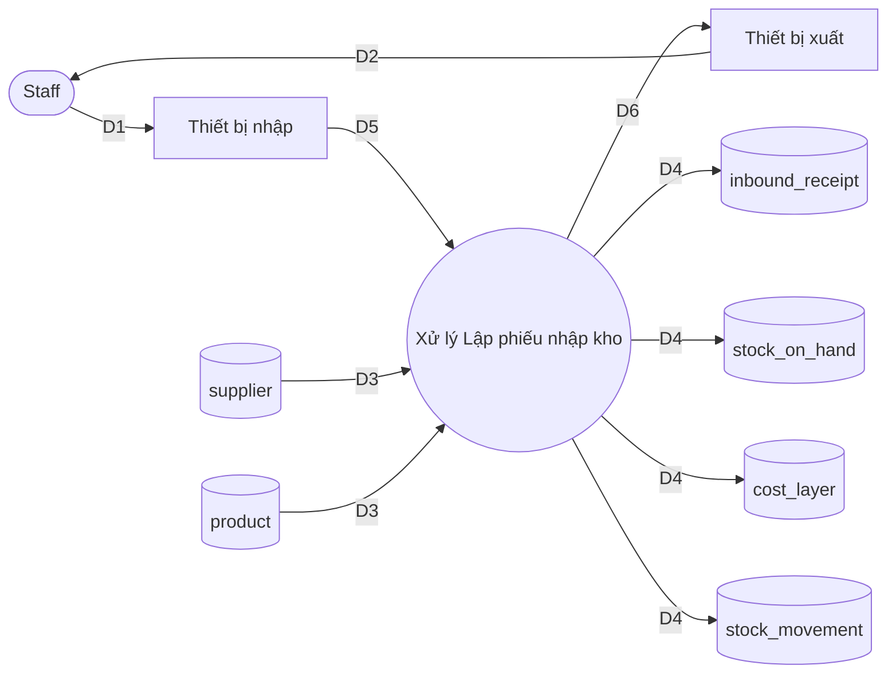
*Hình 10: Biểu đồ DFD mức chi tiết Use Case Lập phiếu nhập kho*

**Ý nghĩa từng dòng dữ liệu:**
| Dòng | Ý nghĩa |
|---|---|
| D1 | Thông tin phiếu nhập kho: Nhà cung cấp, danh sách sản phẩm, số lượng, đơn giá nhập. |
| D5 | Tín hiệu điện tử nhập liệu truyền vào xử lý. |
| D3 | Thông tin nhà cung cấp (`supplier` [E04]) và sản phẩm (`product` [E03]) để kiểm tra hợp lệ. |
| D4 | Dữ liệu phiếu nhập kho (`inbound_receipt` [E19]), cập nhật tồn kho (`stock_on_hand` [E21]), tạo lớp giá nhập mới (`cost_layer` [E23]), và ghi nhận biến động nhập (`stock_movement` [E22]). |
| D6 | Tín hiệu hiển thị cập nhật trạng thái kho và phiếu nhập. |
| D2 | Thông báo hoàn tất nhập kho và mã phiếu nhập. |

**Thuật toán xử lý:**
1. Nhận thông tin phiếu nhập kho từ người dùng (D1, D5).
2. Kiểm tra tính khả dụng của nhà cung cấp và sản phẩm từ cơ sở dữ liệu (D3).
3. Khởi tạo phiếu nhập và xử lý xác nhận thông qua `confirmReceipt` [M15, B07].
4. Cập nhật tăng số lượng tồn kho `stock_on_hand` [E21] tương ứng và ghi nhận biến động qua `StockMovement.inbound` [B07].
5. Tạo lớp giá (`CostLayer`) mới cho số hàng nhập vào qua phương thức `fromInbound` [M19, B07].
6. Lưu toàn bộ dữ liệu phiếu nhập, tồn kho, lớp giá vào bộ nhớ phụ (D4).
7. Trả kết quả thành công và thông tin phiếu ra giao diện (D6, D2).

##### 3.3.2.4. UC09: Tra cứu giá riêng theo khách hàng

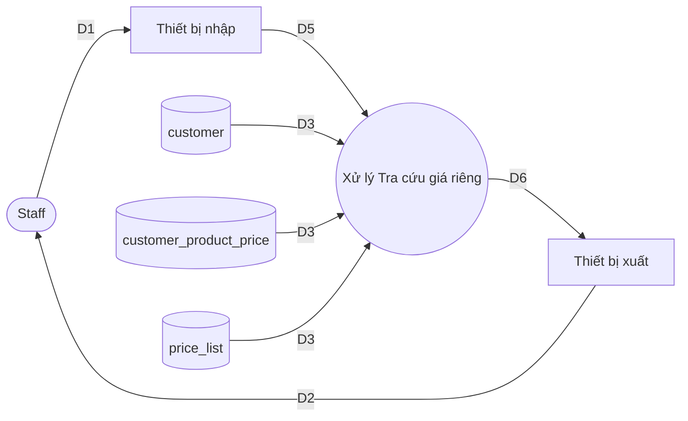
*Hình 11: Biểu đồ DFD mức chi tiết Use Case Tra cứu giá riêng theo khách hàng*

**Ý nghĩa từng dòng dữ liệu:**
| Dòng | Ý nghĩa |
|---|---|
| D1 | Tiêu chí tìm kiếm: Mã/Tên khách hàng, mã/tên sản phẩm. |
| D5 | Tín hiệu điện tử từ bàn phím vào hệ thống. |
| D3 | Thông tin khách hàng (`customer` [E06]), bảng giá riêng (`customer_product_price` [E18]) và bảng giá gốc (`price_list` [E05]). |
| D4 | Không có (chỉ tra cứu). |
| D6 | Tín hiệu hiển thị kết quả bảng giá. |
| D2 | Danh sách kết quả giá sản phẩm theo khách hàng. |

**Thuật toán xử lý:**
1. Nhận tiêu chí tra cứu từ thiết bị nhập (D1, D5).
2. Dùng tiêu chí (Mã khách hàng, Mã sản phẩm) để đọc cơ sở dữ liệu từ bảng `customer` [E06] và `customer_product_price` [E18] (D3).
3. Xử lý thông tin và định dạng kết quả danh sách giá.
4. Gửi kết quả bảng giá đã định dạng ra thiết bị xuất (D6).
5. Hiển thị danh sách giá tương ứng cho người dùng (D2).

##### 3.3.2.5. UC14: Theo dõi công nợ

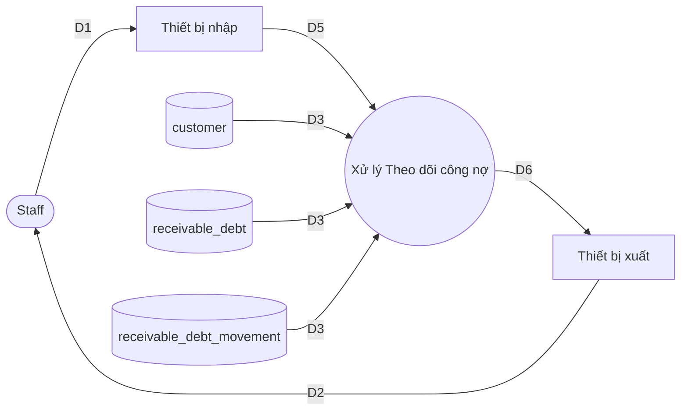
*Hình 12: Biểu đồ DFD mức chi tiết Use Case Theo dõi công nợ*

**Ý nghĩa từng dòng dữ liệu:**
| Dòng | Ý nghĩa |
|---|---|
| D1 | Tiêu chí tra cứu: Mã khách hàng, khoảng thời gian. |
| D5 | Tín hiệu điện tử vào hệ thống. |
| D3 | Tổng công nợ hiện tại (`receivable_debt` [E24]) và lịch sử biến động công nợ (`receivable_debt_movement` [E25]) của khách hàng. |
| D4 | Không có. |
| D6 | Tín hiệu hiển thị báo cáo công nợ và chi tiết biến động. |
| D2 | Dữ liệu công nợ và lịch sử giao dịch thanh toán, ghi nợ hiển thị. |

**Thuật toán xử lý:**
1. Nhận yêu cầu tra cứu công nợ theo tiêu chí khách hàng từ thiết bị nhập (D1, D5).
2. Hệ thống gọi các endpoint `GET /{customerId}/balance` [P10] và `GET /{customerId}/movements` [P09] để lấy dữ liệu.
3. Đọc dữ liệu từ bảng `receivable_debt` [E24] để lấy dư nợ tổng và từ bảng `receivable_debt_movement` [E25] để lấy chi tiết biến động (D3).
4. Phân tích, tổng hợp số liệu công nợ và định dạng để hiển thị.
5. Truyền tín hiệu hiển thị (D6) ra thiết bị xuất.
6. Hiển thị thông tin công nợ và lịch sử chi tiết cho người dùng (D2).

*Sau khi xác định được các thực thể dữ liệu và cách chúng trao đổi qua DFD, bước tiếp theo là xây dựng Sơ đồ Lớp (Class Diagram) để cụ thể hóa các lớp đối tượng và quan hệ của chúng.*

### 3.4. Sơ đồ lớp (Class Diagram)

#### 3.4.1 Cơ sở xây dựng và quy trình
Quá trình xây dựng sơ đồ lớp cho hệ thống được thực hiện qua 7 bước chuẩn:
1. **Xác định lớp, thuộc tính, phương thức**: Trích xuất các lớp miền (domain entities) từ FACTS (E01-E26). Các phương thức nghiệp vụ cốt lõi tại Entity được lấy từ FACTS M (M19-M22). Các Controller, Repository, DTO được loại bỏ để tập trung vào Domain.
2. **Xác định quan hệ**: Dựa trên danh sách các quan hệ (R01-R24) và quy định Cascade/OrphanRemoval để xác định Composition (*--), Aggregation (o--) hay Association (-->).
3. **Tách lớp phụ**: Xác định các lớp con phụ thuộc chặt chẽ như `SalesInvoiceLine`, `GoodsReturnLine`, `InboundReceiptLine`.
4. **Tổng quát hoá**: Sử dụng Interface hoặc Abstract class nếu có. Hệ thống chủ yếu sử dụng các lớp cụ thể.
5. **Tách lớp con**: Phân rã Enum như `SalesInvoiceStatus`, `MovementType` bằng cú pháp `<<enumeration>>`.
6. **Hiệu chỉnh quan hệ**: Ràng buộc các quan hệ liên module (như `branchId`, `customerId`) bằng Association tham chiếu qua ID thay vì tham chiếu thực thể cứng, nhằm đảm bảo kiến trúc Modular Monolith.
7. **Kiểm tra**: Đối chiếu với nguồn sự thật FACTS.

Do hệ thống bao gồm 24 lớp thực thể cốt lõi, sơ đồ được chia thành 1 sơ đồ tổng quát và 3 sơ đồ chi tiết theo các cụm chức năng: Identity & CRM, Catalog & Inventory, Order.

#### 3.4.2 Sơ đồ lớp tổng quát
Sơ đồ dưới đây thể hiện các lớp gốc quan trọng và mối quan hệ tham chiếu chính, bao quát bức tranh toàn cảnh của hệ thống.

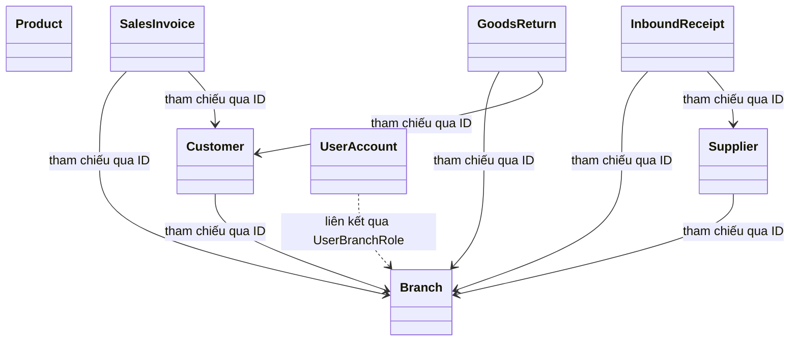
*Hình 13: Sơ đồ lớp tổng quát*

#### 3.4.3 Sơ đồ chi tiết cụm Identity & CRM

```mermaid
classDiagram
    class Branch {
        -Long id
        -String code
        -String name
        -String address
        -String phone
        -String openingHours
        -String internalUrl
        -boolean isActive
        -LocalDateTime createdAt
        -LocalDateTime updatedAt
    }
    
    class UserAccount {
        -Long id
        -UUID publicId
        -String username
        -String passwordHash
        -String fullName
        -String email
        -String phone
        -boolean isActive
        -LocalDateTime createdAt
        -LocalDateTime updatedAt
    }
    
    class Role {
        -Short id
        -String code
        -String name
    }
    
    class Permission {
        -Short id
        -String code
        -String description
    }
    
    class RolePermission {
        -RolePermissionId id
    }
    
    class UserBranchRole {
        -Long id
    }
    
    class Customer {
        -UUID id
        -String customerCode
        -String name
        -String phone
        -String email
        -String address
        -String taxCode
        -Long branchId
    }
    
    class ReceivableDebt {
        -UUID id
        -Long branchId
        -BigDecimal totalDebt
    }
    
    class ReceivableDebtMovement {
        -UUID id
        -Long branchId
        -ReceivableDebtMovementType movementType
        -BigDecimal amount
        -BigDecimal balanceBefore
        -BigDecimal balanceAfter
        -String refType
        -String refId
        -String idempotencyKey
        -ZonedDateTime createdAt
        -UUID createdBy
        -String note
    }
    
    <<enumeration>> ReceivableDebtMovementType
    class ReceivableDebtMovementType {
        INVOICE
        PAYMENT
        RETURN
        ADJUSTMENT
        OPENING_BALANCE
    }

    UserBranchRole "0..*" --> "1" UserAccount : R09
    UserBranchRole "0..*" --> "1" Role : R10
    UserBranchRole "0..*" --> "0..1" Branch : R11
    
    RolePermission "0..*" --> "1" Role : R07
    RolePermission "0..*" --> "1" Permission : R08
    
    ReceivableDebt "0..*" --> "1" Customer : R05/R23
    ReceivableDebtMovement "0..*" --> "1" Customer : R06/R24
    
    Customer --> Branch : tham chiếu qua branchId
    ReceivableDebt --> Branch : tham chiếu qua branchId
    ReceivableDebtMovement --> Branch : tham chiếu qua branchId
```
*Hình 14: Sơ đồ lớp chi tiết cụm Identity & CRM*

#### 3.4.4 Sơ đồ chi tiết cụm Catalog & Inventory

```mermaid
classDiagram
    class Category {
        -Long id
        -String code
        -String name
        -boolean isActive
        -LocalDateTime createdAt
        -LocalDateTime updatedAt
    }
    
    class Product {
        -UUID id
        -String code
        -String name
        -String baseUnit
        -Map attributesCache
        -boolean isActive
        -LocalDateTime createdAt
        -LocalDateTime updatedAt
    }
    
    class Supplier {
        -UUID id
        -Long branchId
        -String code
        -String name
        -String phone
        -String email
        -String address
        -String taxCode
        -boolean isActive
        -LocalDateTime createdAt
        -LocalDateTime updatedAt
    }
    
    class PriceList {
        -Long id
        -Long branchId
        -BigDecimal price
        -OffsetDateTime effectiveDate
        -OffsetDateTime createdAt
    }
    
    class InboundReceipt {
        -UUID id
        -Long branchId
        -String receiptCode
        -ReceiptStatus status
        -UUID supplierId
        -LocalDateTime confirmedAt
        -UUID confirmedBy
        +confirm()
    }
    
    class InboundReceiptLine {
        -Long id
        -Long productId
        -BigDecimal quantity
        -BigDecimal unitCost
        -String unitOfMeasure
    }
    
    class StockOnHand {
        -Long id
        -Long productId
        -Long branchId
        -BigDecimal quantity
    }
    
    class StockMovement {
        -UUID id
        -Long productId
        -Long branchId
        -MovementType movementType
        -BigDecimal quantity
        -String refType
        -String refId
        -Long refLineId
        -UUID performedBy
        -ZonedDateTime createdAt
    }
    
    class CostLayer {
        -UUID id
        -Long productId
        -Long branchId
        -BigDecimal unitCost
        -BigDecimal initialQty
        -BigDecimal remainingQty
        -UUID inboundMovementId
        -BigDecimal costBasis
        -Long version
        +fromInbound()$
        +fromReturn()$
        +consume()
    }
    
    <<enumeration>> ReceiptStatus
    class ReceiptStatus {
        DRAFT
        CONFIRMED
    }
    
    <<enumeration>> MovementType
    class MovementType {
        INBOUND
        SALE
        RETURN
    }

    Category "0..*" o-- "0..1" Category : R01/R02 (parent/children)
    Product "0..*" --> "1" Category : R03
    PriceList "0..*" --> "1" Product : R04
    
    InboundReceipt "1" *-- "0..*" InboundReceiptLine : R21/R22
    
    Supplier --> Branch : tham chiếu qua branchId
    PriceList --> Branch : tham chiếu qua branchId
    InboundReceipt --> Branch : tham chiếu qua branchId
    InboundReceipt --> Supplier : tham chiếu qua supplierId
    InboundReceiptLine --> Product : tham chiếu qua productId
    StockOnHand --> Product : tham chiếu qua productId
    StockOnHand --> Branch : tham chiếu qua branchId
    StockMovement --> Product : tham chiếu qua productId
    StockMovement --> Branch : tham chiếu qua branchId
    CostLayer --> Product : tham chiếu qua productId
    CostLayer --> Branch : tham chiếu qua branchId
```
*Hình 15: Sơ đồ lớp chi tiết cụm Catalog & Inventory*

#### 3.4.5 Sơ đồ chi tiết cụm Order

```mermaid
classDiagram
    class SalesInvoice {
        -UUID id
        -Long branchId
        -UUID customerId
        -String invoiceCode
        -SalesInvoiceStatus status
        -BigDecimal totalAmount
        -BigDecimal previousDebt
        -BigDecimal remainingDebt
        -String paymentMethod
        -BigDecimal advancePayment
        -LocalDateTime confirmedAt
        -UUID confirmedBy
        +confirm()
    }
    
    class SalesInvoiceLine {
        -Long id
        -Long productId
        -BigDecimal quantity
        -BigDecimal unitPrice
        -BigDecimal unitCost
        -BigDecimal costBasis
        -BigDecimal lineTotal
        -String unitOfMeasure
    }
    
    class GoodsReturn {
        -UUID id
        -Long branchId
        -UUID customerId
        -String returnCode
        -UUID invoiceId
        -GoodsReturnStatus status
        -BigDecimal totalAmount
        -String reason
        -LocalDateTime confirmedAt
        -UUID confirmedBy
        +confirm()
    }
    
    class GoodsReturnLine {
        -Long id
        -Long productId
        -BigDecimal quantity
        -BigDecimal unitPrice
        -String unitOfMeasure
    }
    
    class CustomerProductPrice {
        -Long id
        -UUID customerId
        -Long productId
        -Long branchId
        -BigDecimal unitPrice
        -LocalDateTime effectiveFrom
        -LocalDateTime effectiveTo
    }
    
    class IdempotencyRecord {
        -UUID id
        -String idempotencyKey
        -String requestHash
        -String responseSnapshot
        -LocalDateTime createdAt
    }
    
    <<enumeration>> SalesInvoiceStatus
    class SalesInvoiceStatus {
        DRAFT
        CONFIRMED
        CANCELLED
    }
    
    <<enumeration>> GoodsReturnStatus
    class GoodsReturnStatus {
        DRAFT
        CONFIRMED
    }

    SalesInvoice "1" *-- "0..*" SalesInvoiceLine : R17/R18
    GoodsReturn "1" *-- "0..*" GoodsReturnLine : R19/R20
    
    SalesInvoice --> Branch : tham chiếu qua branchId
    SalesInvoice --> Customer : tham chiếu qua customerId
    SalesInvoiceLine --> Product : tham chiếu qua productId
    
    GoodsReturn --> Branch : tham chiếu qua branchId
    GoodsReturn --> Customer : tham chiếu qua customerId
    GoodsReturnLine --> Product : tham chiếu qua productId
    
    CustomerProductPrice --> Customer : tham chiếu qua customerId
    CustomerProductPrice --> Product : tham chiếu qua productId
    CustomerProductPrice --> Branch : tham chiếu qua branchId
```
*Hình 16: Sơ đồ lớp chi tiết cụm Order*

#### 3.4.6 Danh sách các lớp
| STT | Tên lớp | Loại | Ý nghĩa | Nguồn |
|---|---|---|---|---|
| 1 | `Branch` | Entity | Thông tin chi nhánh bán lẻ. | [E01] |
| 2 | `Category` | Entity | Danh mục sản phẩm. | [E02] |
| 3 | `Product` | Entity | Sản phẩm hàng hoá. | [E03] |
| 4 | `Supplier` | Entity | Nhà cung cấp. | [E04] |
| 5 | `PriceList` | Entity | Bảng giá chung của sản phẩm tại chi nhánh. | [E05] |
| 6 | `Customer` | Entity | Khách hàng. | [E06] |
| 7 | `ReceivableDebt` | Entity | Tổng công nợ của khách hàng tại chi nhánh. | [E07, E24] |
| 8 | `ReceivableDebtMovement` | Entity | Biến động công nợ của khách hàng. | [E08, E25] |
| 9 | `Permission` | Entity | Quyền hạn trên hệ thống. | [E09] |
| 10 | `Role` | Entity | Vai trò của người dùng. | [E10] |
| 11 | `RolePermission` | Entity | Cầu nối Vai trò - Quyền hạn. | [E11] |
| 12 | `UserAccount` | Entity | Tài khoản người dùng. | [E12] |
| 13 | `UserBranchRole` | Entity | Cấp phát vai trò cho người dùng tại chi nhánh. | [E13] |
| 14 | `SalesInvoice` | Entity | Hóa đơn bán hàng. | [E14] |
| 15 | `SalesInvoiceLine` | Entity | Dòng chi tiết hóa đơn bán hàng. | [E15] |
| 16 | `GoodsReturn` | Entity | Đơn trả hàng từ khách hàng. | [E16] |
| 17 | `GoodsReturnLine` | Entity | Dòng chi tiết đơn trả hàng. | [E17] |
| 18 | `CustomerProductPrice` | Entity | Giá bán cấu hình riêng cho từng khách hàng. | [E18] |
| 19 | `InboundReceipt` | Entity | Phiếu nhập kho từ nhà cung cấp. | [E19] |
| 20 | `InboundReceiptLine` | Entity | Dòng chi tiết phiếu nhập kho. | [E20] |
| 21 | `StockOnHand` | Entity | Tồn kho hiện tại. | [E21] |
| 22 | `StockMovement` | Entity | Lịch sử biến động tồn kho. | [E22] |
| 23 | `CostLayer` | Entity | Lớp giá vốn theo phương pháp FIFO. | [E23] |
| 24 | `IdempotencyRecord` | Entity | Bản ghi hỗ trợ idempotent cho các thao tác. | [E26] |

#### 3.4.7 Bảng thuộc tính (Một số thuộc tính chính)
| STT | Lớp | Tên thuộc tính | Kiểu | Ràng buộc | Ý nghĩa |
|---|---|---|---|---|---|
| 1 | `Branch` | `code` | String | nullable=false, unique | Mã chi nhánh |
| 2 | `Product` | `code` | String | unique | Mã sản phẩm |
| 3 | `ReceivableDebt` | `totalDebt` | BigDecimal | | Tổng dư nợ |
| 4 | `ReceivableDebtMovement` | `amount` | BigDecimal | | Số tiền biến động |
| 5 | `SalesInvoice` | `invoiceCode` | String | nullable=false, unique | Mã hóa đơn |
| 6 | `CostLayer` | `version` | Long | @Version | Optimistic Lock |
| 7 | `StockOnHand` | `quantity` | BigDecimal | default 0 | Số lượng tồn |

#### 3.4.8 Bảng quan hệ
| STT | Tên quan hệ | Kiểu | Bản số | Ý nghĩa | Nguồn |
|---|---|---|---|---|---|
| 1 | `Category` - `Category` | Aggregation (o--) | 0..* - 0..1 | Cây danh mục (parent/children) | [R01, R02] |
| 2 | `Product` - `Category` | Association (-->) | 0..* - 1 | Sản phẩm thuộc danh mục (Bắt buộc) | [R03] |
| 3 | `PriceList` - `Product` | Association (-->) | 0..* - 1 | Bảng giá của sản phẩm | [R04] |
| 4 | `ReceivableDebt` - `Customer`| Association (-->) | 0..* - 1 | Công nợ của khách hàng | [R05, R23] |
| 5 | `ReceivableDebtMovement` - `Customer`| Association (-->) | 0..* - 1 | Lịch sử công nợ của KH | [R06, R24] |
| 6 | `SalesInvoice` - `SalesInvoiceLine` | Composition (*--) | 1 - 0..* | Hóa đơn và chi tiết (cascade=ALL, orphanRemoval=true) | [R17, R18] |
| 7 | `GoodsReturn` - `GoodsReturnLine` | Composition (*--) | 1 - 0..* | Đơn trả hàng và chi tiết (cascade=ALL, orphanRemoval=true) | [R19, R20] |
| 8 | `InboundReceipt` - `InboundReceiptLine` | Composition (*--) | 1 - 0..* | Phiếu nhập và chi tiết (cascade=ALL, orphanRemoval=true) | [R21, R22] |
| 9 | Các Entity - `branchId` | Association (-->) | - | Tham chiếu logic bằng ID sang Branch | [R12-R16] |

*Với các lớp và thuộc tính đã định nghĩa, Sơ đồ Tuần tự (Sequence Diagram) sau đây sẽ thể hiện sự tương tác cụ thể của chúng trong quá trình gọi hàm và xử lý logic.*

### 3.5. Sơ đồ tuần tự (Sequence Diagram)

Dựa trên các quy tắc nghiệp vụ và danh sách API đã được xác định (FACTS), các sơ đồ tuần tự dưới đây mô tả sự tương tác giữa các đối tượng trong các luồng nghiệp vụ cốt lõi của hệ thống.

#### 3.5.1 Đăng nhập và cấp JWT
Sơ đồ mô tả quá trình xác thực và cấp mới token dựa trên `AuthController` và `AuthService` [FACTS P01, P02, M08, M09, B04].

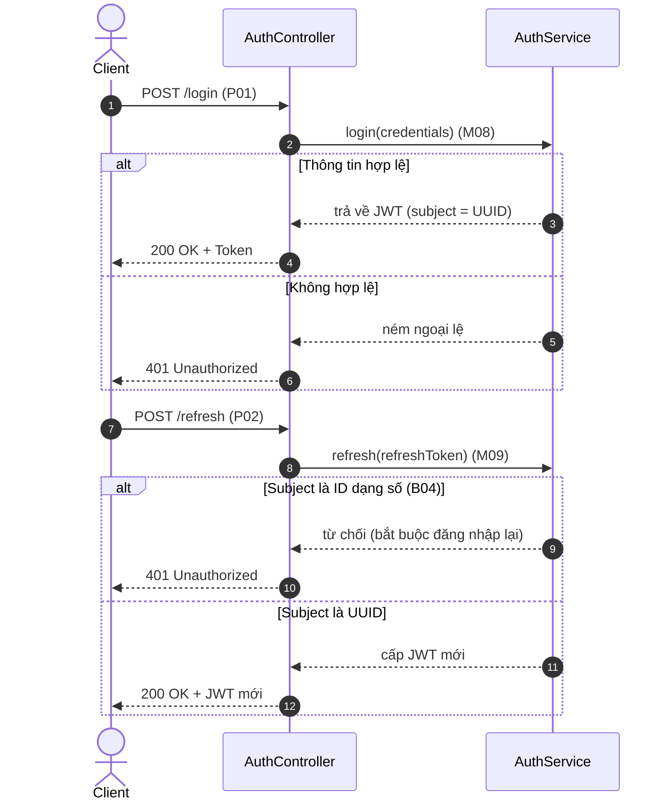
*Hình 17: Sơ đồ tuần tự Đăng nhập và cấp JWT*

#### 3.5.2 Tạo và xác nhận Sales Invoice (Hóa đơn bán hàng)
Sơ đồ mô tả nghiệp vụ tạo và xác nhận hóa đơn, kéo theo các nghiệp vụ trừ tồn kho, tính giá vốn FIFO và ghi nhận công nợ [FACTS M11, M12, M16, M18, M21, M22, B05, B08, B09].

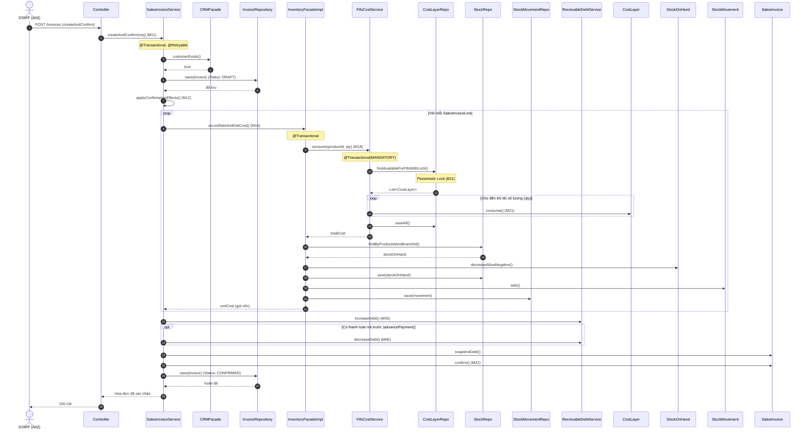
*Hình 18: Sơ đồ tuần tự Tạo và xác nhận Sales Invoice (Hóa đơn bán hàng)*

#### 3.5.3 Trả hàng (Goods Return)
Sơ đồ mô tả nghiệp vụ xác nhận đơn trả hàng, khôi phục tồn kho và giảm trừ công nợ [FACTS M14, M17, M06, B06, B11].

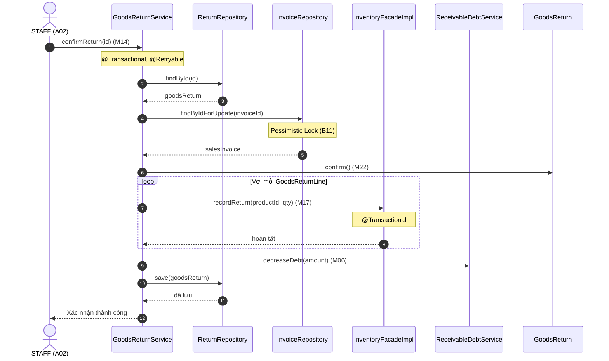
*Hình 19: Sơ đồ tuần tự Trả hàng (Goods Return)*

#### 3.5.4 Nhập kho (Inbound Receipt)
Sơ đồ mô tả luồng xác nhận phiếu nhập kho, cộng số lượng tồn, sinh lịch sử biến động và tạo lớp giá vốn (CostLayer) [FACTS M15, M19, M22, B07].

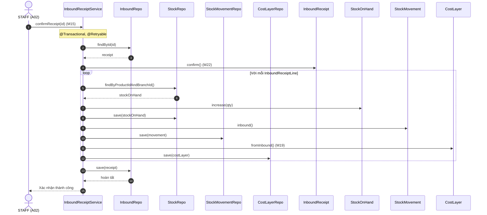
*Hình 20: Sơ đồ tuần tự Nhập kho (Inbound Receipt)*

#### 3.5.5 Tra cứu giá riêng theo khách hàng
Luồng tra cứu áp dụng giá riêng (`CustomerProductPrice` [E18]). Nếu không có, mặc định lấy từ bảng giá chung (`PriceList` [E05]). 
*(Ghi chú: Luồng này minh họa nguyên lý áp dụng giá dựa trên cấu trúc dữ liệu).*

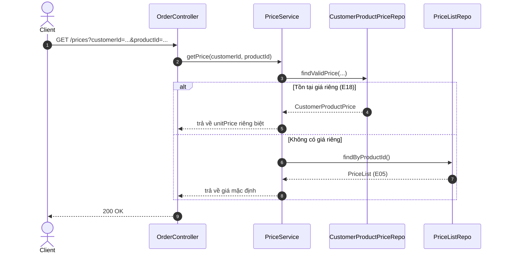
*Hình 21: Sơ đồ tuần tự Tra cứu giá riêng theo khách hàng*

#### 3.5.6 Đồng bộ dữ liệu – Logical Replication
Sơ đồ minh họa mô hình đồng bộ 2 chiều qua PostgreSQL Logical Replication, trong đó HQ đẩy các dữ liệu danh mục xuống Branch, và Branch đẩy các giao dịch phát sinh lên HQ [FACTS O01-O21].

```mermaid
sequenceDiagram
    autonumber
    participant HQ_DB as HQ DB
    participant PubHQ as Publication (HQ)
    participant SubBranch as Subscription (Branch)
    participant Branch_DB as Branch DB
    
    Note over HQ_DB, Branch_DB: Chiều HQ -> Branch (Bảng Danh mục, User, Config...)
    HQ_DB->>PubHQ: Commit Transaction (Product, Category...)
    PubHQ-)SubBranch: Stream WAL (logical changes)
    SubBranch->>Branch_DB: Apply changes
    Branch_DB-->>SubBranch: ACK
    
    participant PubBranch as Publication (Branch)
    participant SubHQ as Subscription (HQ)
    
    Note over Branch_DB, HQ_DB: Chiều Branch -> HQ (Bảng Giao dịch: Invoice, Receipt...)
    Branch_DB->>PubBranch: Commit Transaction (SalesInvoice, StockMovement...)
    PubBranch-)SubHQ: Stream WAL (logical changes)
    SubHQ->>HQ_DB: Apply changes
    HQ_DB-->>SubHQ: ACK
```
*Hình 22: Sơ đồ tuần tự Đồng bộ dữ liệu – Logical Replication*

*Cuối cùng, dựa vào toàn bộ phân tích về dữ liệu và hoạt động bên trên, Sơ đồ Thực thể Kết hợp (ERD) sẽ được thiết kế hoàn thiện nhằm phục vụ việc tạo lập CSDL và mô hình đồng bộ.*

### 3.6. Sơ đồ thực thể kết hợp (ERD)

#### 3.6.1 Cơ sở chuyển đổi từ Sơ đồ lớp sang ERD
Quá trình chuyển đổi từ Sơ đồ lớp (Class Diagram) sang Sơ đồ thực thể kết hợp (ERD) được thực hiện tuân thủ nghiêm ngặt các quy tắc chuẩn hóa dữ liệu. Các lớp thực thể (Entity Classes) được chuyển thành các Thực thể (Entities) trong cơ sở dữ liệu. Các quan hệ tham chiếu bộ nhớ (như Aggregation, Composition, Association) và tham chiếu logic (qua các trường ID như `branchId`, `customerId`) trong kiến trúc Modular Monolith được chuyển hóa thành các mối kết hợp khóa ngoại. Đặc biệt áp dụng Quy tắc 1 (QT1), các cột đóng vai trò khóa ngoại tuyệt đối không được liệt kê như một thuộc tính thông thường bên trong bảng, mà phải được thể hiện bằng đường nét mối kết hợp giữa các thực thể, kèm theo bản số tương ứng. 

Đặc thù bản số 0..1 giữa `Customer` và `Branch`: Trong hệ thống, khách hàng có thể thuộc về một chi nhánh cụ thể hoặc là khách hàng chung của toàn hệ thống. Nếu `branch_id` mang giá trị NULL, khách hàng đó được dùng chung. Do vậy, mối quan hệ từ nhánh `Customer` đến `Branch` mang bản số 0..1 thay vì 1..1.

Do quy mô hệ thống lớn, ERD được chia thành 3 nhóm nghiệp vụ chính: Identity & CRM, Catalog & Inventory, Order & Common.

#### 3.6.2 ERD Nhóm Identity & CRM

```mermaid
erDiagram
    Branch {
        Long id PK
        String code
        String name
        String address
        String phone
        String openingHours
        String internalUrl
        boolean isActive
        LocalDateTime createdAt
        LocalDateTime updatedAt
    }

    UserAccount {
        Long id PK
        UUID publicId
        String username
        String passwordHash
        String fullName
        String email
        String phone
        boolean isActive
        LocalDateTime createdAt
        LocalDateTime updatedAt
    }

    Role {
        Short id PK
        String code
        String name
    }

    Permission {
        Short id PK
        String code
        String description
    }

    RolePermission {
        RolePermissionId id PK
    }

    UserBranchRole {
        Long id PK
    }

    Customer {
        UUID id PK
        String customerCode
        String name
        String phone
        String email
        String address
        String taxCode
    }

    ReceivableDebt {
        UUID id PK
        BigDecimal totalDebt
    }

    ReceivableDebtMovement {
        UUID id PK
        ReceivableDebtMovementType movementType
        BigDecimal amount
        BigDecimal balanceBefore
        BigDecimal balanceAfter
        String refType
        String refId
        String idempotencyKey
        ZonedDateTime createdAt
        UUID createdBy
        String note
    }

    Branch ||--o{ UserBranchRole : "has"
    UserAccount ||--o{ UserBranchRole : "assigned_to"
    Role ||--o{ UserBranchRole : "grants"
    Role ||--o{ RolePermission : "has"
    Permission ||--o{ RolePermission : "includes"
    
    Customer }o--o| Branch : "belongs_to"
    Branch ||--o{ ReceivableDebt : "has"
    Customer ||--o{ ReceivableDebt : "owes"
    Branch ||--o{ ReceivableDebtMovement : "has"
    Customer ||--o{ ReceivableDebtMovement : "records"
```
*Hình 23: Sơ đồ ERD Nhóm Identity & CRM*

#### 3.6.3 ERD Nhóm Catalog & Inventory

```mermaid
erDiagram
    Category {
        Long id PK
        String code
        String name
        boolean isActive
        LocalDateTime createdAt
        LocalDateTime updatedAt
    }

    Product {
        UUID id PK
        String code
        String name
        String baseUnit
        Map attributesCache
        boolean isActive
        LocalDateTime createdAt
        LocalDateTime updatedAt
    }

    Supplier {
        UUID id PK
        String code
        String name
        String phone
        String email
        String address
        String taxCode
        boolean isActive
        LocalDateTime createdAt
        LocalDateTime updatedAt
    }

    PriceList {
        Long id PK
        BigDecimal price
        OffsetDateTime effectiveDate
        OffsetDateTime createdAt
    }

    InboundReceipt {
        UUID id PK
        String receiptCode
        ReceiptStatus status
        LocalDateTime confirmedAt
        UUID confirmedBy
    }

    InboundReceiptLine {
        Long id PK
        BigDecimal quantity
        BigDecimal unitCost
        String unitOfMeasure
    }

    StockOnHand {
        Long id PK
        BigDecimal quantity
    }

    StockMovement {
        UUID id PK
        MovementType movementType
        BigDecimal quantity
        String refType
        String refId
        Long refLineId
        UUID performedBy
        ZonedDateTime createdAt
    }

    CostLayer {
        UUID id PK
        BigDecimal unitCost
        BigDecimal initialQty
        BigDecimal remainingQty
        BigDecimal costBasis
        Long version
    }

    Category |o--o{ Category : "parent_of"
    Category ||--o{ Product : "contains"
    
    Branch ||--o{ Supplier : "has"
    Branch ||--o{ PriceList : "has"
    Product ||--o{ PriceList : "has"
    
    Branch ||--o{ InboundReceipt : "has"
    Supplier ||--o{ InboundReceipt : "supplies"
    InboundReceipt ||--o{ InboundReceiptLine : "contains"
    Product ||--o{ InboundReceiptLine : "includes"
    
    Branch ||--o{ StockOnHand : "has"
    Product ||--o{ StockOnHand : "tracks"
    
    Branch ||--o{ StockMovement : "has"
    Product ||--o{ StockMovement : "records"
    
    Branch ||--o{ CostLayer : "has"
    Product ||--o{ CostLayer : "costs"
    StockMovement |o--o{ CostLayer : "inbound_movement"
```
*Hình 24: Sơ đồ ERD Nhóm Catalog & Inventory*

#### 3.6.4 ERD Nhóm Order & Common

```mermaid
erDiagram
    SalesInvoice {
        UUID id PK
        String invoiceCode
        SalesInvoiceStatus status
        BigDecimal totalAmount
        BigDecimal previousDebt
        BigDecimal remainingDebt
        String paymentMethod
        BigDecimal advancePayment
        LocalDateTime confirmedAt
        UUID confirmedBy
    }

    SalesInvoiceLine {
        Long id PK
        BigDecimal quantity
        BigDecimal unitPrice
        BigDecimal unitCost
        BigDecimal costBasis
        BigDecimal lineTotal
        String unitOfMeasure
    }

    GoodsReturn {
        UUID id PK
        String returnCode
        GoodsReturnStatus status
        BigDecimal totalAmount
        String reason
        LocalDateTime confirmedAt
        UUID confirmedBy
    }

    GoodsReturnLine {
        Long id PK
        BigDecimal quantity
        BigDecimal unitPrice
        String unitOfMeasure
    }

    CustomerProductPrice {
        Long id PK
        BigDecimal unitPrice
        LocalDateTime effectiveFrom
        LocalDateTime effectiveTo
    }

    IdempotencyRecord {
        UUID id PK
        String idempotencyKey
        String requestHash
        String responseSnapshot
        LocalDateTime createdAt
    }

    Branch ||--o{ SalesInvoice : "has"
    Customer ||--o{ SalesInvoice : "billed_to"
    SalesInvoice ||--o{ SalesInvoiceLine : "contains"
    Product ||--o{ SalesInvoiceLine : "includes"

    Branch ||--o{ GoodsReturn : "has"
    Customer ||--o{ GoodsReturn : "returned_by"
    SalesInvoice |o--o{ GoodsReturn : "returns"
    GoodsReturn ||--o{ GoodsReturnLine : "contains"
    Product ||--o{ GoodsReturnLine : "includes"

    Customer ||--o{ CustomerProductPrice : "has"
    Product ||--o{ CustomerProductPrice : "has"
    Branch ||--o{ CustomerProductPrice : "has"
```
*Hình 25: Sơ đồ ERD Nhóm Order & Common*

#### 3.6.5 Từ điển dữ liệu
Bảng dưới đây thống kê các thực thể, thuộc tính chính, và chiều đồng bộ dữ liệu theo kiến trúc HQ/Branch:

| Thực thể | Thuộc tính | Kiểu | Khóa | Ràng buộc | Sở hữu (HQ/Branch) |
|---|---|---|---|---|---|
| `branch` | `id` | Long | PK | @GeneratedValue | HQ -> Branch (O01) |
| `branch` | `code` | String | | unique, nullable=false | HQ -> Branch (O01) |
| `category` | `id` | Long | PK | | HQ -> Branch (O02) |
| `product` | `id` | UUID | PK | | HQ -> Branch (O03) |
| `supplier` | `id` | UUID | PK | | HQ -> Branch (O04) |
| `price_list` | `id` | Long | PK | | HQ -> Branch (O05) |
| `customer` | `id` | UUID | PK | | HQ -> Branch (O06) |
| `customer` | `customerCode` | String | | unique | HQ -> Branch (O06) |
| `role` | `id` | Short | PK | | HQ -> Branch (O07) |
| `permission` | `id` | Short | PK | | HQ -> Branch (O08) |
| `role_permission` | `id` | Long | PK | @EmbeddedId (thực tế) | HQ -> Branch (O09) |
| `user_account` | `id` | Long | PK | | HQ -> Branch (O10) |
| `user_account` | `publicId` | UUID | | unique | HQ -> Branch (O10) |
| `user_branch_role`| `id` | Long | PK | | HQ -> Branch (O11) |
| `sales_invoice` | `id` | UUID | PK | | Branch -> HQ (O14) |
| `sales_invoice` | `invoiceCode` | String | | nullable=false, unique | Branch -> HQ (O14) |
| `sales_invoice_line`| `id` | Long | PK | | Branch -> HQ (O15) |
| `goods_return` | `id` | UUID | PK | | Branch -> HQ (O16) |
| `goods_return` | `returnCode`| String | | nullable=false, unique | Branch -> HQ (O16) |
| `goods_return_line` | `id` | Long | PK | | Branch -> HQ (O17) |
| `inbound_receipt` | `id` | UUID | PK | | Branch -> HQ (O18) |
| `inbound_receipt` | `receiptCode`| String | | unique | Branch -> HQ (O18) |
| `inbound_receipt_line`| `id` | Long | PK | | Branch -> HQ (O19) |
| `stock_movement` | `id` | UUID | PK | | Branch -> HQ (O20) |
| `cost_layer` | `id` | UUID | PK | | Branch -> HQ (O21) |
| `receivable_debt` | `id` | UUID | PK | | Không xác định trong O.. |
| `receivable_debt_movement`| `id` | UUID | PK | | Không xác định trong O.. |
| `stock_on_hand` | `id` | Long | PK | | Không xác định trong O.. |
| `customer_product_price`| `id` | Long | PK | | Không xác định trong O.. |
| `idempotency_record`| `id` | UUID | PK | | Không xác định trong O.. |

*Lưu ý: Các trường khóa ngoại (FK) như `branch_id`, `customer_id` không xuất hiện trong bảng thuộc tính theo QT1, mà được biểu diễn qua các mối kết hợp.*

### Danh sách sơ đồ hình ảnh mới

| Số hình | Tên hình | Mục |
|---|---|---|
| Hình 2 | Sơ đồ Use Case dành cho tác nhân Admin | 3.1.1 |
| Hình 3 | Sơ đồ Use Case dành cho tác nhân Staff | 3.1.1 |
| Hình 4 | Sơ đồ Activity - Luồng Bán hàng | 3.2.1 |
| Hình 5 | Sơ đồ Activity - Luồng Trả hàng | 3.2.2 |
| Hình 6 | Sơ đồ Activity - Luồng Nhập kho | 3.2.3 |
| Hình 7 | Biểu đồ DFD Cấp 0 của hệ thống | 3.3.1 |
| Hình 8 | Biểu đồ DFD mức chi tiết Use Case Lập hóa đơn bán hàng | 3.3.2.1 |
| Hình 9 | Biểu đồ DFD mức chi tiết Use Case Lập phiếu trả hàng | 3.3.2.2 |
| Hình 10 | Biểu đồ DFD mức chi tiết Use Case Lập phiếu nhập kho | 3.3.2.3 |
| Hình 11 | Biểu đồ DFD mức chi tiết Use Case Tra cứu giá riêng theo khách hàng | 3.3.2.4 |
| Hình 12 | Biểu đồ DFD mức chi tiết Use Case Theo dõi công nợ | 3.3.2.5 |
| Hình 13 | Sơ đồ lớp tổng quát | 3.4.2 |
| Hình 14 | Sơ đồ lớp chi tiết cụm Identity & CRM | 3.4.3 |
| Hình 15 | Sơ đồ lớp chi tiết cụm Catalog & Inventory | 3.4.4 |
| Hình 16 | Sơ đồ lớp chi tiết cụm Order | 3.4.5 |
| Hình 17 | Sơ đồ tuần tự Đăng nhập và cấp JWT | 3.5.1 |
| Hình 18 | Sơ đồ tuần tự Tạo và xác nhận Sales Invoice (Hóa đơn bán hàng) | 3.5.2 |
| Hình 19 | Sơ đồ tuần tự Trả hàng (Goods Return) | 3.5.3 |
| Hình 20 | Sơ đồ tuần tự Nhập kho (Inbound Receipt) | 3.5.4 |
| Hình 21 | Sơ đồ tuần tự Tra cứu giá riêng theo khách hàng | 3.5.5 |
| Hình 22 | Sơ đồ tuần tự Đồng bộ dữ liệu – Logical Replication | 3.5.6 |
| Hình 23 | Sơ đồ ERD Nhóm Identity & CRM | 3.6.2 |
| Hình 24 | Sơ đồ ERD Nhóm Catalog & Inventory | 3.6.3 |
| Hình 25 | Sơ đồ ERD Nhóm Order & Common | 3.6.4 |
