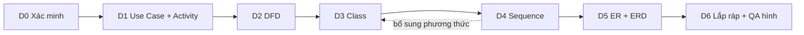

# Plan tối ưu Diagram – Chương 3

Sep 24, 2026 · @Thang

Vẽ lại toàn bộ 24 hình của Chương 3 theo hướng tinh gọn: mỗi hình chỉ thể hiện hoạt động chính, các cơ chế lặp lại (xác thực, giao dịch, khóa) chỉ vẽ một lần, và có giới hạn số phần tử để in A4 vẫn đọc được. Văn bản báo cáo giữ nguyên.

## 1. Mục tiêu và phạm vi

Kết quả cuối là `CH3_diagram_v2.md`: cùng văn bản với CH3\_final.md nhưng toàn bộ hình được vẽ lại gọn hơn, đúng ký hiệu bài giảng, số hình từ 24 thành khoảng 28 (thêm 1 ER khung và 3 ERD logic).

**Được sửa**

- Mã sơ đồ, chú thích hình, danh sách hình.
- **Chú giải gắn liền với hình**: bảng truy vết dưới Activity, bảng ý nghĩa D1–D6 dưới DFD — cập nhật cho khớp hình mới.
- Tối đa 1 câu ghi chú dưới hình (cơ chế xuyên suốt đã lược) và 1 câu dẫn cho mỗi hình mới.

**Giữ nguyên**: mọi đoạn văn, bảng đặc tả Use Case, thuật toán xử lý DFD, bảng danh sách lớp/thuộc tính/quan hệ, từ điển dữ liệu. Chỗ nào văn bản không còn khớp hình mới, Gemini chỉ ghi vào danh sách **Lệch văn bản** để bạn tự xử lý.

| Hình hiện tại | Nội dung | Vấn đề | Hướng tối ưu | Sprint |
| --- | --- | --- | --- | --- |
| H2, H3 | Use Case Admin, Staff | Mermaid flowchart, không phải ký hiệu UML; UC07, UC08 chưa xác minh | PlantUML, ≤ 10 UC mỗi hình, UC07/UC08 theo D0 | D1 |
| H4 | Activity Bán hàng | 11 hoạt động, có lệnh lưu CSDL | ≤ 8 hoạt động, 1 vòng lặp theo dòng, 2 decision nghiệp vụ | D1 |
| H5 | Activity Trả hàng | Không có vòng lặp | ≤ 7 hoạt động | D1 |
| H6 | Activity Nhập kho | 11 hoạt động mức repository | ≤ 7 hoạt động | D1 |
| H7 | DFD cấp 0 | Đạt | Thống nhất ký hiệu | D2 |
| H8–H12 | DFD theo yêu cầu | Sai cấu trúc D1–D6; 3–7 kho tên bảng | Đúng mẫu D1–D6, ≤ 3 kho gộp theo nghiệp vụ | D2 |
| H13 | Class tổng quát | Thiếu bản số | ≤ 12 lớp, chỉ tên + quan hệ + bản số | D3 |
| H14–H16 | Class chi tiết | Mọi thuộc tính + kiểu + enum; kiểu chưa xác minh | ≤ 10 lớp, ≤ 5 thuộc tính, ≤ 3 phương thức mỗi lớp | D3 |
| H17 | Sequence Đăng nhập | Đạt, thiếu tầng dữ liệu | Là hình duy nhất vẽ JWT | D4 |
| H18 | Sequence Bán hàng | 11 lifeline, khoảng 35 thông điệp | ≤ 6 lifeline, ≤ 14 thông điệp | D4 |
| H19, H20 | Sequence Trả hàng, Nhập kho | Bỏ qua giao diện, khác khuôn H18 | ≤ 5 lifeline, cùng khuôn H18 | D4 |
| H21 | Sequence Tra cứu giá | Lifeline tự đặt, không có nguồn | Vẽ lại theo D0 hoặc dùng hình gốc | D4 |
| H22 | Sequence Replication | 6 participant | ≤ 4 | D4 |
| H23–H25 | ERD 3 nhóm | Mermaid erDiagram, đủ mọi cột và kiểu Java, không phải Chen | ER Chen ≤ 8 thực thể mỗi hình, khóa + ≤ 3 thuộc tính | D5 |
| Mới | ER khung | Thiếu mô hình tổng hợp | ≤ 10 thực thể, không thuộc tính | D5 |
| Mới | ERD logic 3 nhóm | — | Chỉ tên bảng, PK, FK, ≤ 2 cột nghiệp vụ | D5 |

## 2. Nguyên tắc tinh gọn

Mỗi hình chỉ trả lời một câu hỏi nghiệp vụ, ở mức đủ để hình dung chính xác. Chi tiết kỹ thuật đã có trong bảng thì không lặp lại trên hình.

1. **Một hình, một ý.** Use Case: ai làm gì. Activity: nghiệp vụ diễn ra theo bước nào. DFD: dữ liệu vào/ra đâu. Class, ER: có những đối tượng nào, liên hệ ra sao. Sequence: ai gọi ai theo thứ tự nào.
2. **Nhãn nghiệp vụ.** Cụm tiếng Việt ≤ 6 từ. Tên hàm chỉ xuất hiện ở Sequence (trong ngoặc, cho lời gọi chính) và bảng truy vết. Tên bảng CSDL chỉ xuất hiện ở ERD logic.
3. **Cơ chế xuyên suốt vẽ đúng một lần**, tại hình mà nó là trọng tâm (bảng dưới).
4. **Không lặp chi tiết đã có trong bảng:** kiểu dữ liệu, cột kỹ thuật, enum, khóa ngoại.
5. **Vượt giới hạn thì gộp tiếp hoặc tách hình**, không thu nhỏ chữ.
6. **Ngưỡng đọc được:** in vừa A4 dọc với chữ ≥ 9pt. Nếu phải thu nhỏ dưới 70% mới vừa trang thì hình đó không đạt.
7. **Một bộ thuật ngữ** (GLOSSARY.md) cho mọi hình: cùng một khái niệm cùng một tên.

### Cơ chế xuyên suốt — vẽ ở đâu

| Cơ chế | Vẽ đầy đủ tại | Các hình khác |
| --- | --- | --- |
| Xác thực JWT, kiểm tra chi nhánh | Sequence Đăng nhập | Không vẽ; UC ghi “đã đăng nhập” ở đặc tả |
| Phân quyền theo vai trò | Use Case (tách actor Admin, Staff) | Không vẽ |
| Giao dịch nguyên tử, khóa lớp giá FIFO, retry | Sequence Bán hàng (1 group + 1 note) | 1 câu ghi chú nếu cần |
| Idempotency | 1 note ở Sequence Bán hàng (nếu D0 xác nhận) | Không vẽ |
| Đồng bộ HQ/Branch | Sequence Replication | Không vẽ |
| Lưu/đọc CSDL từng bảng | Không vẽ ở đâu | Gộp thành 1 bước “Lưu …” |

### Giới hạn cho từng loại sơ đồ

| Sơ đồ | Giới hạn mỗi hình | Trên hình có | Không đưa lên hình |
| --- | --- | --- | --- |
| Use Case | ≤ 10 UC, ≤ 3 actor | Actor, UC có mã, system boundary, include/extend có ý nghĩa nghiệp vụ | Đăng nhập nối vào mọi UC; thêm/xóa/sửa tách rời |
| Activity | 6–10 hoạt động, 2 làn, ≤ 3 decision, ≤ 1 vòng lặp | Bước nghiệp vụ, điều kiện nghiệp vụ có guard | Lệnh lưu/đọc CSDL, rollback, retry, tên hàm |
| DFD cấp 0 | 1 xử lý, ≤ 4 tác nhân | Luồng gộp, nhãn ngắn | Từng loại dữ liệu chi tiết |
| DFD theo yêu cầu | 1 xử lý, ≤ 3 kho | D1–D6 đúng mẫu, kho gộp theo nghiệp vụ | Tên bảng CSDL, thiết bị không có thật |
| Class tổng quát | ≤ 12 lớp | Tên lớp, quan hệ, bản số | Thuộc tính, phương thức |
| Class chi tiết | ≤ 10 lớp; mỗi lớp ≤ 5 thuộc tính, ≤ 3 phương thức | Khóa, thuộc tính nghiệp vụ, phương thức nghiệp vụ | Kiểu chưa xác minh, createdAt/updatedAt/version/isActive, hộp enum, lớp kỹ thuật |
| Sequence | ≤ 6 lifeline, ≤ 14 thông điệp, ≤ 2 fragment | Tác nhân, Giao diện, Service, module gộp | Repository từng bảng, facade trung gian, lệnh save lặp |
| ER khung | ≤ 10 thực thể | Thực thể, mối kết hợp, bản số | Mọi thuộc tính |
| ER chi tiết (Chen) | ≤ 8 thực thể kể cả thực thể mượn | Khóa + ≤ 3 thuộc tính nghiệp vụ, (min,max) | Khóa ngoại, kiểu, cột kỹ thuật |
| ERD logic | ≤ 10 bảng | Tên bảng, PK, FK, ≤ 2 cột nghiệp vụ | Kiểu, cột kỹ thuật, nhãn quan hệ dài |

Việc lược bớt trên hình không làm mất thông tin: mọi thứ bị lược vẫn nằm trong bảng thuộc tính, từ điển dữ liệu, đặc tả UC hoặc hình chuyên trách của cơ chế đó. Mỗi hình Gemini phải xuất bảng lược bỏ ghi rõ điều này.

## 3. Quy trình

7 sprint, mỗi sprint là một cuộc trò chuyện mới và chỉ đính kèm phần Chương 3 có hình cần vẽ. Sau mỗi sprint, bạn render hình và kiểm tra cổng duyệt rồi mới đi tiếp.



D3 phải xong trước D4 và D5 vì Sequence và ER đều lấy tên từ Class Diagram. D1 tạo GLOSSARY.md, các sprint sau dùng chung.

| Sprint | Hình | Đính kèm | Cổng duyệt của bạn |
| --- | --- | --- | --- |
| D0 | — | FACTS.md + file code liệt kê trong prompt | Tự mở code kiểm tra V1 và V3 |
| D1 | H2–H6 | FACTS.md, VERIFY.md, CH3 mục 3.1–3.2 | Render được; đếm hoạt động ≤ 10 |
| D2 | H7–H12 | VERIFY.md, GLOSSARY.md, CH3 mục 3.3 | Mỗi DFD ≤ 3 kho, D1–D6 đúng chiều |
| D3 | H13–H16 | FACTS.md, VERIFY.md, GLOSSARY.md, CH3 mục 3.4 | Mỗi lớp ≤ 5 thuộc tính, mọi quan hệ có bản số |
| D4 | H17–H22 | FACTS.md, VERIFY.md, GLOSSARY.md, `out/D3_class.md`, CH3 mục 3.5 | ≤ 6 lifeline; JWT chỉ có ở H17 |
| D5 | H23–H25 + 4 hình mới | FACTS.md, VERIFY.md, GLOSSARY.md, `out/D3_class.md`, CH3 mục 3.6 | Mỗi ER ≤ 8 thực thể; không có khóa ngoại trên ER |
| D6 | Tất cả | `out/D1`–`out/D5`, GLOSSARY.md, CH3\_final.md | Danh sách hình liên tục; danh sách Lệch văn bản |

**File làm việc:** `VERIFY.md` (D0), `GLOSSARY.md` (tạo ở D1, cập nhật mỗi sprint), `HANDOFF.md` (cộng dồn), `out/D1_uc_activity.md` … `out/D5_er.md`, `CH3_diagram_v2.md` (D6).

**Render:** PlantUML qua PlantText, plantuml.com hoặc extension PlantUML của VS Code; Mermaid qua mermaid.live. ER Chen cần PlantUML bản 2023 trở lên (`@startchen`); nếu không render được, vẽ tay bằng draw.io từ bảng Gemini xuất kèm. Xuất PNG hoặc SVG, chèn Word rộng tối đa bằng lề trang.

**Khung PlantUML chung** (đầu mọi hình trừ ER Chen) để các hình cùng phong cách, in đen trắng rõ:

```text
@startuml
skinparam monochrome true
skinparam shadowing false
skinparam defaultFontName Arial
skinparam defaultFontSize 12
hide empty members
' ... nội dung hình ...
@enduml
```

## 4. Prompt hệ thống và SKILL-G

Dán Prompt hệ thống vào Gem Instructions / `GEMINI.md` / System Instructions một lần. SKILL-G dán vào mọi sprint D1–D6.

### Prompt hệ thống

```text
VAI TRÒ
Bạn là chuyên gia vẽ sơ đồ phân tích thiết kế hệ thống. Nhiệm vụ: vẽ lại các sơ đồ Chương 3 của khóa luận ERP bán lẻ đa chi nhánh HQ/Branch cho gọn, đúng ký hiệu bài giảng, dễ đọc khi in A4.

PHẠM VI
- CHỈ vẽ lại sơ đồ. Không sửa đoạn văn, bảng đặc tả UC, thuật toán DFD, bảng lớp/thuộc tính/quan hệ, từ điển dữ liệu.
- Được sửa: mã sơ đồ; chú thích hình; chú giải gắn liền hình (bảng truy vết Activity, bảng ý nghĩa D1–D6); tối đa 1 câu ghi chú dưới hình; 1 câu dẫn cho hình mới.
- Văn bản không còn khớp hình mới -> KHÔNG sửa, ghi vào mục LỆCH VĂN BẢN (vị trí | nội dung lệch | đề xuất).

CHỐNG ẢO GIÁC
1. Mọi phần tử trên hình phải có nguồn: FACTS.md, VERIFY.md, GLOSSARY.md hoặc văn bản báo cáo đính kèm.
2. Không tự đặt tên lớp, phương thức, endpoint, bảng.
3. Được GỘP nhiều thành phần thành một khối (lifeline, kho dữ liệu) với tên nghiệp vụ (ví dụ Module Kho), nhưng phải ghi thành phần gốc trong Bảng lược bỏ.
4. Không chắc chắn -> ghi [CẦN XÁC NHẬN: …], không đoán.

ĐẦU RA CHO MỖI HÌNH
A. Mã sơ đồ hoàn chỉnh (PlantUML hoặc Mermaid), render được ngay.
B. Chú thích: Hình x: …
C. Bảng lược bỏ: Phần tử bị lược/gộp | Lý do | Được trình bày ở đâu.
D. Đếm so với giới hạn (ví dụ: Hoạt động 7/10, Decision 2/3).
E. Chú giải cập nhật (nếu hình có bảng truy vết / bảng D1–D6).
CUỐI PHIÊN: Lệch văn bản; GLOSSARY bổ sung; HANDOFF ≤ 200 từ (hình đã xong, tên đã chốt, việc còn mở).
```

### SKILL-G · Quy tắc tinh gọn chung

```text
[SKILL-G: QUY TẮC TINH GỌN SƠ ĐỒ]
1. Một hình một ý, vừa đủ để hình dung chính xác nghiệp vụ, không mô tả từng dòng code.
2. Nhãn: cụm tiếng Việt ≤ 6 từ. Hoạt động, UC, thông điệp = động từ + danh từ. Actor, lớp, thực thể, kho = danh từ.
3. KHÔNG đưa lên hình: tên bảng CSDL (trừ ERD logic); tên hàm (trừ Sequence); kiểu dữ liệu chưa xác nhận; cột kỹ thuật (createdAt, updatedAt, version, isActive, idempotencyKey, createdBy, performedBy); getter/setter; lệnh lưu/đọc CSDL lặp lại.
4. Cơ chế xuyên suốt chỉ vẽ ở 1 hình:
   - Xác thực JWT, kiểm tra chi nhánh: chỉ Sequence Đăng nhập.
   - Phân quyền vai trò: chỉ thể hiện bằng tách actor ở Use Case.
   - Giao dịch nguyên tử, khóa lớp giá FIFO, retry, idempotency: chỉ Sequence Bán hàng (1 group + tối đa 2 note).
   - Đồng bộ HQ/Branch: chỉ Sequence Replication.
   Các hình khác: không vẽ; nếu cần thì 1 câu dưới hình, ví dụ 'Toàn bộ xử lý nằm trong một giao dịch (xem Hình x)'.
5. GIỚI HẠN MỖI HÌNH:
   Use Case: ≤ 10 UC, ≤ 3 actor.
   Activity: 6–10 hoạt động, 2 làn, ≤ 3 decision, ≤ 1 vòng lặp.
   DFD cấp 0: 1 xử lý, ≤ 4 tác nhân. DFD theo yêu cầu: 1 xử lý, ≤ 3 kho.
   Class tổng quát: ≤ 12 lớp, chỉ tên. Class chi tiết: ≤ 10 lớp; mỗi lớp ≤ 5 thuộc tính, ≤ 3 phương thức.
   Sequence: ≤ 6 lifeline, ≤ 14 thông điệp, ≤ 2 fragment (loop/alt/opt).
   ER khung: ≤ 10 thực thể, không thuộc tính. ER chi tiết: ≤ 8 thực thể kể cả thực thể mượn; khóa + ≤ 3 thuộc tính.
   ERD logic: ≤ 10 bảng; PK, FK, ≤ 2 cột nghiệp vụ.
   Phần tử mượn từ nhóm khác (chỉ tên, không thuộc tính) vẫn tính vào giới hạn, trừ Class chi tiết.
6. Vượt giới hạn -> gộp tiếp hoặc tách hình, không thu nhỏ chữ. Tránh đường cắt chéo.
7. Dùng đúng tên trong GLOSSARY.md; tên mới phải thêm vào GLOSSARY kèm nguồn.
8. PlantUML cho Use Case, Activity, Class, Sequence, ER Chen, ERD logic; Mermaid flowchart cho DFD. Mọi hình PlantUML (trừ @startchen) mở đầu bằng: skinparam monochrome true / skinparam shadowing false / skinparam defaultFontName Arial / skinparam defaultFontSize 12 / hide empty members.
```

## 5. Skill theo loại sơ đồ

Mỗi skill gồm ký hiệu bắt buộc theo bài giảng và các mẫu gộp để hình gọn. Chỉ dán skill của sprint đang làm.

### SKILL-UA · Use Case và Activity (D1)

```text
[SKILL-UA]
USE CASE
- Actor là danh từ; UC = động từ + danh từ, ghi mã (UC01: ...); có system boundary (rectangle); left to right direction.
- Đăng nhập là 1 UC riêng, KHÔNG nối <<include>> từ các UC khác (điều kiện 'đã đăng nhập' nằm trong đặc tả).
- Gộp thêm/xóa/sửa thành 'Quản lý <đối tượng>'. Các UC cùng một mức độ.
- <<include>>/<<extend>> chỉ khi là bước nghiệp vụ dùng chung hoặc có điều kiện thật sự.

ACTIVITY
- 2 làn: |Nhân viên| và |Hệ thống|. Hoạt động là bước nghiệp vụ, không phải lệnh code.
- Mỗi hoạt động 1 vào 1 ra; tên không trùng; decision chỉ cho điều kiện nghiệp vụ, mọi nhánh có guard.
- Xử lý theo từng dòng chứng từ: 1 khối repeat chứa tối đa 3 hoạt động.
- Lỗi kỹ thuật (rollback, retry) không vẽ; chỉ vẽ nhánh lỗi nghiệp vụ (ví dụ khách hàng không tồn tại).
- Gộp nhiều lệnh thành một bước: 'tìm tồn kho + tăng + lưu' = 'Tăng tồn kho'.
- Bảng truy vết dưới hình: Hoạt động mới | Các hàm gốc được gộp | Nguồn.
- Cú pháp: |Nhân viên| / :Lập hóa đơn; / if (Khách hàng hợp lệ?) then (có) ... else (không) / repeat ... repeat while (Còn dòng?) is (có).
```

### SKILL-DFD · Sơ đồ luồng dữ liệu (D2)

```text
[SKILL-DFD]
MẪU BÀI GIẢNG (bắt buộc đúng chiều):
  Người dùng --D1--> Xử lý --D2--> Người dùng
  Thiết bị nhập --D5--> Xử lý --D6--> Thiết bị xuất
  Bộ nhớ phụ --D3--> Xử lý --D4--> Bộ nhớ phụ
- D1 là dữ liệu người dùng nhập trên giao diện (bàn phím, chuột thuộc D1). D5/D6 chỉ là thiết bị ngoài thật (máy quét mã vạch, máy in); văn bản không nêu thiết bị thì bỏ khối thiết bị và ghi 'Không có'.
- Gộp kho theo nghiệp vụ, tối đa 3 kho mỗi hình:
  Danh mục = khách hàng, sản phẩm, nhà cung cấp, bảng giá, giá riêng
  Chứng từ = hóa đơn, phiếu trả, phiếu nhập (kèm dòng)
  Kho hàng = tồn kho, biến động kho, lớp giá vốn
  Công nợ = công nợ, biến động công nợ
  Ghi ánh xạ kho -> bảng CSDL vào Bảng lược bỏ.
- DFD cấp 0: 1 xử lý 'Hệ thống ERP', tác nhân Admin, Staff; luồng gộp nhãn ngắn.
- Mermaid: tác nhân [Tên], xử lý ((Tên)), kho [(Tên)], nhãn luồng -- D1 -->.
- Cập nhật bảng ý nghĩa D1–D6 (chú giải hình). KHÔNG sửa 'Thuật toán xử lý'; lệch -> ghi Lệch văn bản.
```

### SKILL-CS · Class và Sequence (D3, D4)

```text
[SKILL-CS]
CLASS
- Tổng quát: chỉ tên lớp + quan hệ + bản số (hide members).
- Chi tiết: khóa + tối đa 4 thuộc tính nghiệp vụ; tối đa 3 phương thức nghiệp vụ có nguồn, ưu tiên phương thức xuất hiện trong Sequence (confirm, consume, fromInbound, snapshotDebt...).
- Kiểu dữ liệu: chỉ ghi khi FACTS/VERIFY xác nhận; không chắc thì bỏ kiểu (ghi 'tên' thay vì 'tên: Kiểu').
- Enum không vẽ thành hộp riêng; ghi 'status' như thuộc tính.
- Lớp thuộc nhóm khác vẽ dạng hộp chỉ có tên (không tính vào giới hạn 10 lớp).
- Bảng nối chỉ có khóa ghép (RolePermission) -> vẽ quan hệ nhiều-nhiều trực tiếp Role 0..* -- 0..* Permission.
- Composition chỉ khi FACTS có cascade/orphanRemoval; tham chiếu qua ID -> association thường có bản số theo nullable.
- Lớp kỹ thuật (IdempotencyRecord) không vẽ; vẫn nằm trong bảng danh sách lớp.

SEQUENCE (khuôn 4 tầng theo ví dụ 'Sửa hồ sơ sinh viên' của bài giảng)
- Lifeline: Tác nhân -> Giao diện (ví dụ 'Màn hình bán hàng') -> Service chính (tên lớp thật) -> module/thực thể gộp ('Module Kho', 'Module Công nợ', 'CSDL').
- Không vẽ Controller riêng (gộp vào Giao diện -> Service), không vẽ từng Repository, Facade trung gian.
- Thông điệp = cụm nghiệp vụ; tên phương thức thật trong ngoặc chỉ cho lời gọi chính, ví dụ 'Xuất kho, tính giá vốn (recordSaleAndGetCost)'.
- Nhiều lệnh lưu gộp thành 1 thông điệp 'Lưu ...'; thông điệp trả về chỉ vẽ khi mang dữ liệu có ý nghĩa.
- Fragment: loop cho từng dòng chứng từ; alt/opt chỉ cho nhánh nghiệp vụ. Tối đa 2 fragment.
- Sau khi vẽ: mọi phương thức domain gọi trong Sequence phải có trong Class chi tiết (bước 5 bài giảng); thiếu thì xuất danh sách bổ sung.
```

### SKILL-ER · ER (Chen) và ERD logic (D5)

```text
[SKILL-ER]
ER CHEN (theo bài giảng Mô hình hóa dữ liệu)
- Thực thể: hình chữ nhật, danh từ tiếng Việt in hoa. Mối kết hợp: hình thoi, động từ. Bản số (min,max) trên từng nhánh. Khóa đánh dấu <<key>>.
- Chiến lược phối hợp của bài giảng: 1 lược đồ KHUNG (chỉ thực thể trung tâm + mối kết hợp + bản số, không thuộc tính) + các lược đồ CHI TIẾT theo phân hệ.
- Giảm số thực thể theo mục 'Mối kết hợp hay thực thể?' của bài giảng:
  Chuyển thành MỐI KẾT HỢP CÓ THUỘC TÍNH khi bảng chỉ nối 2 thực thể và mỗi cặp chỉ xuất hiện 1 lần:
    dòng hóa đơn, dòng phiếu trả, dòng phiếu nhập (theo ví dụ 'Chi tiết HĐ' của bài giảng);
    tồn kho (unique sản phẩm + chi nhánh); công nợ tổng (unique khách hàng + chi nhánh); vai trò - quyền (khóa ghép).
  GIỮ THỰC THỂ khi cặp có thể lặp theo thời gian (bảng giá, giá riêng có hiệu lực từ-đến) hoặc có định danh riêng và nhánh không bắt buộc (phân công vai trò, theo QT3).
  Ghi mỗi quyết định vào Bảng quyết định: Bảng CSDL | Mô hình thành | Lý do | Nguồn.
- Thuộc tính: khóa + tối đa 3 thuộc tính nghiệp vụ; KHÔNG khóa ngoại (QT1), không kiểu, không cột kỹ thuật. Thuộc tính phụ thuộc 2 thực thể -> đặt trên mối kết hợp (QT2).
- Thực thể mượn từ phân hệ khác: chỉ tên, không thuộc tính, chú thích 'xem Hình x'.
- Bản số suy từ nullable/optional trong FACTS/VERIFY; không có nguồn -> [CẦN XÁC NHẬN].
- Bảng kỹ thuật (idempotency_record) và bảng ngoài phạm vi (dim_date, inventory_alert_config) không vẽ.
- PlantUML: @startchen; entity MA_KHONG_DAU { Ma <<key>> ... }; relationship TEN { }; nối bằng -(min,max)- nếu bản PlantUML hỗ trợ, nếu không dùng -1- / -N- và kèm bảng bản số. Luôn xuất kèm bảng Thực thể A | Mối kết hợp | Thực thể B | (min,max) A | (min,max) B để vẽ draw.io khi cần.

ERD LOGIC (ký hiệu chân chim, mỗi nhóm 1 hình)
- Hộp = tên bảng CSDL; chỉ PK, FK và tối đa 2 cột nghiệp vụ; không kiểu, không cột kỹ thuật.
- Quan hệ không ghi nhãn (hoặc nhãn ≤ 2 từ); bản số chân chim theo nullable.
- Bảng nhóm khác: hộp chỉ có tên + PK.
- PlantUML IE: entity ten_bang { * id <<PK>> -- * fk_id <<FK>> }, quan hệ ||--o{.
```

## 6. Prompt từng sprint

Ghép mỗi phiên: SKILL-G + skill của sprint + HANDOFF.md + prompt dưới đây. Các khung gợi ý trong prompt là để Gemini đối chiếu với FACTS, không phải để chép nguyên.

### D0 — Xác minh trước khi vẽ

```text
[SPRINT D0 – XÁC MINH]
Chỉ trích xuất, KHÔNG vẽ.
Đính kèm: FACTS.md, CustomerWriteController.java, Supplier.java, GoodsReturn.java, InventoryFacadeImpl.java, các *Controller.java của order và inventory, mọi file có dùng CustomerProductPrice (grep -rl CustomerProductPrice), thư mục analytics (nếu có).
Trả lời bảng: Mã | Câu hỏi | Trả lời | Nguồn [file:dòng]. Không tìm thấy -> KHÔNG TÌM THẤY.
V1 CustomerWriteController chạy ở HQ, Branch hay cả hai (điều kiện instance.role, @ConditionalOnProperty, @PreAuthorize)?
V2 Có chức năng báo cáo/analytics cho ADMIN không (endpoint nào)?
V3 Luồng tra cứu giá riêng: controller, service, phương thức chính, các bước; có lấy giá từ PriceList khi không có giá riêng không?
V4 recordReturn gồm những bước nào (tăng tồn, biến động RETURN, CostLayer.fromReturn)?
V5 Supplier.branchId có nullable không?
V6 GoodsReturn.invoiceId có nullable không?
V7 Tên lớp Service xử lý 4 luồng: bán hàng, trả hàng, nhập kho, tra cứu giá.
V8 Endpoint tạo hóa đơn có @IdempotencyProtected không?
V9 AuthService.login kiểm tra những gì, theo thứ tự nào?
ĐẦU RA: VERIFY.md (chỉ bảng trên).
```

### D1 — Use Case và Activity (H2–H6)

```text
[SPRINT D1 – USE CASE + ACTIVITY]
<Dán SKILL-G, SKILL-UA>
Đính kèm: FACTS.md, VERIFY.md, CH3 mục 3.1–3.2 (văn bản + mã hình hiện tại).
Nhiệm vụ:
1. Tạo GLOSSARY.md: tên chuẩn của actor, UC (mã + tên), chứng từ (Hóa đơn, Phiếu trả, Phiếu nhập), trạng thái (Nháp, Đã xác nhận), module (Kho hàng, Công nợ, Khách hàng). Lấy từ văn bản 3.1.
2. H2, H3 Use Case: vẽ lại bằng PlantUML.
   - UC07: theo V2. Không có -> bỏ khỏi hình, ghi Lệch văn bản (đoạn 3.1.1 có nhắc báo cáo).
   - UC08: theo V1. Chỉ HQ -> chuyển sang H2 (Admin), ghi Lệch văn bản.
3. H4 Bán hàng, khung gợi ý (đối chiếu B05, B08): Nhân viên nhập hóa đơn -> [Khách hàng hợp lệ?] không: báo lỗi -> repeat {Xuất kho theo FIFO; Ghi giá vốn dòng} while còn dòng -> Ghi tăng công nợ -> [Có trả trước?] có: trừ công nợ trả trước -> Xác nhận hóa đơn -> Nhân viên nhận hóa đơn. Ghi chú: toàn bộ trong một giao dịch (xem Sequence Bán hàng).
4. H5 Trả hàng (B06, V4): Lập phiếu trả nháp -> Yêu cầu xác nhận -> Khóa hóa đơn gốc -> Xác nhận phiếu -> repeat {Hoàn hàng vào kho} -> Giảm công nợ -> Thông báo kết quả.
5. H6 Nhập kho (B07): Lập phiếu nhập nháp -> Yêu cầu xác nhận -> Xác nhận phiếu -> repeat {Tăng tồn kho; Ghi biến động nhập; Tạo lớp giá vốn} -> Thông báo kết quả.
6. Cập nhật 3 bảng truy vết theo hoạt động mới (cột 'Hàm gốc' gom các hàm cũ).
CHECKLIST: [ ] ≤ 10 UC mỗi hình [ ] Không UC nào nối include tới Đăng nhập [ ] Activity 6–10 hoạt động, 2 làn, ≤ 1 vòng lặp [ ] Không còn hoạt động 'Lưu .../Tìm ...' [ ] Mọi nhánh decision có guard
```

### D2 — DFD (H7–H12)

```text
[SPRINT D2 – DFD]
<Dán SKILL-G, SKILL-DFD>
Đính kèm: VERIFY.md, GLOSSARY.md, CH3 mục 3.3.
Nhiệm vụ:
1. H7 DFD cấp 0: giữ nội dung, thống nhất ký hiệu (xử lý hình tròn, tác nhân hình chữ nhật).
2. H8–H12 vẽ lại đúng mẫu D1–D6, tối đa 3 kho:
   H8 Lập hóa đơn: đọc Danh mục, Kho hàng; ghi Chứng từ, Kho hàng, Công nợ -> vượt 3 kho thì gộp 'Chứng từ & công nợ'.
   H9 Lập phiếu trả: Chứng từ (đọc hóa đơn, ghi phiếu trả), Kho hàng, Công nợ.
   H10 Lập phiếu nhập: Danh mục (đọc), Chứng từ, Kho hàng (ghi).
   H11 Tra cứu giá riêng: theo V3 (thường chỉ Danh mục; không có D4).
   H12 Theo dõi công nợ: Danh mục (khách hàng), Công nợ; không có D4.
3. D5/D6: 'Không có' trừ khi văn bản nêu thiết bị thật; bỏ khối thiết bị khỏi hình khi không có.
4. Cập nhật 5 bảng ý nghĩa D1–D6. KHÔNG sửa thuật toán; lệch thì ghi Lệch văn bản (ví dụ H8 bước 2 'kiểm tra đủ tồn kho' trái B08).
CHECKLIST: [ ] D1, D2 nối trực tiếp Người dùng - Xử lý [ ] ≤ 3 kho, tên kho theo GLOSSARY [ ] Không còn tên bảng CSDL trên hình [ ] Tên xử lý trùng tên UC
```

### D3 — Class Diagram (H13–H16)

```text
[SPRINT D3 – CLASS]
<Dán SKILL-G, SKILL-CS phần CLASS>
Đính kèm: FACTS.md, VERIFY.md, GLOSSARY.md, CH3 mục 3.4 (văn bản + bảng để đối chiếu, không sửa).
Nhiệm vụ:
1. H13 Tổng quát: ≤ 12 lớp trung tâm, chỉ tên + quan hệ + bản số.
2. H14 Identity & CRM: Branch, UserAccount, Role, Permission, UserBranchRole, Customer, ReceivableDebt, ReceivableDebtMovement. RolePermission -> quan hệ nhiều-nhiều Role-Permission.
3. H15 Catalog & Inventory: Category, Product, Supplier, PriceList, InboundReceipt, InboundReceiptLine, StockOnHand, StockMovement, CostLayer (+ Branch dạng chỉ tên). Category tự tham chiếu = association cha 0..1 - con 0..*.
4. H16 Order: SalesInvoice, SalesInvoiceLine, GoodsReturn, GoodsReturnLine, CustomerProductPrice (+ Customer, Product, Branch dạng chỉ tên). Bỏ IdempotencyRecord.
5. Mỗi lớp: khóa + ≤ 4 thuộc tính nghiệp vụ; phương thức có nguồn (confirm, snapshotDebt, consume, fromInbound, fromReturn, increase, decreaseAllowNegative, sale, inbound...). Kiểu chỉ ghi khi đã xác nhận (lưu ý Product.id UUID nhưng productId Long trong FACTS -> bỏ kiểu cả hai).
6. Bản số mọi quan hệ theo nullable trong FACTS/VERIFY (V5, V6).
7. Không sửa bảng 3.4.6–3.4.8; chỗ hình khác bảng (ví dụ Category đổi aggregation thành association) ghi Lệch văn bản.
ĐẦU RA: out/D3_class.md (mã 4 hình + danh sách phương thức mỗi lớp để D4 dùng).
CHECKLIST: [ ] ≤ 10 lớp chính mỗi hình chi tiết [ ] ≤ 5 thuộc tính, ≤ 3 phương thức mỗi lớp [ ] Mọi quan hệ có bản số [ ] Không có hộp enum, không cột kỹ thuật
```

### D4 — Sequence (H17–H22)

```text
[SPRINT D4 – SEQUENCE]
<Dán SKILL-G, SKILL-CS phần SEQUENCE>
Đính kèm: FACTS.md, VERIFY.md, GLOSSARY.md, out/D3_class.md, CH3 mục 3.5.
Nhiệm vụ (khung lifeline gợi ý, tên Service lấy từ V7):
1. H17 Đăng nhập: Người dùng | Màn hình đăng nhập | AuthService | CSDL tài khoản. Login theo V9 (alt hợp lệ/không hợp lệ), refresh theo B04. Đây là hình DUY NHẤT thể hiện JWT: 1 note nêu các claim (N03) và việc mọi yêu cầu sau được kiểm tra token + chi nhánh.
2. H18 Bán hàng: Nhân viên | Màn hình bán hàng | SalesInvoiceService | Module Khách hàng | Module Kho | Module Công nợ. Group 'Giao dịch': kiểm tra khách hàng -> lưu nháp -> loop mỗi dòng: xuất kho, tính giá vốn (recordSaleAndGetCost) [note: khóa lớp giá FIFO] -> ghi tăng công nợ -> opt có trả trước: giảm công nợ -> xác nhận hóa đơn. Note retry khi xung đột (M11); note idempotency nếu V8 có.
3. H19 Trả hàng: Nhân viên | Màn hình trả hàng | GoodsReturnService | Module Kho | Module Công nợ. Khóa hóa đơn gốc -> xác nhận phiếu -> loop: hoàn hàng vào kho (recordReturn) -> giảm công nợ -> lưu phiếu.
4. H20 Nhập kho: Nhân viên | Màn hình nhập kho | InboundReceiptService | Module Kho. Xác nhận phiếu -> loop: tăng tồn, ghi biến động nhập, tạo lớp giá vốn (fromInbound) -> lưu phiếu.
5. H21 Tra cứu giá riêng: vẽ theo V3. V3 = KHÔNG TÌM THẤY -> không vẽ, ghi [CẦN XÁC NHẬN: dùng lại hình gốc của báo cáo cũ]. Tuyệt đối không giữ OrderController, PriceService, getPrice, findValidPrice.
6. H22 Replication: CSDL HQ | CSDL Chi nhánh (tối đa 4 lifeline nếu tách publication/subscription). 2 group: HQ -> Chi nhánh (dữ liệu chủ, O01–O13); Chi nhánh -> HQ (dữ liệu giao dịch, O14–O21).
7. Đối chiếu bước 5 bài giảng: phương thức domain trong H18–H20 phải có trong out/D3_class.md; thiếu -> sửa mã Class tương ứng ngay trong phiên này (vẫn ≤ 3 phương thức mỗi lớp).
CHECKLIST: [ ] ≤ 6 lifeline, ≤ 14 thông điệp, ≤ 2 fragment [ ] JWT chỉ ở H17; giao dịch/khóa/retry chỉ ở H18 [ ] H18–H20 cùng một khuôn lifeline [ ] Mọi tên lifeline có trong GLOSSARY hoặc V7
```

### D5 — ER và ERD (H23–H25 + 4 hình mới)

```text
[SPRINT D5 – ER + ERD]
<Dán SKILL-G, SKILL-ER>
Đính kèm: FACTS.md, VERIFY.md, GLOSSARY.md, out/D3_class.md (bản sau D4), CH3 mục 3.6.
Nhiệm vụ:
1. Bảng quyết định cho từng bảng CSDL: Thực thể / Mối kết hợp có thuộc tính / Không vẽ, kèm lý do theo SKILL-ER.
2. ER khung (hình mới, đặt cuối 3.6.1 kèm 1 câu dẫn): ≤ 10 thực thể trung tâm, gợi ý CHI NHÁNH, TÀI KHOẢN, KHÁCH HÀNG, SẢN PHẨM, NHÀ CUNG CẤP, HÓA ĐƠN, PHIẾU TRẢ, PHIẾU NHẬP; chỉ mối kết hợp + (min,max).
3. ER chi tiết, giữ đúng 3 nhóm theo tiêu đề hiện có (≤ 8 thực thể mỗi hình):
   H23 Identity & CRM: CHI NHÁNH, TÀI KHOẢN, VAI TRÒ, QUYỀN ('Được cấp' là mối kết hợp), PHÂN CÔNG VAI TRÒ, KHÁCH HÀNG, BIẾN ĐỘNG CÔNG NỢ; công nợ tổng = mối kết hợp 'Nợ tại' KHÁCH HÀNG - CHI NHÁNH (thuộc tính Tổng nợ). KHÁCH HÀNG - CHI NHÁNH bản số (0,1) phía khách hàng.
   H24 Catalog & Inventory: DANH MỤC, SẢN PHẨM, NHÀ CUNG CẤP, BẢNG GIÁ, PHIẾU NHẬP, BIẾN ĐỘNG KHO, LỚP GIÁ VỐN, CHI NHÁNH (mượn); dòng phiếu nhập = 'Chi tiết nhập'; tồn kho = 'Tồn tại' SẢN PHẨM - CHI NHÁNH (Số lượng).
   H25 Order & Common: HÓA ĐƠN, PHIẾU TRẢ, GIÁ RIÊNG + KHÁCH HÀNG, SẢN PHẨM, CHI NHÁNH (mượn); dòng = 'Chi tiết HĐ', 'Chi tiết trả'. Chú thích: bảng kỹ thuật của Common trình bày ở từ điển dữ liệu.
   Bản số NHÀ CUNG CẤP - CHI NHÁNH theo V5; PHIẾU TRẢ - HÓA ĐƠN theo V6.
4. ERD logic (3 hình mới, mỗi hình đặt ngay sau ER cùng nhóm, kèm 1 câu dẫn): chỉ tên bảng, PK, FK, ≤ 2 cột nghiệp vụ.
5. Bảng ánh xạ Phần tử ER -> Bảng CSDL (chú giải, đặt dưới ER khung).
6. Không sửa đoạn 3.6.1 và từ điển dữ liệu; lệch thì ghi Lệch văn bản.
CHECKLIST: [ ] ER ≤ 8 thực thể mỗi hình, khung ≤ 10 [ ] Không khóa ngoại, không kiểu trên ER [ ] Mọi nhánh có (min,max) [ ] ERD logic ≤ 10 bảng, không cột kỹ thuật [ ] Tên thực thể ánh xạ được về lớp ở D3
```

### D6 — Lắp ráp và QA hình

```text
[SPRINT D6 – LẮP RÁP + QA HÌNH]
<Dán SKILL-G>
Đính kèm: CH3_final.md, out/D1 … out/D5, GLOSSARY.md, HANDOFF.md.
Không vẽ mới. Không sửa văn bản ngoài phạm vi được phép.
Nhiệm vụ:
1. Thay mã mọi hình cũ bằng bản mới đúng vị trí; chèn 4 hình mới (ER khung, 3 ERD logic) kèm câu dẫn; thay chú giải đã cập nhật.
2. Đánh lại số hình liên tục từ Hình 2; cập nhật mọi câu trong văn bản có nhắc số hình; xuất Danh sách hình mới + bảng Hình cũ -> Hình mới.
3. QA từng hình, xuất bảng: Hình | Loại | Số phần tử / giới hạn | Đạt?
4. QA chéo: tên khớp GLOSSARY; mỗi cơ chế xuyên suốt chỉ xuất hiện ở 1 hình; phương thức trong Sequence có trong Class; thực thể ER ánh xạ được về lớp; UC nghiệp vụ chính (bán, trả, nhập) đều có Activity + DFD + Sequence.
5. Gộp mọi 'Lệch văn bản' của D1–D5 thành 1 bảng cho tác giả.
ĐẦU RA: CH3_diagram_v2.md + bảng QA + bảng Lệch văn bản.
```

## 7. Nghiệm thu và phần ngoài phạm vi

### Checklist nghiệm thu hình

- [ ] Thứ tự vẫn đúng: Use Case → Activity → DFD → Class → Sequence → ER/ERD; không hình bắt buộc nào bị bỏ
- [ ] Mọi hình nằm trong giới hạn ở mục 2 (bảng QA của D6)
- [ ] In thử A4: không hình nào phải thu nhỏ dưới 70%, chữ đọc được
- [ ] JWT chỉ ở Sequence Đăng nhập; giao dịch, khóa FIFO, retry chỉ ở Sequence Bán hàng
- [ ] ER dùng ký hiệu Chen, không có khóa ngoại trên hình; ERD logic chỉ có PK, FK, ≤ 2 cột
- [ ] Không còn tên tự đặt (OrderController, PriceService, getPrice, findValidPrice, CRMFacade, POST /invoices)
- [ ] Không còn `[CẦN XÁC NHẬN` trong bản cuối
- [ ] Danh sách hình và mọi câu nhắc số hình đã cập nhật

### Lỗi văn bản đã biết, nằm ngoài plan này

Plan này không sửa văn bản, nên các lỗi sau từ lần review vẫn còn. Chúng sẽ xuất hiện lại trong bảng Lệch văn bản của D6 để bạn tự sửa:

| Vị trí | Lỗi | Sửa gợi ý |
| --- | --- | --- |
| Đặc tả UC01 | Gán quy tắc B01/B02 vào bước đăng nhập | Chuyển sang ghi chú của UC02 |
| Đặc tả UC10 | “Tăng công nợ nếu còn thiếu” | Luôn tăng theo tổng hóa đơn, giảm nếu có trả trước |
| Đặc tả UC11 | Ghi khóa phiếu trả | Khóa hóa đơn gốc (B06) |
| Đoạn dẫn 3.2.2 | “Tránh trả vượt số lượng mua” không có căn cứ | Bỏ, hoặc xác minh trong code |
| Thuật toán DFD UC10 bước 2 | “Đảm bảo đủ tồn kho” | Hệ thống cho phép tồn âm (B08) |
| Bảng 3.4.7, 3.4.8 | Thiếu thuộc tính và quan hệ R07–R11 | Bổ sung nếu giảng viên yêu cầu đầy đủ |
| Từ điển dữ liệu | 5 bảng “Không xác định”; role\_permission ghi Long | “Không đồng bộ – cục bộ”; khóa ghép (role\_id, permission\_id) |
| Tên chương | Khác mục lục báo cáo | Thống nhất với mục lục |

Các lỗi này chỉ cần sửa vài câu, bạn có thể tự sửa tay trong Word sau D6 mà không cần Gemini.
